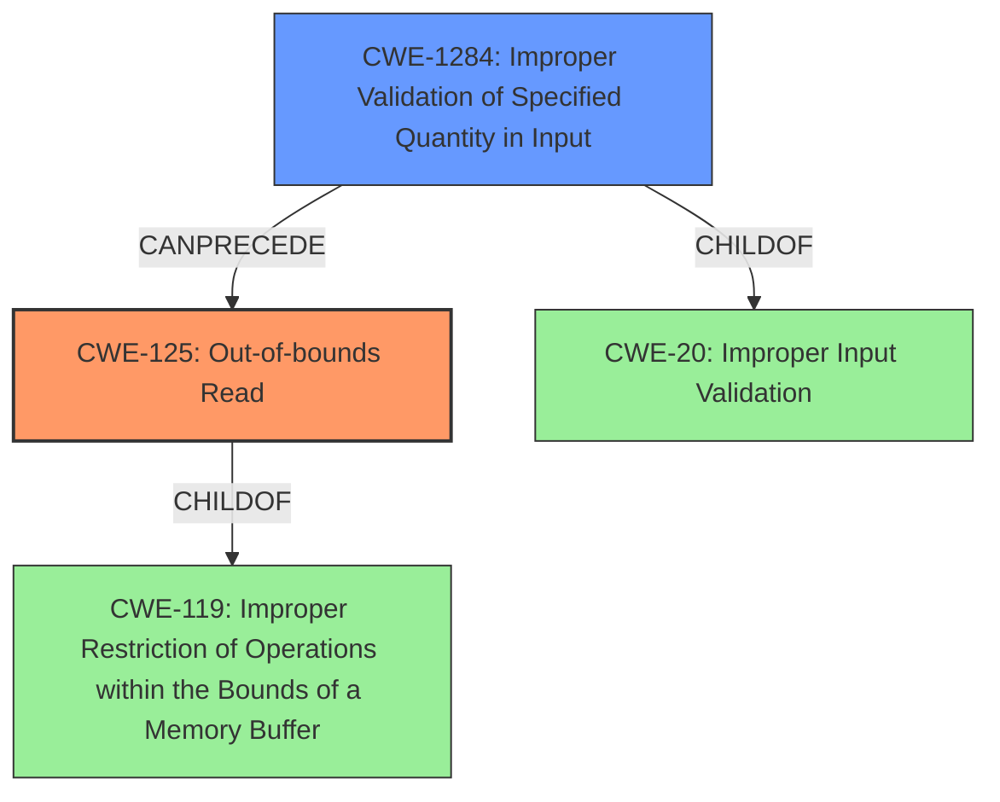

# Final Resolution for CVE-2022-32595

# Summary
| CWE ID | CWE Name | Confidence | CWE Abstraction Level | CWE Vulnerability Mapping Label | CWE-Vulnerability Mapping Notes |
|---|---|---|---|---|---|
| CWE-125 | Out-of-bounds Read | 0.95 | Base | Primary CWE | Allowed |
| CWE-1284 | Improper Validation of Specified Quantity in Input | 0.70 | Base | Secondary Candidate | Allowed |

## Evidence and Confidence

*   **Confidence Score:** 0.93
*   **Evidence Strength:** HIGH

## Relationship Analysis
The primary CWE is CWE-125 (**Out-of-bounds Read**), a base-level CWE. The secondary CWE is CWE-1284 (**Improper Validation of Specified Quantity in Input**), also a base-level CWE.

-   Parent-child hierarchical relationships: CWE-125 is a child of CWE-119 (**Improper Restriction of Operations within the Bounds of a Memory Buffer**). CWE-1284 is a child of CWE-20 (**Improper Input Validation**).
-   Chain relationships showing progression of vulnerability: An improper validation of quantity (CWE-1284) can lead to an out-of-bounds read (CWE-125).
-   Peer relationships that offered alternative classifications: CWE-20 was initially considered but CWE-1284 is more specific.
-   Abstraction levels: Both selected CWEs are at the base level, which is the preferred level of abstraction.

## Vulnerability Chain
The vulnerability chain starts with the **improper validation of a specified quantity in input** (CWE-1284). This leads to an **out-of-bounds read** (CWE-125), resulting in local information disclosure.

-   Initial flaw: **Incorrect bounds check** due to improper validation of quantity.
-   Weakness: **Out-of-bounds read**.
-   Impact: Local information disclosure.

## Summary of Analysis
The initial analysis correctly identified CWE-125 as the primary weakness given the vulnerability description of "out of bounds read due to an **incorrect bounds check**". The criticism suggested considering the input validation aspect more deeply.

The vulnerability description explicitly states an out-of-bounds read caused by an **incorrect bounds check**. This clearly aligns with CWE-125.

The suggestion to consider CWE-1284 (**Improper Validation of Specified Quantity in Input**) is valuable because the "incorrect bounds check" implies that the quantity (size/length) used for the bounds was not properly validated. While CWE-20 is a general input validation issue, CWE-1284 is more specific to quantity values, making it a better fit. The retriever results also show this to be a relevant result.

The decision to use CWE-125 as the primary CWE and CWE-1284 as a secondary contributing factor provides a more accurate and specific representation of the vulnerability. Both CWEs are at the base level of abstraction, which is the preferred level for mapping.