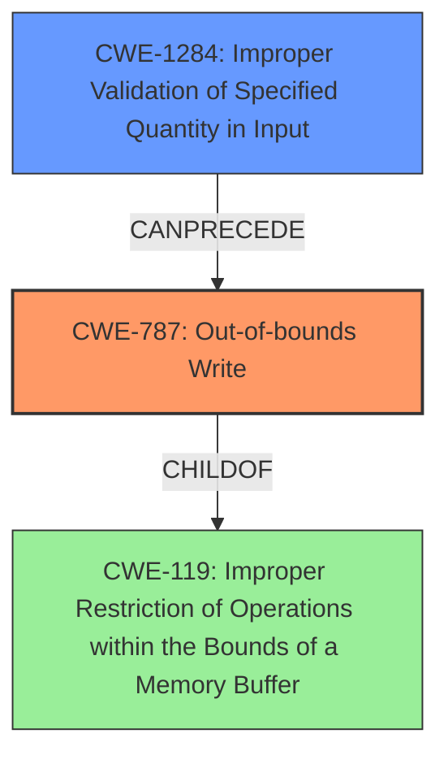

# Final Resolution for CVE-2022-32603

# Summary
| CWE ID | CWE Name | Confidence | CWE Abstraction Level | CWE Vulnerability Mapping Label | CWE-Vulnerability Mapping Notes |
|---|---|---|---|---|---|
| CWE-787 | Out-of-bounds Write | 0.95 | Base | Allowed | Primary CWE |
| CWE-1284 | Improper Validation of Specified Quantity in Input | 0.75 | Base | Allowed | Secondary Candidate, part of chain: CWE-1284 -> CWE-787 |

## Evidence and Confidence

*   **Confidence Score:** 0.90
*   **Evidence Strength:** HIGH

## Relationship Analysis
The primary relationship influencing the decision is the parent-child relationship between CWE-787 and CWE-119, ensuring that the more specific CWE-787 is chosen over the more general CWE-119. The chain relationship between CWE-1284 and CWE-787 highlights the progression of the vulnerability, starting with improper input validation leading to an out-of-bounds write.

## Vulnerability Chain
The vulnerability chain starts with **CWE-1284 (Improper Validation of Specified Quantity in Input)**, where the input size or length is not properly validated. This leads to **CWE-787 (Out-of-bounds Write)**, where the program writes data beyond the allocated buffer. The consequence of this is a local escalation of privilege.

## Summary of Analysis
The initial analysis and criticism are both well-reasoned and supported by the provided evidence. The vulnerability description clearly states an **"out of bounds write"** due to **"improper input validation,"** which directly maps to **CWE-787 (Out-of-bounds Write)**. The criticism correctly points out that the analysis appropriately avoids the more abstract **CWE-119 (Improper Restriction of Operations within the Bounds of a Memory Buffer)** by selecting the more precise **CWE-787**.

The relationship analysis influenced the final selection by confirming that **CWE-787** is the most specific and appropriate base-level representation of the **out-of-bounds write**. The chain relationship between **CWE-1284** and **CWE-787** helps to understand the progression of the vulnerability. As the criticism highlights, **CWE-1284** is part of a chain where it can lead to **CWE-787**: `CWE-1284 -> CWE-787`.

The selection of **CWE-787** and **CWE-1284** is at the optimal level of specificity because they accurately represent the **rootcause** and impact of the vulnerability, based on the available evidence. Both are also base level CWEs.