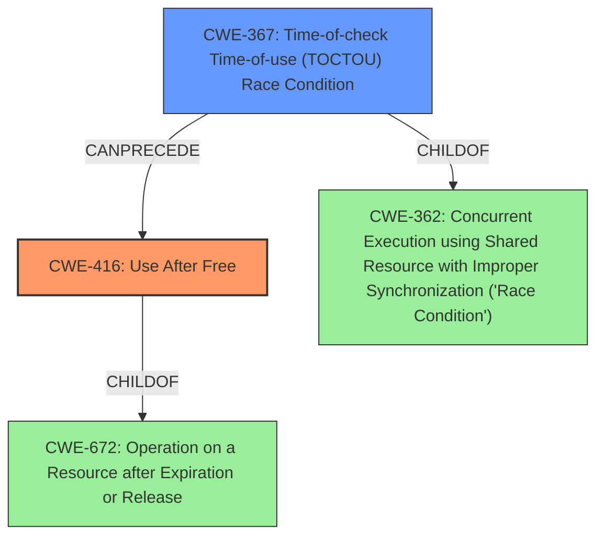

# Final Resolution for CVE-2022-32608

# Summary
| CWE ID | CWE Name | Confidence | CWE Abstraction Level | CWE Vulnerability Mapping Label | CWE-Vulnerability Mapping Notes |
|---|---|---|---|---|---|
| CWE-416 | Use After Free | 0.95 | Variant | Primary | Allowed | Caused by accessing memory after it has been freed. The most effective mitigation is using languages with automatic memory management. |
| CWE-367 | Time-of-check Time-of-use (TOCTOU) Race Condition | 0.80 | Base | Secondary Candidate | Allowed | The **race condition** enables the **use after free** by allowing a resource to be freed between a check and use. Careful design to avoid unnecessary checks before using shared resources is crucial. Also consider CWE-362 (CWE-362: Concurrent Execution using Shared Resource with Improper Synchronization ('Race Condition')) as a more general alternative. |

## Evidence and Confidence

*   **Confidence Score:** 0.95
*   **Evidence Strength:** HIGH

## Relationship Analysis
The primary CWE is CWE-416 (**Use After Free**), which is a Variant of CWE-672 (Operation on a Resource after Expiration or Release). This hierarchical relationship confirms that CWE-416 is a specific case of operating on a resource that has been released. The secondary CWE, CWE-367 (**Time-of-check Time-of-use (TOCTOU) Race Condition**), represents the root cause that allows the **use-after-free** to occur. CWE-367 is a child of CWE-362 (CWE-362: Concurrent Execution using Shared Resource with Improper Synchronization ('Race Condition')), indicating that it is a specific type of **race condition**.

## Vulnerability Chain
The vulnerability chain begins with a **race condition** (CWE-367), where a check on a resource's state is invalidated by another thread before the resource is used. This leads to the resource being freed while another thread still holds a reference to it. Subsequently, the thread attempts to access the freed memory, resulting in a **use-after-free** (CWE-416). The impact is a local escalation of privilege with System execution privileges needed.

## Summary of Analysis
The initial analysis correctly identified CWE-416 (**Use After Free**) as the primary weakness and CWE-367 (**Time-of-check Time-of-use (TOCTOU) Race Condition**) as a secondary candidate. The evidence provided supports this classification, as the vulnerability description clearly states a **race condition** leading to a **use-after-free**. The graph relationships further reinforce this, with CWE-416 being a specific type of CWE-672 and CWE-367 being a specific type of CWE-362.

The decision to classify CWE-416 as primary is based on the immediate result of the vulnerability being the **use after free**. CWE-367 is a contributing factor, enabling the primary weakness. Both CWEs are at appropriate levels of abstraction (Variant and Base, respectively).

The analysis relies heavily on the provided evidence from the vulnerability description: "there is a possible **use after free** due to a **race condition**." This statement directly supports the selection of CWE-416 and CWE-367. The retriever results also support this with CWE-367 and CWE-416 as top results, along with the related CWEs CWE-366 and CWE-362.