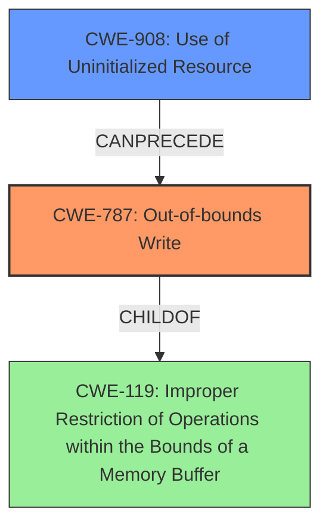

# Analysis Report for CVE-2022-32615

# Vulnerability Analysis Report: CVE-2022-32615

## Description

In ccd, there is a possible out of bounds write due to uninitialized data. This could lead to local escalation of privilege with System execution privileges needed. User interaction is not needed for exploitation. Patch ID ALPS07326559 Issue ID ALPS07326559.

## Vulnerability Description Key Phrases

**Rootcause:** uninitialized data
**Weakness:** out of bounds write
**Impact:** local escalation of privilege
**Product:** Android
**Component:** ccd

## Analysis (with Relationship Data)

# Summary
| CWE ID  | CWE Name                                                     | Confidence | CWE Abstraction Level | CWE Vulnerability Mapping Label | CWE-Vulnerability Mapping Notes |
| :-------- | :----------------------------------------------------------- | :---------- | :---------------------- | :------------------------------ | :------------------------------ |
| CWE-787 | Out-of-bounds Write | 0.95      | Base                      | Allowed                         |                                 |
| CWE-908 | Use of Uninitialized Resource | 0.85      | Base                      | Allowed                         |                                 |

## Evidence and Confidence

*   **Confidence Score:** 0.90
*   **Evidence Strength:** HIGH

- **Analysis and Justification:**
  - *Explanation:* The vulnerability description explicitly states "**out of bounds write** due to **uninitialized data**". The "CVE Reference Links Content Summary" reinforces this, stating that the vulnerability stems from "an out-of-bounds write can occur due to the use of uninitialized data." This aligns directly with CWE-787 (Out-of-bounds Write), which describes a condition where the product writes data past the end of the intended buffer. The root cause is described as "**uninitialized data**" which aligns to CWE-908 (Use of Uninitialized Resource).
  - *Relationship Analysis:* CWE-787 is a child of CWE-119 (Improper Restriction of Operations within the Bounds of a Memory Buffer). CWE-908 can lead to CWE-787 because the use of uninitialized data can cause unexpected values that lead to an out-of-bounds write.

- **Confidence Score:**
  - Confidence: 0.95 (High confidence due to clear technical description and CVE reference confirming the **out of bounds write** and the **uninitialized data**.)
---
- **Analysis and Justification:**
  - *Explanation:* The vulnerability description states the rootcause is "**uninitialized data**" which aligns with CWE-908 (Use of Uninitialized Resource). The "CVE Reference Links Content Summary" supports this, stating "an out-of-bounds write can occur due to the use of **uninitialized data**."
  - *Relationship Analysis:* No direct relationships found.

- **Confidence Score:**
  - Confidence: 0.85 (High confidence because the vulnerability description and CVE reference material clearly point to the use of **uninitialized data** as the root cause)

## Criticism of Analysis

Okay, let's review the provided analysis and the CWE specifications to provide a critique.

**Overall Assessment:**

The analysis is generally good and correctly identifies the two main CWEs: `CWE-787: Out-of-bounds Write` and `CWE-908: Use of Uninitialized Resource`. The confidence levels assigned (0.95 and 0.85, respectively) are reasonable given the available information.  The justification for the mappings is also well-articulated.

**Detailed Critique:**

1.  **CWE-787: Out-of-bounds Write:**

    *   **Mapping:** The mapping to `CWE-787` is accurate. The description explicitly states an out-of-bounds write, and the CVE Reference Links Content Summary corroborates this.
    *   **Abstraction Level:** `CWE-787` is a "Base" level CWE, which is preferred.
    *   **Relationships:** The analysis correctly identifies that `CWE-787` is a child of `CWE-119`.
    *   **Confidence:** Confidence of 0.95 is justified.
    *   **Mitigations:** The analysis could have been strengthened by referencing some of the mitigations suggested for `CWE-787`.  For example, mentioning using a language that prevents out-of-bounds writes (e.g., Java, C# with appropriate safeguards) or using libraries like SafeStr would have added value. Emphasizing the importance of compiler-based overflow detection mechanisms (e.g., /GS flag in Visual Studio) would also be helpful.
    *   **CWE-119 Consideration:** It is good that the analysis points out that `CWE-787` is a child of `CWE-119`. It also acknowledges the guidance that `CWE-119` is discouraged and that more specific CWEs should be used where possible.

2.  **CWE-908: Use of Uninitialized Resource:**

    *   **Mapping:** The mapping to `CWE-908` is also correct. The description directly points to "uninitialized data" as the root cause.
    *   **Abstraction Level:** `CWE-908` is a "Base" level CWE.
    *   **Relationships:** No direct relationships were identified which is correct since it is often a root cause.
    *   **Confidence:** Confidence of 0.85 is justified.
    *   **Mitigations:** The analysis could have been improved by including some of the mitigations for `CWE-908`.  Specifically, emphasizing the need to *explicitly initialize the resource before use* is crucial.  Highlighting the importance of checking complex conditionals that might prevent initialization is also a good point to include.
    * **Link to CWE-787 Mitigations:** While it is correct that they are separate CWEs, a more detailed analysis could explain that mitigating `CWE-908` could prevent the conditions that lead to `CWE-787`.

3.  **Overall Structure and Clarity:**

    *   The use of bullet points and clear headings makes the analysis easy to follow.
    *   The "Evidence Strength" being HIGH is accurate.
    *   The analysis effectively incorporates information from both the vulnerability description and the CVE reference summary.

**Suggestions for Improvement:**

*   **Chain Perspective:** explicitly discussing the chain-like relationship between `CWE-908` and `CWE-787`. Uninitialized data (CWE-908) can lead to unexpected or arbitrary values being used, which can then cause an out-of-bounds write (CWE-787).
*   **Mitigation Details:** Expand on the "Potential Mitigations" sections by referencing specific techniques from the CWE specifications. This would make the analysis more actionable.
*   **Consider Specific Variants of CWE-787:** In some cases, more specific variants such as `CWE-122` (Heap-based Buffer Overflow) or `CWE-121` (Stack-based Buffer Overflow) might be applicable if more information about the memory allocation is available. However, without that information, `CWE-787` is the correct general choice.
*   **Consider alternative CWEs from Retriever Results**: Several other CWEs were identified by the retriever results such as `CWE-131: Incorrect Calculation of Buffer Size`, `CWE-191: Integer Underflow`, `CWE-190: Integer Overflow` and `CWE-416: Use After Free`. The analysis could be improved by explaining why these CWEs were not selected despite being identified by the retriever results. For example, integer overflows/underflows are often related, but unless there's an *explicit* calculation of the buffer size or indexing going wrong, it's not appropriate to add those CWEs. `CWE-416` requires more information than is currently available to justify its inclusion.
*   **Usefulness of Provided Examples**: While the provided examples for each CWE are useful, a better analysis would explain if the CVE being reviewed is similar to any of the provided examples.
*   **Input Validation (CWE-20):** While the vulnerability is not *directly* caused by `CWE-20`, it's worth acknowledging that improper or missing input validation somewhere in the processing chain could contribute to the issue. If a size or offset is ultimately derived from external input, a discussion of this could be useful.

**Revised Summary (Including Suggestions):**

| CWE ID  | CWE Name                                                     | Confidence | CWE Abstraction Level | CWE Vulnerability Mapping Label | CWE-Vulnerability Mapping Notes |
| :-------- | :----------------------------------------------------------- | :---------- | :---------------------- | :------------------------------ | :------------------------------ |
| CWE-787 | Out-of-bounds Write | 0.95      | Base                      | Allowed                         |                                 |
| CWE-908 | Use of Uninitialized Resource | 0.85      | Base                      | Allowed                         |                                 |

**Revised Analysis Excerpts (Illustrative):**

*   **For CWE-787 Mitigation:** "...Mitigation strategies include using memory-safe languages or libraries, employing compiler-based overflow detection (e.g., the /GS flag in Microsoft Visual Studio, AddressSanitizer (ASan)), and rigorously validating buffer sizes before write operations.  Preventing `CWE-908` (Use of Uninitialized Resource) is a critical step, as using uninitialized data can lead to unpredictable values being written, triggering the out-of-bounds condition."

*   **For CWE-908 Mitigation:** "...Mitigations focus on ensuring explicit initialization of all resources before use.  Pay particular attention to conditional logic where initialization might be skipped. Avoid race conditions in initialization routines, especially in multi-threaded environments. This can, in turn, help prevent `CWE-787` by ensuring predictable and safe values are used in buffer operations."

By incorporating these suggestions, the analysis would be even more comprehensive and actionable.

## Final Resolution

# Summary
| CWE ID  | CWE Name                                                     | Confidence | CWE Abstraction Level | CWE Vulnerability Mapping Label | CWE-Vulnerability Mapping Notes |
| :-------- | :----------------------------------------------------------- | :---------- | :---------------------- | :------------------------------ | :------------------------------ |
| CWE-787 | Out-of-bounds Write | 0.95      | Base                      | Allowed                         | Primary CWE |
| CWE-908 | Use of Uninitialized Resource | 0.85      | Base                      | Allowed                         | Secondary Candidate |

## Evidence and Confidence

*   **Confidence Score:** 0.92
*   **Evidence Strength:** HIGH

## Relationship Analysis
The primary relationship is that **CWE-908 (Use of Uninitialized Resource)** can *precede* **CWE-787 (Out-of-bounds Write)**. The uninitialized resource results in unpredictable values which leads to a write outside the intended buffer. Both CWEs are at the Base level, providing the optimal specificity. **CWE-787** is a child of **CWE-119 (Improper Restriction of Operations within the Bounds of a Memory Buffer)**. However, **CWE-787** is more specific and therefore preferred.

## Vulnerability Chain
The vulnerability chain starts with **CWE-908 (Use of Uninitialized Resource)**. Because the resource isn't initialized, it contains an arbitrary value. This value is then used in a write operation, leading to **CWE-787 (Out-of-bounds Write)**. The impact is local escalation of privilege. There are no missing links in the chain.

## Summary of Analysis
The initial analysis and the criticism are both accurate. The vulnerability description clearly states "**out of bounds write** due to **uninitialized data**." This supports the selection of **CWE-787 (Out-of-bounds Write)** and **CWE-908 (Use of Uninitialized Resource)**.

The relationship analysis confirms that **CWE-908** can lead to **CWE-787**. The abstraction levels are appropriate (Base).

The retriever results suggested other CWEs, such as **CWE-131 (Incorrect Calculation of Buffer Size)**, **CWE-190 (Integer Overflow or Wraparound)**, and **CWE-416 (Use After Free)**, but these are not directly supported by the vulnerability description. There is no mention of buffer size calculations or memory management issues beyond the uninitialized data. Therefore, sticking to **CWE-787** and **CWE-908** is the most accurate and evidence-based decision.

The selected CWEs are at the optimal level of specificity because they directly address the root cause (**uninitialized data**) and the resulting vulnerability (**out-of-bounds write**).

*Report generated on 2025-03-18 14:12:23*
