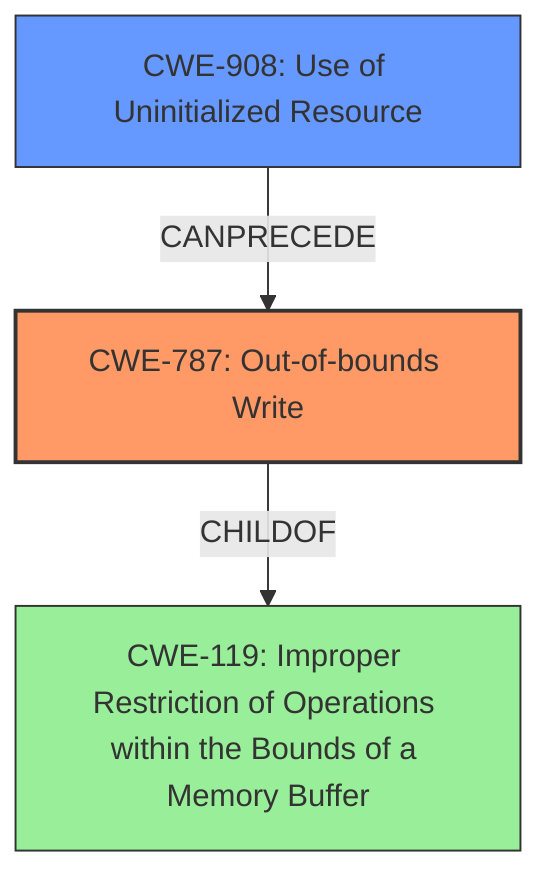

# Final Resolution for CVE-2022-32615

# Summary
| CWE ID  | CWE Name                                                     | Confidence | CWE Abstraction Level | CWE Vulnerability Mapping Label | CWE-Vulnerability Mapping Notes |
| :-------- | :----------------------------------------------------------- | :---------- | :---------------------- | :------------------------------ | :------------------------------ |
| CWE-787 | Out-of-bounds Write | 0.95      | Base                      | Allowed                         | Primary CWE |
| CWE-908 | Use of Uninitialized Resource | 0.85      | Base                      | Allowed                         | Secondary Candidate |

## Evidence and Confidence

*   **Confidence Score:** 0.92
*   **Evidence Strength:** HIGH

## Relationship Analysis
The primary relationship is that **CWE-908 (Use of Uninitialized Resource)** can *precede* **CWE-787 (Out-of-bounds Write)**. The uninitialized resource results in unpredictable values which leads to a write outside the intended buffer. Both CWEs are at the Base level, providing the optimal specificity. **CWE-787** is a child of **CWE-119 (Improper Restriction of Operations within the Bounds of a Memory Buffer)**. However, **CWE-787** is more specific and therefore preferred.

## Vulnerability Chain
The vulnerability chain starts with **CWE-908 (Use of Uninitialized Resource)**. Because the resource isn't initialized, it contains an arbitrary value. This value is then used in a write operation, leading to **CWE-787 (Out-of-bounds Write)**. The impact is local escalation of privilege. There are no missing links in the chain.

## Summary of Analysis
The initial analysis and the criticism are both accurate. The vulnerability description clearly states "**out of bounds write** due to **uninitialized data**." This supports the selection of **CWE-787 (Out-of-bounds Write)** and **CWE-908 (Use of Uninitialized Resource)**.

The relationship analysis confirms that **CWE-908** can lead to **CWE-787**. The abstraction levels are appropriate (Base).

The retriever results suggested other CWEs, such as **CWE-131 (Incorrect Calculation of Buffer Size)**, **CWE-190 (Integer Overflow or Wraparound)**, and **CWE-416 (Use After Free)**, but these are not directly supported by the vulnerability description. There is no mention of buffer size calculations or memory management issues beyond the uninitialized data. Therefore, sticking to **CWE-787** and **CWE-908** is the most accurate and evidence-based decision.

The selected CWEs are at the optimal level of specificity because they directly address the root cause (**uninitialized data**) and the resulting vulnerability (**out-of-bounds write**).