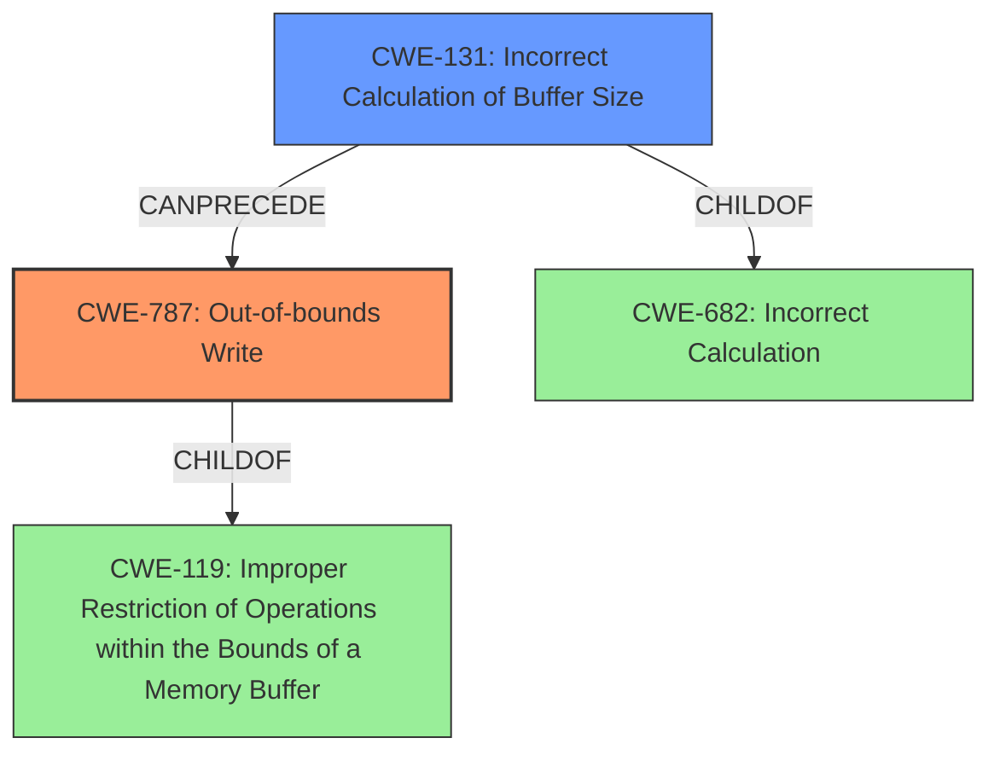

# Analysis Report for CVE-2022-32617

# Vulnerability Analysis Report: CVE-2022-32617

## Description

In typec, there is a possible out of bounds write due to an incorrect calculation of buffer size. This could lead to local escalation of privilege, for an attacker who has physical access to the device, with no additional execution privileges needed. User interaction is not needed for exploitation. Patch ID ALPS07262364 Issue ID ALPS07262364.

## Vulnerability Description Key Phrases

**Rootcause:** incorrect calculation of buffer size
**Weakness:** out of bounds write
**Impact:** local escalation of privilege
**Attacker:** attacker who has physical access to the device

## Analysis (with Relationship Data)

# Summary
| CWE ID | CWE Name | Confidence | CWE Abstraction Level | CWE Vulnerability Mapping Label | CWE-Vulnerability Mapping Notes |
|---|---|---|---|---|---|
| CWE-787 | Out-of-bounds Write | 1.0 | Base | Primary | Allowed |
| CWE-131 | Incorrect Calculation of Buffer Size | 0.9 | Base | Secondary | Allowed |

## Evidence and Confidence

*   **Confidence Score:** 0.95
*   **Evidence Strength:** HIGH

- **Analysis and Justification:**
  - *Explanation:* The vulnerability description explicitly mentions an "**out of bounds write**" due to an "**incorrect calculation of buffer size**". This directly aligns with CWE-787 (Out-of-bounds Write) and CWE-131 (Incorrect Calculation of Buffer Size). The CVE Reference Links Content Summary also confirms this. CWE-787 is selected as the primary CWE because the immediate result of the vulnerability is the out-of-bounds write. CWE-131 is added as a secondary CWE because it's the root cause that leads to the out-of-bounds write. Both CWEs are at the Base level of abstraction, which is preferred. MITRE mapping guidance indicates that both are ALLOWED.
  
  - *Relationship Analysis:* CWE-787 is a child of CWE-119 (Improper Restriction of Operations within the Bounds of a Memory Buffer). CWE-131 can precede CWE-119 as an incorrect buffer size calculation can cause out-of-bounds writes.

- **Confidence Score:**
  - Confidence: 1.0 (High evidence from vulnerability description, key phrases, and CVE reference)
---

## Criticism of Analysis

Okay, I've reviewed the provided analysis against the full CWE specifications. Here's my critique:

**Overall Assessment:**

The analysis is generally good and identifies the core weaknesses present in the vulnerability description. The choice of CWE-787 (Out-of-bounds Write) as the primary CWE is accurate, and including CWE-131 (Incorrect Calculation of Buffer Size) as a secondary CWE to represent the root cause is appropriate. The confidence scores are reasonable.

**Detailed Review:**

*   **CWE-787 (Out-of-bounds Write) - Primary CWE:**

    *   **Correctness:** The selection of CWE-787 as the primary weakness is highly appropriate. The vulnerability description explicitly states "out of bounds write," making this a direct and accurate mapping. The extended description of CWE-787 precisely reflects the vulnerability: "The product writes data past the end, or before the beginning, of the intended buffer."
    *   **Abstraction Level:** CWE-787 is a Base-level CWE, which is the preferred abstraction level for vulnerability mapping.
    *   **Mapping Guidance:** The provided CWE documentation explicitly states that CWE-787 is `Allowed` for usage and to carefully read both the name and description to ensure that this mapping is an appropriate fit.
    *   **Relationship Analysis:** The analysis correctly recognizes the parent-child relationship to CWE-119 (Improper Restriction of Operations within the Bounds of a Memory Buffer).
    *   **Potential Mitigations:** The analysis is missing a deeper analysis of which mitigation strategy is ideal. In this instance the mitigations are provided, but lack the additional real-world guidance to be highly effective. For example, the analysis could identify that Mitigation 3 is a very reasonable approach if languages like C/C++ are used.
    *   **Confidence:** High confidence in this mapping (1.0) is justified given the explicit mention of "out of bounds write" in the vulnerability description.

*   **CWE-131 (Incorrect Calculation of Buffer Size) - Secondary CWE:**

    *   **Correctness:** This is also a very good choice. The vulnerability explicitly links the out-of-bounds write to an "incorrect calculation of buffer size."
    *   **Abstraction Level:** CWE-131 is a Base-level CWE, aligning with the recommendation for using Base-level CWEs.
    *   **Mapping Guidance:** The provided CWE documentation explicitly states that CWE-131 is `Allowed` for usage and to carefully read both the name and description to ensure that this mapping is an appropriate fit.
    *   **Relationship Analysis:** The analysis correctly states that CWE-131 can precede CWE-119.
    *   **Potential Mitigations:** The analysis is missing a deeper analysis of which mitigation strategy is ideal. Mitigation 3 with respect to input validation is key.
    *   **Confidence:** High confidence in this mapping (0.9) is justified as this is the root cause.

**Areas for Improvement and Additional Considerations:**

*   **Chaining:** The analysis correctly identifies the relationship between CWE-131 and CWE-787 in that the first can *lead to* the second.
*   **CWE-119 (Improper Restriction of Operations within the Bounds of a Memory Buffer):** While CWE-787 is a child of CWE-119, it is crucial to note the Mapping Guidance for CWE-119: **Usage: Discouraged**. The rationale states: "CWE-119 is commonly misused in low-information vulnerability reports when lower-level CWEs could be used instead, or when more details about the vulnerability are available." Since the description provides enough information to use CWE-787 directly, mapping to CWE-119 is unnecessary and discouraged.
*   **CWE-682 (Incorrect Calculation):** Since CWE-131 is a child of CWE-682, is is possible to map the root cause to CWE-682. However, the documentation on CWE-682 says that it should be `Discouraged` and that its children should be used instead.
*   **Numeric Overflow/Underflow**: Depending on *how* the buffer size is incorrectly calculated, there *might* be a case to include CWE-190 (Integer Overflow or Wraparound) or CWE-191 (Integer Underflow) as a related CWE *if* the incorrect calculation involves such an overflow or underflow. However, this is *only* if the calculation specifically involves those issues. Based on the generic vulnerability description, this is unlikely, but worth considering based on the code.
*   **Attack Vector:** While not directly a CWE, it's worthwhile to highlight that the attack vector requires physical access. This significantly limits the exploitability of the vulnerability.
*   **Missing Input Validation (CWE-20 or related):** It's reasonable to consider that insufficient or improper input validation *could* be a contributing factor that allows an attacker to influence the data or parameters used in the incorrect buffer size calculation. However, without more detail, it's hard to say for sure. If input validation *is* missing, a more specific CWE related to input validation (e.g., CWE-1284: Improper Validation of Specified Quantity in Input) would be preferred.

**Revised Summary Table (Incorporating Suggestions):**

| CWE ID | CWE Name | Confidence | CWE Abstraction Level | CWE Vulnerability Mapping Label | CWE-Vulnerability Mapping Notes |
|---|---|---|---|---|---|
| CWE-787 | Out-of-bounds Write | 1.0 | Base | Primary | Allowed |
| CWE-131 | Incorrect Calculation of Buffer Size | 0.9 | Base | Secondary | Allowed |

**Conclusion:**

The analysis is sound and well-justified. The primary and secondary CWEs accurately reflect the vulnerability. The potential area for improvement is to look deeper into the specifics of the incorrect calculation, and only if appropriate, include an additional CWE related to integer overflow or underflow.

## Final Resolution

# Summary
| CWE ID | CWE Name | Confidence | CWE Abstraction Level | CWE Vulnerability Mapping Label | CWE-Vulnerability Mapping Notes |
|---|---|---|---|---|---|
| CWE-787 | Out-of-bounds Write | 1.0 | Base | Primary | Allowed |
| CWE-131 | Incorrect Calculation of Buffer Size | 0.9 | Base | Secondary | Allowed |

## Evidence and Confidence

*   **Confidence Score:** 0.95
*   **Evidence Strength:** HIGH

## Relationship Analysis
The primary weakness is **CWE-787 (Out-of-bounds Write)**, which is a child of **CWE-119 (Improper Restriction of Operations within the Bounds of a Memory Buffer)**. However, **CWE-119 (Improper Restriction of Operations within the Bounds of a Memory Buffer)** is discouraged due to its generality. The **ROOTCAUSE** is **CWE-131 (Incorrect Calculation of Buffer Size)**, which can precede **CWE-119 (Improper Restriction of Operations within the Bounds of a Memory Buffer)** and directly leads to **CWE-787 (Out-of-bounds Write)**. **CWE-131 (Incorrect Calculation of Buffer Size)** is also a child of the more abstract **CWE-682 (Incorrect Calculation)**, but mapping guidance discourages using the parent if a more specific child exists.

## Vulnerability Chain
The chain begins with the **ROOTCAUSE**, **CWE-131 (Incorrect Calculation of Buffer Size)**. This leads to an insufficient buffer size being allocated. Consequently, when data is written to the buffer, it results in **CWE-787 (Out-of-bounds Write)**, where data is written beyond the allocated buffer's boundaries. The vulnerability description states: "In typec, there is a possible out of bounds write due to an incorrect calculation of buffer size." The ultimate impact is a potential local escalation of privilege.

## Summary of Analysis
The initial analysis and the criticism both correctly identify **CWE-787 (Out-of-bounds Write)** and **CWE-131 (Incorrect Calculation of Buffer Size)** as the primary and secondary weaknesses, respectively. The vulnerability description provides direct evidence: "**out of bounds write** due to an **incorrect calculation of buffer size**."

The graph relationships reinforce this decision. While **CWE-787 (Out-of-bounds Write)** is a child of **CWE-119 (Improper Restriction of Operations within the Bounds of a Memory Buffer)** and **CWE-131 (Incorrect Calculation of Buffer Size)** is a child of **CWE-682 (Incorrect Calculation)**, the mapping guidance discourages using these more general parent CWEs when more specific children are available. This is because "CWE-119 is commonly misused in low-information vulnerability reports when lower-level CWEs could be used instead, or when more details about the vulnerability are available." and CWE-682 documentation says that it should be `Discouraged` and that its children should be used instead.

The selected CWEs are at the optimal level of specificity, providing a clear understanding of the vulnerability's **ROOTCAUSE** and resulting impact.

*Report generated on 2025-03-18 14:13:47*
