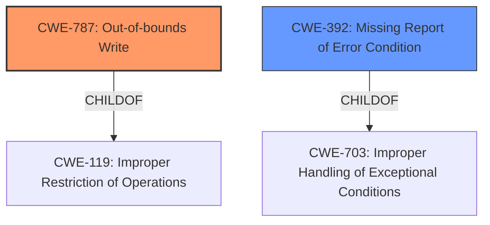

# Final Resolution for CVE-2022-32623

# Summary
| CWE ID | CWE Name | Confidence | CWE Abstraction Level | CWE Vulnerability Mapping Label | CWE-Vulnerability Mapping Notes |
|---|---|---|---|---|---|
| **CWE-787** | **Out-of-bounds Write** | 0.9 | Base | Primary CWE | Allowed |
| **CWE-392** | **Missing Report of Error Condition** | 0.7 | Base | Secondary CWE | Allowed |

## Evidence and Confidence

*   **Confidence Score:** 0.8
*   **Evidence Strength:** MEDIUM

## Relationship Analysis
The primary **weakness** is clearly an out-of-bounds write (CWE-787), which is a child of CWE-119 (Improper Restriction of Operations within the Bounds of a Memory Buffer). The secondary **weakness**, originally identified as CWE-703 (Improper Handling of Exceptional Conditions), is too abstract. The criticism suggested more specific alternatives. After reviewing the options and considering that the vulnerability description mentions "**incorrect error handling**," CWE-392 (Missing Report of Error Condition) seems more appropriate because it suggests the error was not properly reported. CWE-392 is a child of CWE-703.

## Vulnerability Chain
The chain of events starts with an error condition occurring within the `mdp` component. This error is not properly reported (CWE-392), leading to a failure to handle the exceptional condition correctly. Consequently, data is written beyond the boundaries of the allocated buffer (CWE-787), resulting in a local escalation of privilege.

## Summary of Analysis
The initial analysis correctly identified CWE-787 as the primary **weakness**. The criticism correctly pointed out that CWE-703 is too abstract and suggested considering its children. Based on the vulnerability description, which mentions "**incorrect error handling**", CWE-392 (Missing Report of Error Condition) is a more accurate and specific representation of the **root cause** than CWE-703. The evidence directly supports the out-of-bounds write, and the phrase "**incorrect error handling**" from the vulnerability description supports the selection of CWE-392. This results in the chain: a missing error report leading to an out-of-bounds write, which allows for local escalation of privilege. The selected CWEs are at the optimal level of specificity because they accurately describe the vulnerability and its **root cause** based on the available evidence.