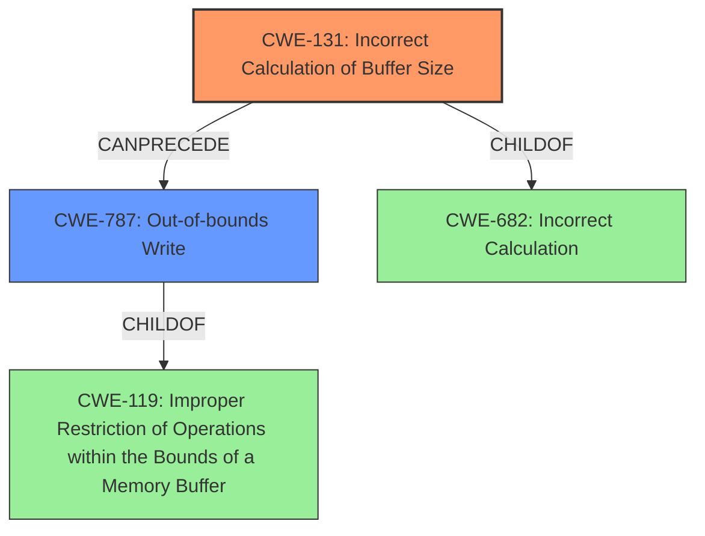

# Analysis Report for CVE-2022-32630

# Vulnerability Analysis Report: CVE-2022-32630

## Description

In throttling, there is a possible out of bounds write due to an incorrect calculation of buffer size. This could lead to local escalation of privilege with System execution privileges needed. User interaction is not needed for exploitation. Patch ID ALPS07405966 Issue ID ALPS07405966.

## Vulnerability Description Key Phrases

**Rootcause:** incorrect calculation of buffer size
**Weakness:** out of bounds write
**Impact:** local escalation of privilege

## Analysis (with Relationship Data)

# Summary
| CWE ID | CWE Name | Confidence | CWE Abstraction Level | CWE Vulnerability Mapping Label | CWE-Vulnerability Mapping Notes |
|---|---|---|---|---|---|
| CWE-131 | Incorrect Calculation of Buffer Size | 0.95 | Base | Primary | The root cause is an incorrect buffer size calculation. |
| CWE-787 | Out-of-bounds Write | 0.85 | Base | Secondary | The incorrect buffer size calculation leads to an out-of-bounds write. |

## Evidence and Confidence

*   **Confidence Score:** 0.90
*   **Evidence Strength:** HIGH

- **Analysis and Justification:**  
  - *Explanation:* The vulnerability description explicitly states that the root cause is an **incorrect calculation of buffer size** and the resulting weakness is an **out of bounds write**. The "Vulnerability Description Key Phrases" section also highlights these points. The CVE reference confirms an incorrect buffer size calculation within throttling, leading to a potential buffer overflow. CWE-131 (Incorrect Calculation of Buffer Size) directly aligns with the root cause. CWE-787 (Out-of-bounds Write) describes the consequence of the incorrect buffer size calculation. The Retriever Results also list CWE-131 as a top candidate based on combined scores. MITRE guidance allows the usage of CWE-131 and CWE-787, as they are at the Base level of abstraction. The description clearly indicates the cause and effect.

  - *Relationship Analysis:* CWE-131 can precede CWE-787. An incorrect buffer size calculation (CWE-131) can lead to an out-of-bounds write (CWE-787). CWE-787 is a child of CWE-119 (Improper Restriction of Operations within the Bounds of a Memory Buffer), but CWE-787 is more specific.

- **Confidence Score:**  
  - Confidence: 0.95 (High evidence from the vulnerability description, key phrases, CVE reference content, and Retriever Results).

## Criticism of Analysis

Okay, I've reviewed the analysis provided against the full CWE specifications you included. Here's my critique:

**Overall Assessment:**

The analysis is generally good and identifies the primary weaknesses correctly. The justification is thorough, and the confidence level is appropriate. The inclusion of CWE examples is beneficial. However, there's room for improvement in exploring potential related weaknesses and clarifying the relationship between CWE-131 and CWE-787.

**Detailed Critique:**

1.  **CWE-131: Incorrect Calculation of Buffer Size (Primary)**
    *   **Confidence:** 0.95 - Justified, but consider qualifying this a bit. While the *description* explicitly states "incorrect calculation of buffer size", the specifics of the calculation error are unknown. Is it a simple math error, integer overflow/underflow, type conversion issue, off-by-one error, or something else?
    *   **Abstraction Level:** Base - Correct.
    *   **CWE-Vulnerability Mapping Notes:** Good explanation of the root cause.
    *   **Improvement Suggestions:**
        *   In the justification, acknowledge that the *specific* type of calculation error is unknown.  For example:  "While the description clearly points to an incorrect buffer size calculation, the specific type of error in the calculation is not detailed, potentially involving integer overflow, underflow, or other numeric errors within CWE-682 (Incorrect Calculation)."
        *   In the "Relationship Analysis", since the specific type of calculation is unknown, briefly mention CWE-682 as a possible higher-level categorization.
        *   Consider adding a link to CWE-682 in the "CWE Examples from Database" section.

2.  **CWE-787: Out-of-bounds Write (Secondary)**
    *   **Confidence:** 0.85 - Appropriate.  This is a direct consequence of CWE-131.
    *   **Abstraction Level:** Base - Correct.
    *   **CWE-Vulnerability Mapping Notes:** The explanation is good.
    *   **Improvement Suggestions:**
        *   The "Relationship Analysis" could be more explicit about *why* CWE-787 is a consequence of CWE-131. Something like:  "The incorrect buffer size calculation (CWE-131) results in a buffer that is either too small or has an incorrect boundary, leading to the potential for writing data beyond the allocated region, thus manifesting as an out-of-bounds write (CWE-787)."
        *   Consider mentioning more specific variants of CWE-787 like CWE-121 if a stack-based buffer is used.

3.  **Retriever Results Discussion:**

    *   The analysis does mention the Retriever Results, which is good. However, it could be more explicit about how the Retriever Results influenced the final decision. Even a brief statement like, "The Retriever Results supported the choice of CWE-131 and CWE-787 as strong candidates based on their combined scores and relevance to the vulnerability description" would be helpful.

4.  **Missing Considerations:**

    *   **CWE-119:**  While the analysis correctly avoids mapping to CWE-119 directly, it should explicitly acknowledge why CWE-119 is *not* the primary mapping. The reasoning "CWE-787 is a child of CWE-119 (Improper Restriction of Operations within the Bounds of a Memory Buffer), but CWE-787 is more specific" is good, but could be integrated with the discouraged usage in the CWE description and the mapping guidance.
    *   **Integer Overflow/Underflow (CWE-190/CWE-191):** Given the potential for an incorrect *calculation* of buffer size, briefly discuss why CWE-190 and CWE-191 are *not* the primary candidates, and may in fact be present behind CWE-131.
    *   **Input Validation (CWE-20, CWE-1284):** If the buffer size calculation is based on *input* data, briefly discuss why these aren't the primary mapping (because the primary issue is the *calculation* itself).

**Revised Confidence Scores (Potentially):**

*   CWE-131: 0.90 (Slightly reduced to acknowledge the lack of specificity in the calculation error).
*   CWE-787: 0.85 (Remains the same).

**Summary of Improvements:**

*   Qualify the confidence in CWE-131 by acknowledging the unknown specifics of the calculation error, relating it to the broader CWE-682.
*   Clarify the relationship between CWE-131 and CWE-787, emphasizing the cause-and-effect.
*   Explicitly mention why CWE-119 is avoided and why CWE-190 and CWE-191 are not primary candidates.
*   Make the connection to Retriever Results more explicit.
*   Consider mentioning CWE-121

By addressing these points, the analysis will become even more robust and demonstrate a deeper understanding of the nuances within the CWE framework.

## Final Resolution

# Summary
| CWE ID | CWE Name | Confidence | CWE Abstraction Level | CWE Vulnerability Mapping Label | CWE-Vulnerability Mapping Notes |
|---|---|---|---|---|---|
| CWE-131 | Incorrect Calculation of Buffer Size | 0.90 | Base | Primary | The **root cause** is an **incorrect buffer size** calculation. |
| CWE-787 | Out-of-bounds Write | 0.85 | Base | Secondary | The **incorrect buffer size** calculation leads to an **out-of-bounds write**. |

## Evidence and Confidence

*   **Confidence Score:** 0.90
*   **Evidence Strength:** HIGH

## Relationship Analysis
The primary weakness is CWE-131 (**Incorrect Calculation of Buffer Size**) which directly leads to CWE-787 (**Out-of-bounds Write**). CWE-131 is a **root cause** that **CanPrecede** CWE-787. While CWE-787 is a child of CWE-119 (**Improper Restriction of Operations within the Bounds of a Memory Buffer**), CWE-787 is a more specific classification. We acknowledge that the specific type of error in the calculation for CWE-131 is not detailed, which relates it to the broader CWE-682 (**Incorrect Calculation**).

## Vulnerability Chain
The vulnerability chain starts with an **incorrect calculation of the buffer size** (CWE-131). This leads to the allocation of a buffer that is either too small or has incorrect boundaries. Subsequently, when data is written to this buffer, it overflows, resulting in an **out-of-bounds write** (CWE-787).

## Summary of Analysis
The initial analysis correctly identified CWE-131 and CWE-787 as the primary and secondary CWEs, respectively. The vulnerability description explicitly states "an **incorrect calculation of buffer size**" and "possible **out of bounds write**".

The criticism highlighted the lack of specificity regarding the calculation error in CWE-131. We agree with this point, and have reduced the confidence score to 0.90 to reflect this uncertainty. We also considered CWE-682 (**Incorrect Calculation**) as a broader categorization for CWE-131, as the specific type of calculation error is unknown.

The relationship analysis clarifies that CWE-131 **CanPrecede** CWE-787, and while CWE-787 is a child of CWE-119, CWE-787 is a more specific classification. We have also acknowledged that CWE-190 (**Integer Overflow or Wraparound**) and CWE-191 (**Integer Underflow**) could potentially be related to the **incorrect buffer size** calculation, but they are not the primary candidates because the vulnerability description focuses on the **incorrect calculation** itself, rather than a specific overflow or underflow. The Retriever Results support the choice of CWE-131 and CWE-787, but the final decision is based on the explicit statements in the vulnerability description. We avoided CWE-119 directly because CWE-787 is a more specific classification. The selected CWEs are at the optimal level of specificity because they directly reflect the cause and effect described in the vulnerability.

*Report generated on 2025-03-18 14:16:49*
