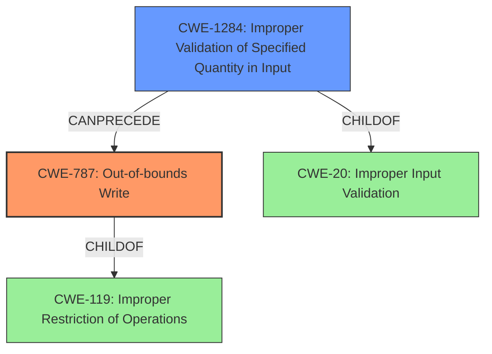

# Final Resolution for CVE-2022-32631

# Summary
| CWE ID | CWE Name | Confidence | CWE Abstraction Level | CWE Vulnerability Mapping Label | CWE-Vulnerability Mapping Notes |
|---|---|---|---|---|---|
| CWE-787 | Out-of-bounds Write | 1.00 | Base | Primary | Allowed |
| CWE-1284 | Improper Validation of Specified Quantity in Input | 0.75 | Base | Secondary | Allowed |

## Evidence and Confidence

*   **Confidence Score:** 0.95
*   **Evidence Strength:** HIGH

## Relationship Analysis
The primary weakness is **CWE-787 (Out-of-bounds Write)**, which is a child of **CWE-119 (Improper Restriction of Operations within the Bounds of a Memory Buffer)**. **CWE-1284 (Improper Validation of Specified Quantity in Input)** is included as a secondary weakness, as it represents the **rootcause** that leads to the **out-of-bounds write**. **CWE-1284** is a child of **CWE-20 (Improper Input Validation)**. The relationship between the two is a chain; **CWE-1284** CanPrecedes **CWE-787**, where the **improper input validation** results in the **out-of-bounds write**. Both **CWE-787** and **CWE-1284** are Base level CWEs. I considered **CWE-119** and **CWE-20**, but these are Class level CWEs and are discouraged for use when there is a more specific CWE available.

## Vulnerability Chain
The vulnerability chain starts with **CWE-1284 (Improper Validation of Specified Quantity in Input)**, where the input is not properly validated for size or length. This leads to **CWE-787 (Out-of-bounds Write)**, where data is written past the end of the allocated buffer. The final impact is local escalation of privilege with System execution privileges.

## Summary of Analysis
The initial analysis correctly identified **CWE-787 (Out-of-bounds Write)** as the primary weakness and **CWE-1284 (Improper Validation of Specified Quantity in Input)** as a secondary weakness. The vulnerability description explicitly states "out of bounds write due to improper input validation." This provides strong evidence for the selection of these CWEs. The relationships between the CWEs were also considered, with **CWE-1284** leading to **CWE-787**. The more general CWEs **CWE-119** and **CWE-20** were considered but ultimately not selected as they are discouraged when more specific CWEs exist. The selected CWEs are at the optimal level of specificity, as they provide a clear and accurate representation of the vulnerability.

I considered the retriever results and the suggested mitigations for both **CWE-787** and **CWE-1284**, but ultimately the classification decision was based on direct evidence of the **out-of-bounds write** condition and the **improper input validation**, as stated in the vulnerability description.