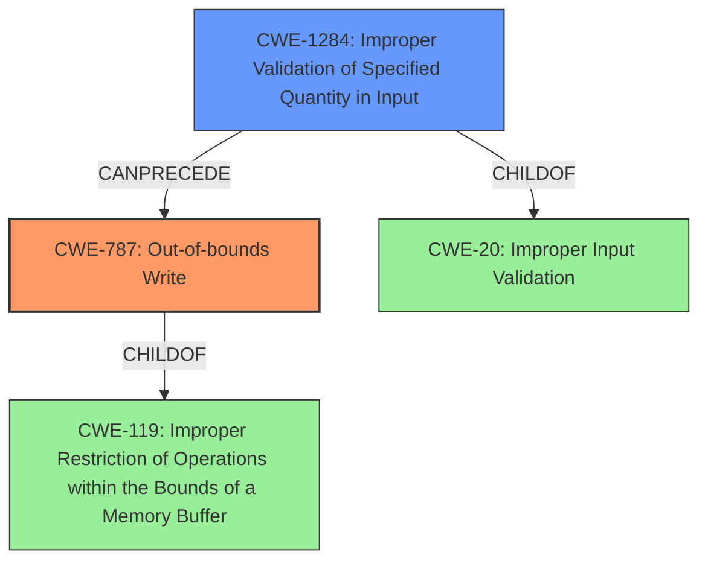

# Final Resolution for CVE-2022-32634

# Summary
| CWE ID | CWE Name | Confidence | CWE Abstraction Level | CWE Vulnerability Mapping Label | CWE-Vulnerability Mapping Notes |
|---|---|---|---|---|---|
| **CWE-787** | **Out-of-bounds Write** | 1.0 | Base | Primary | Allowed |
| **CWE-1284** | **Improper Validation of Specified Quantity in Input** | 0.85 | Base | Secondary | Allowed |

## Evidence and Confidence

*   **Confidence Score:** 0.93
*   **Evidence Strength:** HIGH

## Relationship Analysis
The primary **weakness** is **CWE-787 (Out-of-bounds Write)**, a base-level CWE that directly reflects the vulnerability description. It is a child of CWE-119. The **root cause** is **CWE-1284 (Improper Validation of Specified Quantity in Input)**, which is also a base-level CWE and a child of CWE-20, providing a more specific explanation for the **improper input validation**. The vulnerability chain progresses from **improper input validation** of a quantity to an **out-of-bounds write**.

## Vulnerability Chain
The vulnerability chain starts with the **root cause**, which is **CWE-1284 (Improper Validation of Specified Quantity in Input)**. A quantity, such as length or size, is not validated. This leads to **CWE-787 (Out-of-bounds Write)**, where data is written beyond the intended buffer. This results in a local escalation of privilege.

## Summary of Analysis
The initial analysis correctly identified **CWE-787 (Out-of-bounds Write)** but used the overly broad **CWE-20 (Improper Input Validation)** as a secondary CWE. The criticism correctly pointed out that **CWE-20 (Improper Input Validation)** is discouraged and suggested more specific alternatives. Based on the vulnerability description stating "**out of bounds write due to improper input validation**," **CWE-1284 (Improper Validation of Specified Quantity in Input)** is a more precise and appropriate classification. The vulnerability description explicitly states "**out of bounds write due to improper input validation**" so the evidence to support the classification is strong. The graph relationships confirm that **CWE-1284 (Improper Validation of Specified Quantity in Input)** can precede **CWE-787 (Out-of-bounds Write)** in a vulnerability chain. The selected CWEs are at the optimal level of specificity, with **CWE-787 (Out-of-bounds Write)** representing the direct consequence and **CWE-1284 (Improper Validation of Specified Quantity in Input)** identifying the specific type of input validation error.