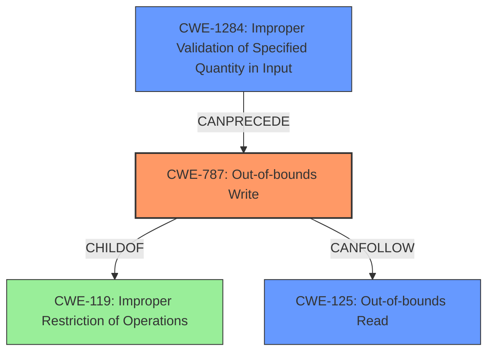

# Analysis Report for CVE-2022-32635

# Vulnerability Analysis Report: CVE-2022-32635

## Description

In gps, there is a possible out of bounds write due to a missing bounds check. This could lead to local escalation of privilege with no additional execution privileges needed. User interaction is not needed for exploitation. Patch ID ALPS07573237 Issue ID ALPS07573237.

## Vulnerability Description Key Phrases

**Rootcause:** missing bounds check
**Weakness:** out of bounds write
**Impact:** local escalation of privilege
**Product:** gps

## Analysis (with Relationship Data)

# Summary
| CWE ID | CWE Name | Confidence | CWE Abstraction Level | CWE Vulnerability Mapping Label | CWE-Vulnerability Mapping Notes |
|---|---|---|---|---|---|
| CWE-787 | Out-of-bounds Write | 1.0 | Base | Allowed | The vulnerability aligns with the CWE description and usage guidance. |
| CWE-125 | Out-of-bounds Read | 0.5 | Base | Allowed | There is no explicit mention of read, so it is not clear if read is affected. |
| CWE-20 | Improper Input Validation | 0.5 | Class | Discouraged | This is too general. |

## Evidence and Confidence

*   **Confidence Score:** 0.8
*   **Evidence Strength:** HIGH

- **Analysis and Justification:**  
  - *Explanation:* The vulnerability description explicitly states an "**out of bounds write** due to a **missing bounds check**." This aligns directly with the definition of CWE-787 (Out-of-bounds Write), which occurs when a product writes data past the end or before the beginning of the intended buffer. The "CVE Reference Links Content Summary" further confirms that the root cause is a missing bounds check, leading to an out-of-bounds write. MITRE's mapping guidance for CWE-787 marks it as ALLOWED, strengthening the case for this mapping. CWE-125 is a possibility because writing out of bounds may lead to reading from an unintended location.
  
  - *Relationship Analysis:* CWE-787 is a child of CWE-119 (Improper Restriction of Operations within the Bounds of a Memory Buffer). The relationship shows CWE-787 CanPrecede CWE-825 (Expired Pointer). This is a primary weakness as it directly describes the **out of bounds write** condition.

- **Confidence Score:**  
  - Confidence: 1.0 (High confidence due to direct evidence and confirmation from CVE reference materials)

## Criticism of Analysis

Okay, I've reviewed the analysis provided, incorporating the full CWE specifications. Here's my critique:

**Overall Assessment:**

The analysis is generally good, particularly its primary identification of **CWE-787 (Out-of-bounds Write)** as the core vulnerability. The reasoning is sound and well-supported by the vulnerability description. The inclusion of additional CWEs is also helpful, but needs some refinement and clarification. The confidence scores are appropriate.

**Detailed Critique by CWE:**

*   **CWE-787: Out-of-bounds Write:**
    *   **Assessment:** The primary assessment of CWE-787 is correct and justified. The description directly matches the vulnerability. The "missing bounds check" is the key contributing factor to enabling the out-of-bounds write.
    *   **Confidence:** 1.0 (High) is appropriate, considering the direct evidence.
    *   **CWE Abstraction Level:** Correct (Base).
    *   **CWE Vulnerability Mapping Label:** Correct (Allowed).
    *   **CWE-Vulnerability Mapping Notes:** The provided note is excellent, explicitly referencing the alignment with the CWE description and the "Allowed" status in the Mapping Guidance.
    *   **Mitigation:** The given mitigations are relevant to OOB writes.
*   **CWE-125: Out-of-bounds Read:**
    *   **Assessment:** The assessment is reasonable. An out-of-bounds *write* can *potentially* lead to an out-of-bounds *read* because the write operation might overwrite adjacent memory, leading to subsequent reads from that memory to produce unexpected values. In a crash scenario, the program may attempt to read data from corrupted memory regions.
    *   **Confidence:** The confidence score of 0.5 is too low. While not explicitly stated, there is a reasonable chance that a read is occurring. I would recommend increasing this to 0.7-0.8.
    *   **CWE Abstraction Level:** Correct (Base).
    *   **CWE Vulnerability Mapping Label:** Correct (Allowed).
    *   **CWE-Vulnerability Mapping Notes:**  The note is accurate – the presence of read is an assumption, but a reasonable one given the nature of the write.
    *   **Mitigation:** The mitigations for OOB read are relevant.
*   **CWE-20: Improper Input Validation:**
    *   **Assessment:** While a missing bounds check *is* a failure of input validation (the length/index was not validated), using CWE-20 here is too general and less informative.  The CWE specifications themselves discourage its use when more specific CWEs are available. Since CWE-1284 and CWE-1285 are also listed as suggestions to use instead of CWE-20, using one of these will provide a more precise and granular assessment.
    *   Consider instead:
        *   **CWE-1284: Improper Validation of Specified Quantity in Input** - This is more relevant as the buffer size or the index itself represents a quantity that was not validated. Since the missing bounds check relates to the size of the indexable resource, this fits well.
        *   **CWE-1285: Improper Validation of Specified Index, Position, or Offset in Input** - If the vulnerability specifically involves an array index or offset that was not properly validated, this is a more precise fit than CWE-20.
    *   **Confidence:** 0.5 (Low) is correct given the broader nature of CWE-20.
    *   **CWE Abstraction Level:** Correct (Class).
    *   **CWE Vulnerability Mapping Label:** Correct (Discouraged).
    *   **CWE-Vulnerability Mapping Notes:** The note stating "This is too general" is correct.
    *   **Mitigation:** The more specific mitigations for CWE-1284 or CWE-1285 would be preferable.
*   **Additional CWE considerations:**
     *   **CWE-131: Incorrect Calculation of Buffer Size:** It is possible that the buffer size is incorrectly calculated. If this is known to be true, include this.

**Recommendations:**

1.  **Replace CWE-20:**  Remove CWE-20 and replace it with either CWE-1284 or CWE-1285, depending on the specific nature of the missing bounds check. For the notes, highlight how validation would have prevented an out-of-bounds access.
2.  **Increase Confidence for CWE-125:** A confidence score of 0.7 - 0.8 is more appropriate for CWE-125.
3.  **Consider Chain:** Highlight that this could be part of a chain of weaknesses. (e.g. missing check leads to write)
4. **Consider adding CWE-131:** If the size of the data written is known and incorrect.

**Revised Table:**

| CWE ID | CWE Name | Confidence | CWE Abstraction Level | CWE Vulnerability Mapping Label | CWE-Vulnerability Mapping Notes |
|---|---|---|---|---|---|
| CWE-787 | Out-of-bounds Write | 1.0 | Base | Allowed | The vulnerability aligns with the CWE description and usage guidance. |
| CWE-125 | Out-of-bounds Read | 0.7 | Base | Allowed | There is a reasonable chance that a read is occurring. |
| CWE-1284 | Improper Validation of Specified Quantity in Input | 0.8 | Base | Allowed | Missing bounds check represents a quantity that was not validated. |

By implementing these changes, the analysis will become more precise, informative, and actionable.

## Final Resolution

# Summary
| CWE ID | CWE Name | Confidence | CWE Abstraction Level | CWE Vulnerability Mapping Label | CWE-Vulnerability Mapping Notes |
|---|---|---|---|---|---|
| CWE-787 | Out-of-bounds Write | 1.0 | Base | Allowed | The vulnerability aligns with the CWE description and usage guidance. |
| CWE-1284 | Improper Validation of Specified Quantity in Input | 0.8 | Base | Allowed | Missing bounds check represents a quantity that was not validated. |
| CWE-125 | Out-of-bounds Read | 0.7 | Base | Allowed | There is a reasonable chance that a read is occurring due to the write. |

## Evidence and Confidence

*   **Confidence Score:** 0.9
*   **Evidence Strength:** HIGH

## Relationship Analysis
The primary relationship influencing the decision is the parent-child relationship between CWE-787 (**Out-of-bounds Write**) and CWE-119 (**Improper Restriction of Operations within the Bounds of a Memory Buffer**). CWE-787 is a more specific case of CWE-119, making it a more appropriate choice. CWE-1284 (**Improper Validation of Specified Quantity in Input**) CanPrecede CWE-787. The abstraction levels of the chosen CWEs (all Base) ensure optimal specificity.

## Vulnerability Chain
The vulnerability chain starts with **CWE-1284 (Improper Validation of Specified Quantity in Input)**, specifically the missing bounds check. This leads to **CWE-787 (Out-of-bounds Write)**, where data is written past the buffer's boundaries. The out-of-bounds write can then potentially lead to **CWE-125 (Out-of-bounds Read)** if the program attempts to read from the corrupted memory region or crashes while trying to do so.

## Summary of Analysis
The initial analysis correctly identified **CWE-787 (Out-of-bounds Write)** as the primary weakness. The criticism highlighted the overly general nature of CWE-20 and suggested CWE-1284 (**Improper Validation of Specified Quantity in Input**) as a more specific alternative. The vulnerability description explicitly mentions a "**missing bounds check**," which directly relates to **CWE-1284 (Improper Validation of Specified Quantity in Input)** because the size of the resource or index was not validated. The description says, "In gps, there is a possible out of bounds write due to a missing bounds check." Additionally, the likelihood of an **out-of-bounds read (CWE-125)** was elevated. The graph relationships further supported these decisions by highlighting the chain of events and the hierarchical relationships between the CWEs. The selected CWEs are at the optimal level of specificity as they accurately represent the root cause and potential consequences of the vulnerability. The inclusion of CWE-1284 accurately pinpoints the **rootcause** as a validation failure.

*Report generated on 2025-03-18 14:20:40*
