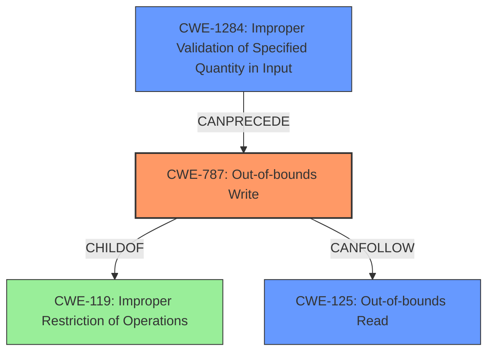

# Final Resolution for CVE-2022-32635

# Summary
| CWE ID | CWE Name | Confidence | CWE Abstraction Level | CWE Vulnerability Mapping Label | CWE-Vulnerability Mapping Notes |
|---|---|---|---|---|---|
| CWE-787 | Out-of-bounds Write | 1.0 | Base | Allowed | The vulnerability aligns with the CWE description and usage guidance. |
| CWE-1284 | Improper Validation of Specified Quantity in Input | 0.8 | Base | Allowed | Missing bounds check represents a quantity that was not validated. |
| CWE-125 | Out-of-bounds Read | 0.7 | Base | Allowed | There is a reasonable chance that a read is occurring due to the write. |

## Evidence and Confidence

*   **Confidence Score:** 0.9
*   **Evidence Strength:** HIGH

## Relationship Analysis
The primary relationship influencing the decision is the parent-child relationship between CWE-787 (**Out-of-bounds Write**) and CWE-119 (**Improper Restriction of Operations within the Bounds of a Memory Buffer**). CWE-787 is a more specific case of CWE-119, making it a more appropriate choice. CWE-1284 (**Improper Validation of Specified Quantity in Input**) CanPrecede CWE-787. The abstraction levels of the chosen CWEs (all Base) ensure optimal specificity.

## Vulnerability Chain
The vulnerability chain starts with **CWE-1284 (Improper Validation of Specified Quantity in Input)**, specifically the missing bounds check. This leads to **CWE-787 (Out-of-bounds Write)**, where data is written past the buffer's boundaries. The out-of-bounds write can then potentially lead to **CWE-125 (Out-of-bounds Read)** if the program attempts to read from the corrupted memory region or crashes while trying to do so.

## Summary of Analysis
The initial analysis correctly identified **CWE-787 (Out-of-bounds Write)** as the primary weakness. The criticism highlighted the overly general nature of CWE-20 and suggested CWE-1284 (**Improper Validation of Specified Quantity in Input**) as a more specific alternative. The vulnerability description explicitly mentions a "**missing bounds check**," which directly relates to **CWE-1284 (Improper Validation of Specified Quantity in Input)** because the size of the resource or index was not validated. The description says, "In gps, there is a possible out of bounds write due to a missing bounds check." Additionally, the likelihood of an **out-of-bounds read (CWE-125)** was elevated. The graph relationships further supported these decisions by highlighting the chain of events and the hierarchical relationships between the CWEs. The selected CWEs are at the optimal level of specificity as they accurately represent the root cause and potential consequences of the vulnerability. The inclusion of CWE-1284 accurately pinpoints the **rootcause** as a validation failure.