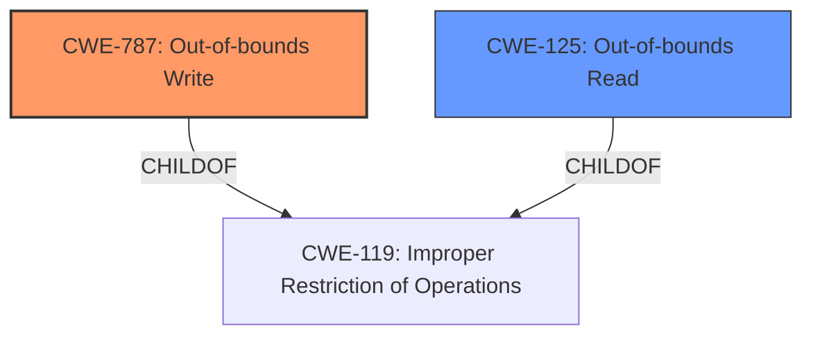

# Final Resolution for CVE-2022-32637

# Summary
| CWE ID | CWE Name | Confidence | CWE Abstraction Level | CWE Vulnerability Mapping Label | CWE-Vulnerability Mapping Notes |
|---|---|---|---|---|---|
| CWE-787 | Out-of-bounds Write | 0.95 | Base | Allowed | The primary weakness is an **out-of-bounds write** due to a **missing bounds check**. |
| CWE-125 | Out-of-bounds Read | 0.6 | Base | Allowed | A possible secondary weakness is an **out-of-bounds read**, although evidence is weak. |

## Evidence and Confidence

*   **Confidence Score:** 0.9
*   **Evidence Strength:** MEDIUM

## Relationship Analysis
The primary relationship influencing the decision is the parent-child relationship between CWE-787 (Out-of-bounds Write) and CWE-119 (Improper Restriction of Operations within the Bounds of a Memory Buffer). CWE-787 is a more specific type of CWE-119, providing a more accurate classification. CWE-125 is also a child of CWE-119. There are no clear chain relationships identified from the vulnerability description.

## Vulnerability Chain
The vulnerability chain starts with a **missing bounds check**, leading directly to an **out-of-bounds write**. A possible **out-of-bounds read** could occur in conjunction with the write operation.

## Summary of Analysis
The initial analysis and criticism were well-considered. The primary classification of CWE-787 is strongly supported by the vulnerability description, which explicitly states "out of bounds write due to a missing bounds check." This aligns perfectly with the description of CWE-787.

The inclusion of CWE-125 was more speculative. The vulnerability description focuses on the write, and there's no explicit evidence of a read. Therefore, I've slightly reduced the confidence score for CWE-125 to 0.6.

I agree with the criticism regarding CWE-20. It is a high-level, class-level CWE, and the provided information allows for a more specific mapping. Therefore, I have removed CWE-20 from the final classification.

The graph relationships confirm that CWE-787 and CWE-125 are both specific instances of the more general CWE-119. Choosing CWE-787 provides the optimal level of specificity based on the available evidence.

The vulnerability description provides sufficient evidence for CWE-787 ("**out of bounds write** due to a **missing bounds check**").