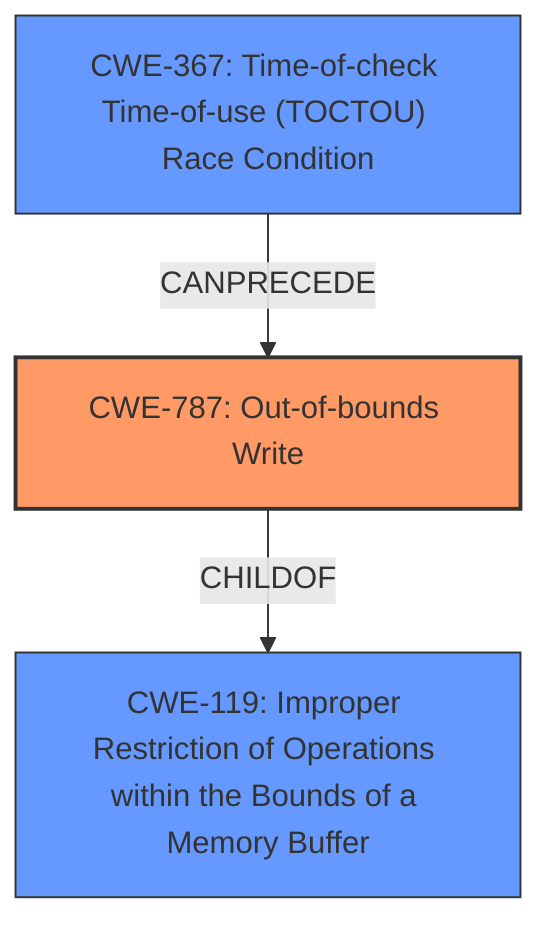

# Final Resolution for CVE-2022-32638

# Summary
| CWE ID | CWE Name | Confidence | CWE Abstraction Level | CWE Vulnerability Mapping Label | CWE-Vulnerability Mapping Notes |
|---|---|---|---|---|---|
| CWE-787 | Out-of-bounds Write | 0.90 | Base | Primary | ALLOWED |
| CWE-367 | Time-of-check Time-of-use (TOCTOU) Race Condition | 0.80 | Base | Secondary | ALLOWED |

## Evidence and Confidence

*   **Confidence Score:** 0.85
*   **Evidence Strength:** HIGH

## Relationship Analysis
The primary weakness is **CWE-787 (Out-of-bounds Write)**, which is a child of **CWE-119 (Improper Restriction of Operations within the Bounds of a Memory Buffer)**. This hierarchical relationship confirms that the vulnerability is indeed related to memory buffer handling but is specifically an out-of-bounds write, making **CWE-787** the more precise choice. The secondary cause, **CWE-367 (Time-of-check Time-of-use (TOCTOU) Race Condition)**, can **precede** **CWE-787** in a vulnerability chain where the race condition leads to an invalid memory state, resulting in the out-of-bounds write. The retriever results were also evaluated to determine why other CWEs were not chosen.

## Vulnerability Chain
The vulnerability chain starts with a **race condition** (**CWE-367**), where the state of a memory buffer is checked before a write operation. However, due to timing issues, an attacker can modify the buffer's state between the check and the use, leading to the buffer being in an unexpected state. This results in an **out-of-bounds write** (**CWE-787**), which can lead to local escalation of privilege.

## Summary of Analysis
The initial analysis correctly identified **CWE-787 (Out-of-bounds Write)** as the primary weakness and **CWE-367 (Time-of-check Time-of-use (TOCTOU) Race Condition)** as the secondary cause. The vulnerability description states "possible **out of bounds write** due to a **race condition**" provides strong evidence for these classifications. The criticism helped refine the analysis by emphasizing the importance of explaining how the attacker can influence the memory state in a timely manner. The decision is also based on the MITRE mapping guidance, which allows both **CWE-787** and **CWE-367**. The selected CWEs are at the optimal level of specificity because they accurately represent the root cause and the resulting weakness. Confidence in **CWE-787** was increased to 0.90 due to the explicit mention of "out of bounds write" in the vulnerability description. The retriever results were also addressed to ensure that other CWEs were not more appropriate.