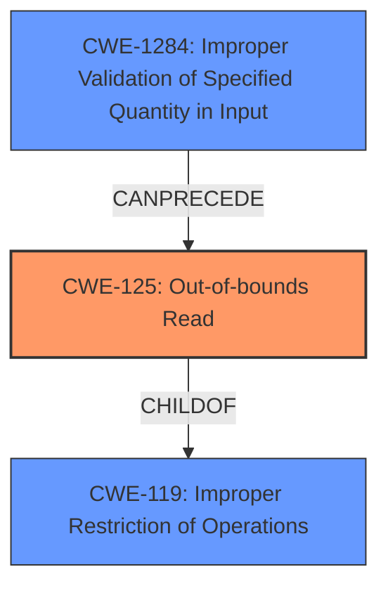

# Final Resolution for CVE-2022-32639

# Summary
| CWE ID | CWE Name | Confidence | CWE Abstraction Level | CWE Vulnerability Mapping Label | CWE-Vulnerability Mapping Notes |
|---|---|---|---|---|---|
| CWE-125 | Out-of-bounds Read | 1.0 | Base | Allowed | Primary CWE |
| CWE-1284 | Improper Validation of Specified Quantity in Input | 0.6 | Base | Allowed | Secondary Candidate CWE |

## Evidence and Confidence

*   **Confidence Score:** 1.0
*   **Evidence Strength:** HIGH

## Relationship Analysis
The primary relationship that impacted the decision was the parent-child relationship between CWE-125 (**Out-of-bounds Read**) and CWE-119 (**Improper Restriction of Operations within the Bounds of a Memory Buffer**). While CWE-119 is a broader category, CWE-125 provides a more specific and accurate classification of the vulnerability. CWE-1284 (**Improper Validation of Specified Quantity in Input**) can precede CWE-125 because the lack of input validation can lead to an out-of-bounds read.

## Vulnerability Chain
The vulnerability chain starts with a **missing bounds check** (potentially related to CWE-1284), leading to an **out-of-bounds read** (CWE-125). This can then lead to local escalation of privilege.

## Summary of Analysis
The initial analysis and criticism both align strongly with the primary classification of CWE-125 (**Out-of-bounds Read**) due to the explicit mention of an "out-of-bounds read" in the vulnerability description. The evidence provided, "In watchdog, there is a possible out of bounds read due to a missing bounds check," directly supports this classification. The criticism reinforces the decision to use CWE-125 over its parent CWE-119 because CWE-125 is more specific.
CWE-1284 (**Improper Validation of Specified Quantity in Input**) is included as a secondary contributing factor due to the mention of a "**missing bounds check**," which implies a failure to validate the input. The graph relationships influenced the final selection by highlighting the hierarchical relationship between CWE-125 and CWE-119, justifying the selection of the more specific CWE-125. The selected CWEs are at the optimal level of specificity, with CWE-125 accurately describing the vulnerability and CWE-1284 capturing a contributing factor.