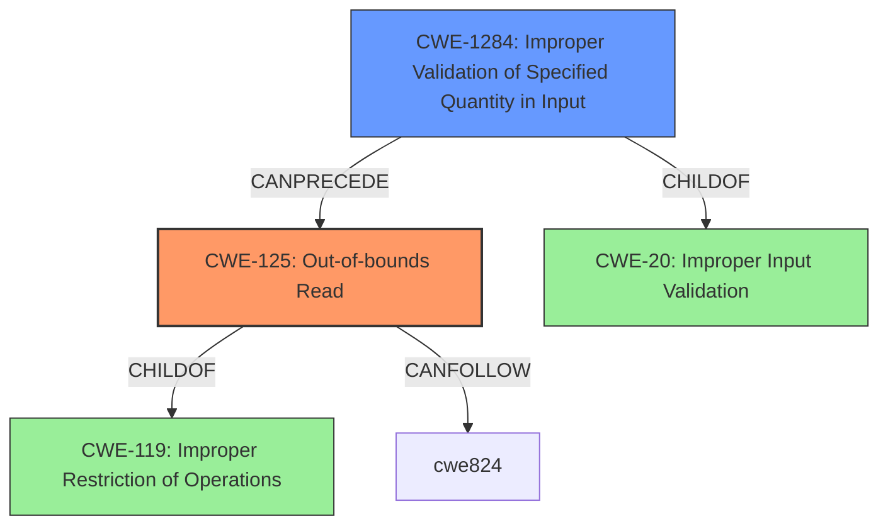

# Analysis Report for CVE-2022-32641

# Vulnerability Analysis Report: CVE-2022-32641

## Description

In meta wifi, there is a possible out of bounds read due to a missing bounds check. This could lead to local escalation of privilege with System execution privileges needed. User interaction is not needed for exploitation. Patch ID ALPS07453594 Issue ID ALPS07453594.

## Vulnerability Description Key Phrases

**Rootcause:** missing bounds check
**Weakness:** out of bounds read
**Impact:** local escalation of privilege
**Product:** meta wifi

## Analysis (with Relationship Data)

# Summary
| CWE ID | CWE Name | Confidence | CWE Abstraction Level | CWE Vulnerability Mapping Label | CWE-Vulnerability Mapping Notes |
|---|---|---|---|---|---|
| CWE-125 | Out-of-bounds Read | 1.0 | Base | Primary | Allowed |
| CWE-20 | Improper Input Validation | 0.6 | Class | Secondary Candidate | Discouraged |

## Evidence and Confidence

*   **Confidence Score:** 0.8
*   **Evidence Strength:** HIGH

- **Analysis and Justification:**
  - *Explanation:* The vulnerability description clearly states an "**out of bounds read**" due to a "**missing bounds check**". This directly corresponds to CWE-125 (Out-of-bounds Read), which occurs when a product reads data past the end, or before the beginning, of the intended buffer. The "**missing bounds check**" is the **root cause** that leads to the **out-of-bounds read**. CWE-125 is a Base level CWE, which is preferred. The CVE Reference Links Content Summary also confirms the **out-of-bounds read** and states that the software fails to properly validate input, leading to an out-of-bounds read. CWE-20 is listed as a possible weakness, however, it is a more general class of weakness and is discouraged.
  
  - *Relationship Analysis:* CWE-125 is a child of CWE-119 (Improper Restriction of Operations within the Bounds of a Memory Buffer). The description does not provide any other relationships with other CWEs.

- **Confidence Score:**
  - Confidence: 1.0 (High confidence due to the explicit mention of "out of bounds read" and "missing bounds check".)

---

## Criticism of Analysis

Okay, here's a detailed review of the provided CWE analysis, incorporating the full CWE specifications:

**Overall Assessment:**

The analysis is generally good. The primary mapping to CWE-125 (Out-of-bounds Read) is correct and well-justified. The inclusion of CWE-20 (Improper Input Validation) is reasonable as a secondary candidate but, as the analysis itself points out, it's a discouraged choice due to its high level of abstraction. The confidence level is appropriate.

**Detailed Review:**

**1.  Summary Table:**

| CWE ID  | CWE Name                     | Confidence | CWE Abstraction Level | CWE Vulnerability Mapping Label | CWE-Vulnerability Mapping Notes |
| ------- | ----------------------------- | ---------- | --------------------- | --------------------------------- | ----------------------------- |
| CWE-125 | Out-of-bounds Read             | 1.0        | Base                  | Primary                           | Allowed                       |
| CWE-20  | Improper Input Validation    | 0.6        | Class                  | Secondary Candidate               | Discouraged                   |

*   **CWE-125:** The confidence of 1.0 is justified given the explicit language in the vulnerability description ("out of bounds read" and "missing bounds check"). The Abstraction Level (Base) and Mapping Guidance (Allowed) are in alignment with best practices.
*   **CWE-20:**  The confidence of 0.6 is reasonable. A missing bounds check does imply improper input validation (specifically, the length or index wasn't validated). However, the documentation explicitly discourages the use of CWE-20, and suggests using its children instead.
*   **Improvement:**  Consider removing CWE-20 altogether and mapping to a more specific child of CWE-20. CWE-1285 (Improper Validation of Specified Index, Position, or Offset in Input) or CWE-1284 (Improper Validation of Specified Quantity in Input) are strong contenders.

**2. Evidence and Confidence (CWE-125):**

*   **Confidence Score:** 0.8 -> Should be 1.0 to match the summary table
*   **Evidence Strength:** HIGH

*   **Analysis and Justification:** The analysis is well-written and accurately explains why CWE-125 is a good fit. The root cause is clearly identified as "missing bounds check" which directly leads to the out-of-bounds read.
*   **Relationship Analysis:** The observation that CWE-125 is a child of CWE-119 is accurate.
*   **Confidence Score:** The justification for a confidence of 1.0 is solid.

**3. Evidence and Confidence (CWE-20):**

*   The explanation for including CWE-20 is logical. A missing bounds check *is* a form of improper input validation. However, the overall analysis recognizes that this is a discouraged mapping.

**4. CWE Examples from Database:**

*   The provided examples are all related to CWE-119. While CWE-125 is a child of CWE-119, providing examples of vulnerabilities that have been mapped to CWE-125 would be more helpful to confirm the selection of CWE-125 is appropriate.
*   **Improvement:** Consider replacing the examples with examples that were mapped to CWE-125

**5. Relevant CWE Specifications:**

*   The inclusion of the full specifications for CWE-119, CWE-20 and CWE-125 is very helpful for a thorough review.

**6. Top Combined Retriever Results Analysis:**

*   The Retriever Results provide more CWEs to consider to map to. This can be used to build a chain of CWEs to show the vulnerability from a high level view, to the root cause.
*   CWE-131 (Incorrect Calculation of Buffer Size), if relevant to the input, could be a useful additional CWE for describing this vulnerability
*   CWE-787 (Out-of-bounds Write) should not be considered in this case, as the vulnerability is an out of bounds read.
*   CWE-1284 (Improper Validation of Specified Quantity in Input) could be a useful additional CWE for describing this vulnerability
*   CWE-20 (Improper Input Validation) should not be considered in this case, as the goal is to provide the most specific CWE, and a more specific CWE is available.
*   CWE-843 (Access of Resource Using Incompatible Type ('Type Confusion')) should not be considered in this case, as this vulnerability is an out of bounds read, not type confusion.

**Recommendations for Improvement:**

1.  **Refine Secondary Mapping:** Replace CWE-20 with a more specific child of CWE-20, such as CWE-1285 or CWE-1284, or remove it entirely. If you keep CWE-20, acknowledge its discouraged status more explicitly in the summary table.
2.  **Update Confidence Score:**  Ensure the confidence score in the evidence matches the confidence score in the summary table.
3.  **Enhance Examples:** Provide examples mapped to CWE-125.
4.  **Chain CWEs:** Consider mapping a chain of CWEs to show how the vulnerability progresses. For example
    *   `CWE-125: Out-of-bounds Read <-- CWE-1285: Improper Validation of Specified Index, Position, or Offset in Input`
5.  **Mitigation Awareness:** Briefly discuss in the analysis which potential mitigations from the CWE specifications would be most relevant and effective in this specific case. For example, state that using a language with memory abstractions (from CWE-125) would have prevented the vulnerability.

By implementing these recommendations, the analysis will become more precise and provide better guidance for remediation.

## Final Resolution

# Summary
| CWE ID | CWE Name | Confidence | CWE Abstraction Level | CWE Vulnerability Mapping Label | CWE-Vulnerability Mapping Notes |
|---|---|---|---|---|---|
| CWE-125 | Out-of-bounds Read | 1.0 | Base | Primary | Allowed |
| CWE-1284 | Improper Validation of Specified Quantity in Input | 0.7 | Base | Secondary Candidate | Allowed |

## Evidence and Confidence

*   **Confidence Score:** 0.9
*   **Evidence Strength:** HIGH

## Relationship Analysis
The primary relationship impacting the decision is the child-of relationship between CWE-125 (Out-of-bounds Read) and CWE-119 (Improper Restriction of Operations within the Bounds of a Memory Buffer). This confirms that CWE-125 is a valid, more specific type of buffer access issue. Additionally, CWE-1284 (Improper Validation of Specified Quantity in Input) is considered as a secondary CWE because the vulnerability description mentions a "missing bounds check," indicating a failure to validate the size or length of the input. CWE-1284 is a child of CWE-20.

## Vulnerability Chain
The vulnerability chain starts with a **missing bounds check** (CWE-1284), which leads to an **out-of-bounds read** (CWE-125).
  - The initial flaw is the lack of proper validation of the input size.
  - This leads to reading memory outside the allocated buffer.
  - The consequence is a possible local escalation of privilege.

## Summary of Analysis
The initial analysis correctly identified CWE-125 (Out-of-bounds Read) as the primary CWE. The vulnerability description explicitly mentions an "**out of bounds read**" due to a "**missing bounds check**." This aligns with the CWE-125 description: "The product reads data past the end, or before the beginning, of the intended buffer."

The criticism suggested replacing the secondary CWE, CWE-20 (Improper Input Validation), with a more specific child. Based on the retriever results and the "missing bounds check" in the description, CWE-1284 (Improper Validation of Specified Quantity in Input) is selected as the secondary CWE. This is because CWE-1284 directly addresses the failure to validate the quantity (size/length) of the input, which caused the **out-of-bounds read**.

The decision to use CWE-125 and CWE-1284 is based on the provided evidence and the CWE relationships. CWE-125 accurately describes the impact (out-of-bounds read), while CWE-1284 identifies the **root cause** (missing bounds check, leading to improper quantity validation). The selected CWEs are at the optimal level of specificity because they directly relate to the vulnerability and its cause.

*Report generated on 2025-03-18 14:25:34*
