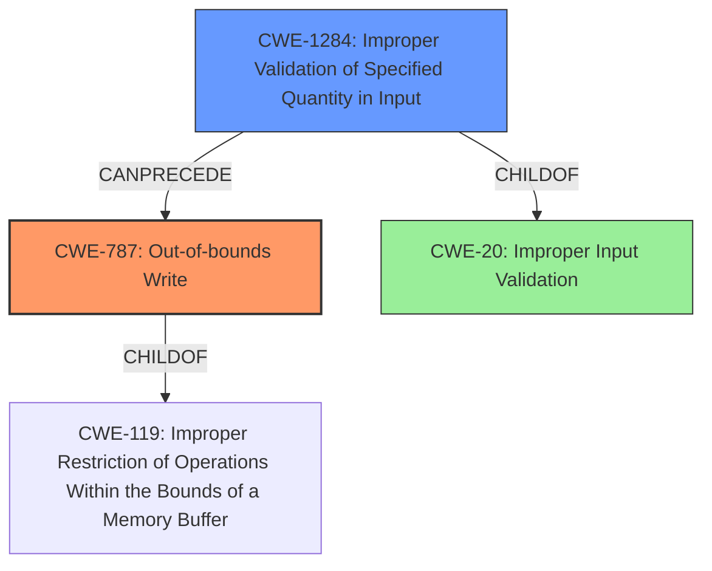

# Final Resolution for CVE-2022-32647

# Summary
| CWE ID | CWE Name | Confidence | CWE Abstraction Level | CWE Vulnerability Mapping Label | CWE-Vulnerability Mapping Notes |
|---|---|---|---|---|---|
| **CWE-787** | **Out-of-bounds Write** | 0.95 | Base | Primary | Allowed |
| **CWE-1284** | **Improper Validation of Specified Quantity in Input** | 0.80 | Base | Secondary Candidate | Allowed, more specific than CWE-20, potentially related to size/length validation |

## Evidence and Confidence

*   **Confidence Score:** 0.90
*   **Evidence Strength:** HIGH

## Relationship Analysis
The primary relationship is that **CWE-1284** Improper Validation of Specified Quantity in Input can precede **CWE-787** Out-of-bounds Write. **CWE-787** is a child of **CWE-119** Improper Restriction of Operations within the Bounds of a Memory Buffer, indicating that it's a specific type of memory safety violation. **CWE-1284** is a child of **CWE-20** Improper Input Validation, but is more specific.

## Vulnerability Chain
The vulnerability chain starts with **CWE-1284** (**Improper Validation of Specified Quantity in Input**). This weakness allows a malformed input, specifically related to size or length, to proceed. This leads directly to **CWE-787** (**Out-of-bounds Write**), where the improperly validated input causes data to be written outside the intended buffer boundaries.

## Summary of Analysis
The initial analysis correctly identified **CWE-787** (**Out-of-bounds Write**) as the primary weakness. The criticism pointed out that using **CWE-20** (**Improper Input Validation**) as a secondary candidate is not optimal due to its broad nature and the availability of more specific CWEs.

The vulnerability description states: "In ccu, there is a possible **out of bounds write** due to **improper input validation**."

I agree with the criticism and have updated the secondary CWE to **CWE-1284** (**Improper Validation of Specified Quantity in Input**). This choice is based on the likelihood that the out-of-bounds write is caused by failing to properly validate the size or length of an input value. This is a more specific and relevant classification than the general **CWE-20**. **CWE-1284** is a Base level CWE, which aligns with the recommended level of abstraction.

The graph relationships confirm that **CWE-1284** can precede **CWE-787**, supporting the vulnerability chain. Choosing **CWE-1284** provides a more precise understanding of the vulnerability's root cause related to input validation.