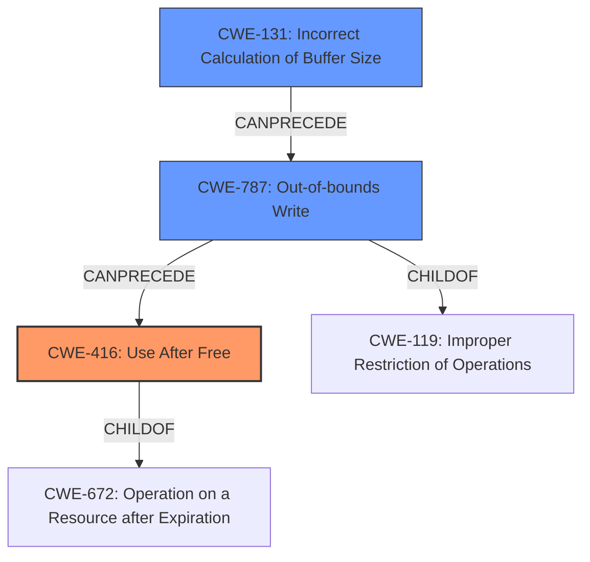

# Final Resolution for CVE-2022-32649

# Summary
| CWE ID | CWE Name | Confidence | CWE Abstraction Level | CWE Vulnerability Mapping Label | CWE-Vulnerability Mapping Notes |
|---|---|---|---|---|---|
| CWE-416 | Use After Free | 0.9 | Variant | Primary | Allowed |
| CWE-131 | Incorrect Calculation of Buffer Size | 0.7 | Base | Secondary | Allowed |
| CWE-787 | Out-of-bounds Write | 0.5 | Base | Contributing | Allowed |

## Evidence and Confidence

*   **Confidence Score:** 0.8
*   **Evidence Strength:** HIGH

## Relationship Analysis
The primary weakness is CWE-416 (**Use After Free**) which is a variant of CWE-672 (Operation on Resource after Expiry). The root cause of the UAF is identified as CWE-131 (**Incorrect Calculation of Buffer Size**). The criticism suggested the addition of CWE-787 (**Out-of-bounds Write**). CWE-787 is a child of CWE-119 (**Improper Restriction of Operations within the Bounds of a Memory Buffer**). The suggested addition of CWE-787 to the analysis provides a more granular description of the **incorrect buffer calculation**. CWE-131 can precede CWE-787, leading to CWE-416.

## Vulnerability Chain
The vulnerability chain begins with CWE-131 (**Incorrect Calculation of Buffer Size**), leading to CWE-787 (**Out-of-bounds Write**), and culminating in CWE-416 (**Use After Free**).
  - The **incorrect buffer size** calculation (CWE-131) can lead to memory corruption through an **out-of-bounds write** (CWE-787).
  - This memory corruption can result in a pointer being freed prematurely or incorrectly, leading to a **use-after-free** condition (CWE-416) when the same memory region is accessed later.

## Summary of Analysis
The initial analysis correctly identified CWE-416 (**Use After Free**) as the primary weakness due to the explicit mention in the vulnerability description. The initial analysis also correctly identified CWE-131 (**Incorrect Calculation of Buffer Size**) as a contributing factor.

The criticism suggested adding CWE-787 (**Out-of-bounds Write**) to further describe the **incorrect buffer calculation** that occurred. The vulnerability description says there's "**use after free** due to a **logic error**" which suggests there was an **incorrect buffer calculation** that resulted in writing beyond the intended bounds of the buffer.

The relationship analysis and mapping guidance support the inclusion of CWE-787. The chain progresses from **incorrect buffer size calculation** (CWE-131) to **out-of-bounds write** (CWE-787), eventually leading to the **use-after-free** condition (CWE-416).

The selected CWEs provide an optimal level of specificity. CWE-416 is a variant that directly matches the vulnerability, while CWE-131 and CWE-787 provide insight into the root cause and mechanism of the vulnerability.