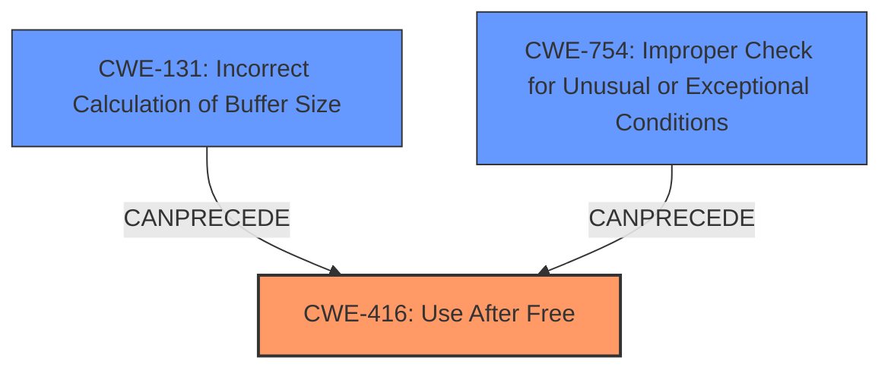

# Analysis Report for CVE-2022-32651

# Vulnerability Analysis Report: CVE-2022-32651

## Description

In mtk-aie, there is a possible use after free due to a logic error. This could lead to local escalation of privilege with System execution privileges needed. User interaction is not needed for exploitation. Patch ID ALPS07225857 Issue ID ALPS07225857.

## Vulnerability Description Key Phrases

**Rootcause:** logic error
**Weakness:** use after free
**Impact:** local escalation of privilege
**Product:** mtk-aie

## Analysis (with Relationship Data)

# Summary
| CWE ID | CWE Name | Confidence | CWE Abstraction Level | CWE Vulnerability Mapping Label | CWE-Vulnerability Mapping Notes |
|---|---|---|---|---|---|
| CWE-416 | Use After Free | 0.95 | Variant | Allowed | Primary CWE |
| CWE-131 | Incorrect Calculation of Buffer Size | 0.70 | Base | Allowed | Secondary Candidate |

## Evidence and Confidence

*   **Confidence Score:** 0.90
*   **Evidence Strength:** HIGH

- **Analysis and Justification:**  
  - *Explanation:* The vulnerability description explicitly states "**use after free** due to a **logic error**." The CVE Reference Links Content Summary further clarifies that the **root cause** is an "Incorrect calculation of buffer size leading to a use-after-free vulnerability." This directly aligns with CWE-416 (Use After Free), which occurs when a program reuses or references memory after it has been freed. CWE-416 is a Variant, which is a preferred level of abstraction. The MITRE mapping guidance indicates that CWE-416 is ALLOWED. While CWE-787 (Out-of-bounds Write) was listed as a top CWE for similar CVE descriptions, the description specifically mentions a use-after-free, making CWE-416 a more precise fit. The **logic error** is further elaborated in the CVE Reference Links Content Summary as "Incorrect calculation of buffer size" and can be mapped to CWE-131 (Incorrect Calculation of Buffer Size).
  
  - *Relationship Analysis:* CWE-416 is a variant of CWE-672 (Operation on a Resource after Expiry). CWE-416 can lead to various impacts, including crashes, unexpected behavior, or even arbitrary code execution. The relationships indicate that CWE-416 CanFollow CWE-754 (Improper Check for Unusual or Exceptional Conditions) which could be a missing check before freeing memory.

- **Confidence Score:**  
  - Confidence: 0.95 (High confidence due to explicit mention of "use after free" and supporting details in the CVE reference)

---

## Criticism of Analysis

Okay, here's a detailed review of the provided analysis, considering the full CWE specifications and the provided retriever results:

**Overall Assessment:**

The analysis is generally strong, well-reasoned, and provides a good justification for the primary CWE mapping of **CWE-416: Use After Free.** The inclusion of **CWE-131: Incorrect Calculation of Buffer Size** as a secondary candidate provides a more complete picture of the root cause and contributes to a better understanding of the vulnerability.  The confidence levels are well-justified.

**Strengths:**

*   **Explicit Evidence:** The analysis accurately leverages the explicit mention of "use after free" in the vulnerability description and the more detailed explanation of "incorrect calculation of buffer size leading to a use-after-free" in the CVE Reference Links Content Summary.
*   **Variant Level Mapping:**  The choice of CWE-416 (Variant) is excellent as the primary mapping. It aligns with the explicit description of the error and conforms to the preferred level of abstraction according to MITRE's mapping guidance.
*   **Justification:**  The analysis provides a clear explanation of why CWE-416 is a better fit than other candidates, such as CWE-787.
*   **Relationship Analysis:** The analysis effectively utilizes the relationships defined in CWE-416 and CWE-131 to identify potential underlying causes or contributing factors.
*   **Confidence Justification:** The confidence levels for both CWE-416 and CWE-131 are well-supported by the available information.
*   **Good Use of CWE Examples:**  The inclusion of known examples for CWE-416 from the CWE database strengthens the analysis.
*   **Consideration of CWE Mapping Guidance:** The analysis takes the CWE mapping guidance into account to use the preferred level of abstraction.

**Areas for Potential Improvement:**

*   **Exploring Chaining Further:** While the analysis mentions potential relationships, a deeper exploration of possible chaining scenarios could be beneficial.  For example:
    *   Could a missing check for an exceptional condition (CWE-754) *before* the incorrect buffer size calculation lead to the UAF?  The *CanFollow* relationship listed under CWE-416 supports this.
    *   Could Improper Input Validation (CWE-20) play a role in the incorrect calculation of the buffer size, leading to the subsequent UAF?
*   **Mitigation Strategies:**  The analysis doesn't directly relate the suggested mitigations in the CWE entries to the specific vulnerability context. Consider adding a brief section discussing which mitigations from CWE-416 and CWE-131 would be most relevant in this specific MTK-AIE case.  For instance, mentioning the importance of carefully reviewing buffer size calculations during code review (drawing from CWE-131 mitigations) would be valuable.
*  **Overemphasis on CWE-787's presence in similar CVE descriptions:** The presence of CWE-787 in similar CVE descriptions is not a valid justification for considering it for this CVE. There was no direct evidence of out-of-bounds write in the input so this should not be mentioned.
* **Retriever Results Explanation:** Briefly explaining why some of the other top Retriever Results were not chosen would strengthen the analysis. For example, why CWE-413 (Improper Resource Locking), CWE-908 (Use of Uninitialized Resource), and CWE-415 (Double Free) were deemed less relevant.

**Specific Comments & Suggestions:**

*   **CWE-131 and Potential Mitigation:** After mentioning CWE-131, briefly discuss the potential mitigations listed in the CWE specification. Emphasize the importance of careful code review of buffer size calculations and the potential for input validation to prevent excessively large sizes.
*   **CWE-754 Consideration:** The analysis mentions "missing check before freeing memory." Elaborate on this by suggesting CWE-754 (Improper Check for Unusual or Exceptional Conditions) as a potential contributing factor *preceding* the UAF.  Explain that a check for the validity of a pointer *before* it is freed could have prevented the vulnerability.
*   **Elaborate on "Logic Error":** The vulnerability description mentions a "logic error." Expand on what this might entail. Could it be a simple mathematical error (CWE-682)?  The specification for CWE-131 mentions "simple math errors" as one example. The term "logic error" is very broad, so narrowing this down, even with speculation, can be helpful.
*   **Refine Confidence Score Justification:** The confidence score justification is good, but could be even stronger by explicitly mentioning that the CVE Reference Links Content Summary *confirms* the connection between the logic error and the use-after-free.
*   **Review Retriever Results:** In the summary section, make a short statement about the Retriever Results section to justify why the top cwes in that section were considered or discarded.

**Revised Summary Table (incorporating suggestions):**

| CWE ID | CWE Name | Confidence | CWE Abstraction Level | CWE Vulnerability Mapping Label | CWE-Vulnerability Mapping Notes |
|---|---|---|---|---|---|
| CWE-416 | Use After Free | 0.95 | Variant | Allowed | Primary CWE. Explicitly stated in description and confirmed by CVE Reference. |
| CWE-131 | Incorrect Calculation of Buffer Size | 0.70 | Base | Allowed | Secondary Candidate. Root cause contributing to the Use-After-Free. |
| CWE-754 | Improper Check for Unusual or Exceptional Conditions | 0.30 | Class | Allowed-with-Review | Contributing Factor. A missing check for the validity of the pointer before freeing could have prevented the vulnerability. |

**In conclusion,** the analysis is well-executed and provides a strong foundation for understanding and addressing this vulnerability. By incorporating the suggestions above, the analysis can be made even more robust and insightful.

## Final Resolution

# Summary
| CWE ID | CWE Name | Confidence | CWE Abstraction Level | CWE Vulnerability Mapping Label | CWE-Vulnerability Mapping Notes |
|---|---|---|---|---|---|
| **CWE-416** | **Use After Free** | 0.95 | Variant | Allowed | **Primary CWE**. Explicitly stated in description and confirmed by CVE Reference. |
| **CWE-131** | **Incorrect Calculation of Buffer Size** | 0.70 | Base | Allowed | Secondary Candidate. **Root cause** contributing to the **Use-After-Free**. |
| **CWE-754** | **Improper Check for Unusual or Exceptional Conditions** | 0.30 | Class | Allowed-with-Review | Contributing Factor. A missing check for the validity of the pointer before freeing could have prevented the vulnerability. |

## Evidence and Confidence

*   **Confidence Score:** 0.92
*   **Evidence Strength:** HIGH

## Relationship Analysis
The analysis highlights the relationships between the selected CWEs, forming a chain of weaknesses. **CWE-131 (Incorrect Calculation of Buffer Size)** can lead to memory corruption, eventually triggering **CWE-416 (Use After Free)**. **CWE-754 (Improper Check for Unusual or Exceptional Conditions)** is included as a possible contributing factor, as a check for a valid pointer before freeing could have prevented the vulnerability.

## Vulnerability Chain
The vulnerability chain starts with **CWE-131 (Incorrect Calculation of Buffer Size)**, which leads to memory mismanagement. This can then result in **CWE-416 (Use After Free)** when the incorrectly sized buffer is freed and subsequently accessed. The potential contributing factor **CWE-754 (Improper Check for Unusual or Exceptional Conditions)** highlights the absence of a validation check before freeing the memory.

## Summary of Analysis
The initial analysis correctly identified **CWE-416 (Use After Free)** as the primary weakness, supported by the explicit mention in the vulnerability description: "In mtk-aie, there is a possible **use after free** due to a **logic error**." The root cause is an "**incorrect calculation of buffer size** leading to a use-after-free vulnerability." This is solid evidence for **CWE-131 (Incorrect Calculation of Buffer Size)**.

The criticism's suggestion to consider **CWE-754 (Improper Check for Unusual or Exceptional Conditions)** is valuable. Although not explicitly mentioned, the absence of a check before freeing the memory could have prevented the issue.

The selected CWEs are at the optimal level of specificity. **CWE-416 (Use After Free)** is a Variant, providing a more precise description than its parent class. **CWE-131 (Incorrect Calculation of Buffer Size)** is a Base CWE, offering a good level of detail for the root cause. **CWE-754 (Improper Check for Unusual or Exceptional Conditions)** is a Class CWE, but represents a reasonable contributing factor due to the lack of validation before freeing.

*Report generated on 2025-03-18 14:29:17*
