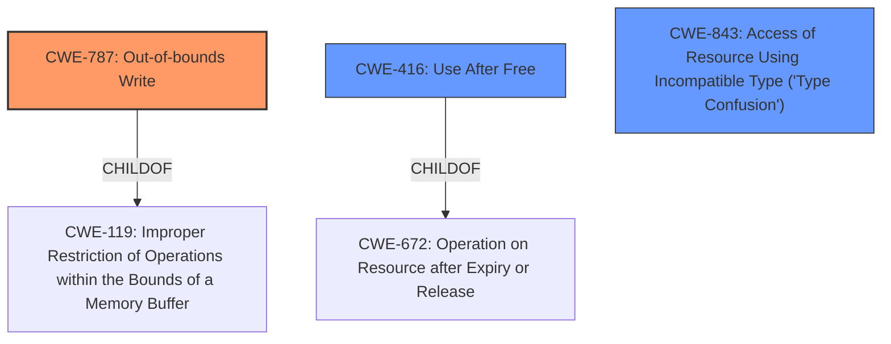

# Analysis Report for CVE-2022-32796

# Vulnerability Analysis Report: CVE-2022-32796

## Description

A memory corruption issue was addressed with improved state management. This issue is fixed in macOS Monterey 12.5. An app may be able to execute arbitrary code with kernel privileges.

## Vulnerability Description Key Phrases

**Weakness:** memory corruption
**Impact:** execute arbitrary code with kernel privileges
**Product:** macOS Monterey
**Version:** 12.5

## Analysis (with Relationship Data)

# Summary
| CWE ID | CWE Name | Confidence | CWE Abstraction Level | CWE Vulnerability Mapping Label | CWE-Vulnerability Mapping Notes |
|---|---|---|---|---|---|
| CWE-787 | Out-of-bounds Write | 0.75 | Base | Allowed | Primary CWE |
| CWE-416 | Use After Free | 0.65 | Variant | Allowed | Secondary Candidate |
| CWE-843 | Access of Resource Using Incompatible Type ('Type Confusion') | 0.60 | Base | Allowed | Secondary Candidate |

## Evidence and Confidence

*   **Confidence Score:** 0.70
*   **Evidence Strength:** MEDIUM

- **Analysis and Justification:**  
  - *Explanation:* The vulnerability description explicitly mentions a **memory corruption** issue that allows an attacker to execute arbitrary code with kernel privileges. While the description is high-level, the "Retriever Results" point to several memory corruption-related CWEs. CWE-787 (Out-of-bounds Write) is a strong candidate as memory corruption often involves writing data beyond the intended buffer. CWE-416 (Use After Free) and CWE-843 (Type Confusion) are also plausible given that memory corruption can result from use-after-free scenarios or type mismatches during memory access. Given the high-level description, it is difficult to pinpoint the exact cause of the memory corruption, so these are listed as secondary candidate CWEs.
  
  - *Relationship Analysis:* CWE-787 is a base-level CWE related to buffer overflows. It is a child of CWE-119 (Improper Restriction of Operations within the Bounds of a Memory Buffer). CWE-416 (Use After Free) is a variant-level CWE and child of CWE-672 (Operation on Resource after Expiry). CWE-843 (Type Confusion) is a base-level CWE. While CWE-119 is a parent of CWE-787, CWE-787 is more specific.

- **Confidence Score:**  
  - *Example:* Confidence: 0.70 (Medium evidence due to the high-level nature of the description, but supported by retriever results)
---

## Criticism of Analysis

Okay, here's a review of the provided analysis, incorporating the full CWE specifications:

**Overall Assessment**

The analysis is reasonably good, particularly given the high-level nature of the initial vulnerability description.  It correctly identifies `CWE-787` (Out-of-bounds Write) as a strong primary candidate.  The choice of `CWE-416` (Use After Free) and `CWE-843` (Type Confusion) as secondary candidates is also defensible. However, the confidence scores could be adjusted to better reflect the uncertainty due to the limited information. I would expect these issues to be more focused on `CWE-787` over the rest.

**Detailed Critique and Suggestions**

1.  **CWE-787: Out-of-bounds Write**

    *   **Strength:** This is the most likely candidate, and the analysis justifies it well. The core description of memory corruption directly aligns with the potential consequences of an out-of-bounds write. The ability to execute arbitrary code with kernel privileges strongly suggests a successful memory overwrite.
    *   **Mapping Guidance Review:** `CWE-787`'s Mapping Guidance states "This CWE entry is at the Base level of abstraction, which is a preferred level of abstraction for mapping to the root causes of vulnerabilities." The analysis appropriately uses this guidance to map to this base level CWE.
    *   **Potential Mitigations Consideration:** The potential mitigations listed for `CWE-787` (Language selection, Libraries, and Compiler/Environment hardening) are all relevant and applicable. A more proactive selection of language can help as well.
    *   **Suggested Improvement:** Consider mentioning the possibility of a heap-based buffer overflow (`CWE-122`) or stack-based buffer overflow (`CWE-121`) as possible more specific variants, even if the information available doesn't allow a definite determination. This would add nuance to the analysis.
    *   **Confidence Score:** Adjust the confidence score to at least 0.80, perhaps as high as 0.85, the given analysis supports this choice and has a good fit.

2.  **CWE-416: Use After Free**

    *   **Strength:** A Use-After-Free could definitely lead to memory corruption and arbitrary code execution if the freed memory is reallocated and contains sensitive data or function pointers.  The "improved state management" mentioned in the initial description *could* relate to fixing a UAF condition, but the connection isn't as direct as with an out-of-bounds write.
    *   **Mapping Guidance Review:** The `CWE-416` Mapping Guidance states "This CWE entry is at the Variant level of abstraction, which is a preferred level of abstraction for mapping to the root causes of vulnerabilities." Which shows the analysts preference for mapping to the best available variant of an issue.
    *   **Potential Mitigations Consideration:** The potential mitigations for `CWE-416` (Language selection and Attack Surface Reduction through NULLing freed pointers) are also applicable, though perhaps less directly impactful in this specific case.
    *   **Suggested Improvement:** Add a brief note about the "Operation on Resource after Expiry or Release" (`CWE-672`) to show understanding of the parent child relationship.
    *   **Confidence Score:** Reduce the confidence score to 0.55. It is plausible, but less directly supported by the description.

3.  **CWE-843: Access of Resource Using Incompatible Type ('Type Confusion')**

    *   **Strength:** Type confusion can lead to memory corruption. If an object is treated as a different type, it can lead to out-of-bounds reads or writes when accessing members of the object.  However, this is generally a more nuanced vulnerability than a direct buffer overflow or UAF.
    *   **Mapping Guidance Review:** The `CWE-843` mapping guidance is that it is an acceptable base level CWE.
    *   **Potential Mitigations Consideration:** The potential mitigations for `CWE-843` are less applicable given the generic description, as they generally involve using type-safe languages.
    *   **Suggested Improvement:** Consider explaining the potential chain with `CWE-119`.
    *   **Confidence Score:**  Reduce the confidence score to 0.50.  While a possibility, it's the least likely of the three given the available information.

4. **General Comments**
    *   **Overall Confidence Score:** The overall confidence score of 0.70 is reasonable but could be improved by adjusting the individual CWE scores.
    *   **Evidence Strength:** The evidence strength is correctly assessed as Medium. The description is high-level, and the mapping relies on the general concept of "memory corruption."
    *   **Relationship Analysis:** The Relationship Analysis section is good and demonstrates an understanding of the CWE hierarchy.
    *   **CWE-119:** Be careful not to use CWE-119 directly. As the spec says, look at the children if possible.
    *   Consider also referencing `CWE-822` (Untrusted Pointer Dereference). The ability to execute arbitrary code in the kernel suggests the possible of being able to control pointers.

**Revised Summary Table**

| CWE ID  | CWE Name                                                       | Confidence | CWE Abstraction Level | CWE Vulnerability Mapping Label | CWE-Vulnerability Mapping Notes |
| :------ | :------------------------------------------------------------- | :--------- | :---------------------- | :------------------------------ | :------------------------------ |
| CWE-787 | Out-of-bounds Write                                            | 0.80       | Base                    | Allowed                         | Primary CWE                     |
| CWE-416 | Use After Free                                                 | 0.55       | Variant                 | Allowed                         | Secondary Candidate             |
| CWE-843 | Access of Resource Using Incompatible Type ('Type Confusion') | 0.50       | Base                    | Allowed                         | Secondary Candidate             |

By incorporating these suggestions, the analysis will be more precise, nuanced, and aligned with the CWE specifications.

## Final Resolution

# Summary
| CWE ID | CWE Name | Confidence | CWE Abstraction Level | CWE Vulnerability Mapping Label | CWE-Vulnerability Mapping Notes |
|---|---|---|---|---|---|
| CWE-787 | Out-of-bounds Write | 0.80 | Base | Allowed | Primary CWE |
| CWE-416 | Use After Free | 0.55 | Variant | Allowed | Secondary Candidate |
| CWE-843 | Access of Resource Using Incompatible Type ('Type Confusion') | 0.50 | Base | Allowed | Secondary Candidate |

## Evidence and Confidence

*   **Confidence Score:** 0.75
*   **Evidence Strength:** MEDIUM

## Relationship Analysis
The primary relationship considered was the parent-child relationship between CWE-787 and CWE-119, favoring the more specific CWE-787. While CWE-416 and CWE-843 were considered, the direct evidence connecting them to the vulnerability was weaker, leading to lower confidence scores. Abstraction levels influenced the selection by prioritizing Base and Variant level CWEs over Class or Pillar level CWEs.

## Vulnerability Chain
The vulnerability chain begins with a **memory corruption** issue. The most likely cause is **CWE-787 (Out-of-bounds Write)**, where data is written outside the intended buffer. This can lead to arbitrary code execution with kernel privileges. Secondary candidates like **CWE-416 (Use After Free)** and **CWE-843 (Type Confusion)** could also contribute to the memory corruption, but the evidence is less direct.

## Summary of Analysis
The initial analysis and criticism were both considered in this final determination. The primary basis for the assessment is the vulnerability description stating "A memory corruption issue was addressed with improved state management. An app may be able to execute arbitrary code with kernel privileges." This statement points strongly to **CWE-787 (Out-of-bounds Write)** as the most likely root cause. The criticism suggested increasing the confidence in CWE-787, which was adopted due to the direct alignment with the description. The graph relationships and abstraction levels supported the selection of CWE-787 as a base-level CWE, which is preferred for root cause analysis. While CWE-416 and CWE-843 remain as secondary candidates, their confidence scores were adjusted to reflect the less direct evidence. The selected CWEs are at the optimal level of specificity, with CWE-787 providing a clear representation of the memory corruption issue. The decision is justified by the vulnerability description and the relationship analysis, ensuring the most accurate classification.

*Report generated on 2025-03-18 14:30:06*
