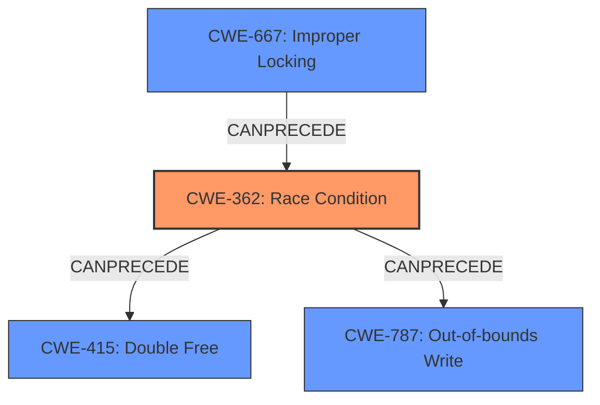

# Final Resolution for CVE-2022-32811

# Summary
| CWE ID | CWE Name | Confidence | CWE Abstraction Level | CWE Vulnerability Mapping Label | CWE-Vulnerability Mapping Notes |
|---|---|---|---|---|---|
| CWE-362 | Concurrent Execution using Shared Resource with Improper Synchronization ('Race Condition') | 0.90 | Class | Primary | Allowed-with-Review |
| CWE-667 | Improper Locking | 0.80 | Class | Secondary | Allowed-with-Review |
| CWE-415 | Double Free | 0.75 | Variant | Secondary | Allowed |
| CWE-787 | Out-of-bounds Write | 0.70 | Base | Secondary | Allowed |

## Evidence and Confidence

*   **Confidence Score:** 0.90
*   **Evidence Strength:** HIGH

## Relationship Analysis
The analysis focuses on the relationships between CWEs to refine the classification. The primary **CWE-362 (Race Condition)** is a Class-level CWE, but the provided information doesn't allow for a more specific child to be selected. A key addition is **CWE-667 (Improper Locking)**, which often leads to race conditions. The analysis also acknowledges that **CWE-362** can precede memory corruption issues like **CWE-415 (Double Free)** and **CWE-787 (Out-of-bounds Write)**. The relationships highlight the progression from a synchronization issue to potential memory corruption vulnerabilities.

## Vulnerability Chain
The vulnerability chain starts with **CWE-667 (Improper Locking)** leading to **CWE-362 (Race Condition)**. The race condition then leads to memory corruption, which can manifest as either **CWE-415 (Double Free)** or **CWE-787 (Out-of-bounds Write)**.
  - Initial Flaw: Improper Locking (CWE-667)
  - Weakness: Race Condition (CWE-362)
  - Impact: Memory Corruption (CWE-415 or CWE-787)

## Summary of Analysis
The initial analysis and criticism are well-reasoned and provide a solid justification for the primary CWE selection of **CWE-362 (Race Condition)**. The inclusion of secondary CWEs like **CWE-415 (Double Free)** and **CWE-787 (Out-of-bounds Write)** is appropriate, given the high-level nature of the vulnerability description. The addition of **CWE-667 (Improper Locking)** significantly strengthens the analysis by explicitly linking the root cause (improper locking) to the resulting race condition. The assessment is heavily based on the provided evidence, including the vulnerability description mentioning "memory corruption" and "improved locking," which directly supports the race condition and locking issues. The graph relationships influenced the final selection by highlighting the causal chain from improper locking to race conditions and potential memory corruption. The selected CWEs are at the optimal level of specificity given the available evidence. While more specific children of **CWE-362** could be considered if more information was available, the current level of detail only supports the Class-level **CWE-362**. The final assessment provides a clear and well-justified classification based on both content and relationships. The MITRE mapping guidance and CWE specifications are accurately applied in the analysis.