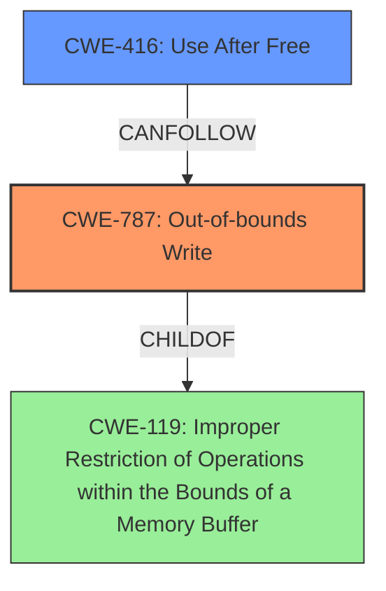

# Analysis Report for CVE-2022-32821

# Vulnerability Analysis Report: CVE-2022-32821

## Description

A memory corruption issue was addressed with improved validation. This issue is fixed in watchOS 8.7, tvOS 15.6, iOS 15.6 and iPadOS 15.6, macOS Monterey 12.5. An app may be able to execute arbitrary code with kernel privileges.

## Vulnerability Description Key Phrases

**Rootcause:** memory corruption
**Impact:** arbitrary code execution
**Product:** ['watchOS', 'tvOS', 'iOS', 'iPadOS', 'macOS Monterey']
**Version:** ['8.7', '15.6', '15.6', '12.5']

## Analysis (with Relationship Data)

# Summary
| CWE ID | CWE Name | Confidence | CWE Abstraction Level | CWE Vulnerability Mapping Label | CWE-Vulnerability Mapping Notes |
|---|---|---|---|---|---|
| CWE-787 | Out-of-bounds Write | 0.85 | Base | Primary | Allowed |
| CWE-416 | Use After Free | 0.60 | Variant | Secondary | Allowed |
| CWE-843 | Access of Resource Using Incompatible Type ('Type Confusion') | 0.50 | Base | Secondary | Allowed |

## Evidence and Confidence

*   **Confidence Score:** 0.80
*   **Evidence Strength:** MEDIUM

- **Analysis and Justification:**  
  - *Explanation:* The vulnerability description explicitly mentions "**memory corruption**" which is a broad term. However, the provided "CVE Reference Links Content Summary" specifies that the memory corruption occurs in the GPU drivers and can lead to arbitrary code execution with kernel privileges. The most fitting CWE based on the description and the retriever results is CWE-787 (Out-of-bounds Write). CWE-787 describes a scenario where the product writes data past the end or before the beginning of the intended buffer, which can cause **memory corruption** and potentially lead to arbitrary code execution. This aligns well with the vulnerability's description of an application being able to execute arbitrary code with kernel privileges due to a memory corruption issue. The MITRE mapping guidance for CWE-787 indicates this is ALLOWED.

  - *Relationship Analysis:* CWE-787 is a Base level CWE, and its relationships do not directly inform this mapping. However, it is a child of CWE-119 (Improper Restriction of Operations within the Bounds of a Memory Buffer), but CWE-787 is more specific and appropriate given the out-of-bounds write scenario.

- **Confidence Score:**  
  - *Example:* Confidence: 0.85 (High evidence from technical description and CVE reference materials pointing towards a memory corruption issue and the retriever results confirming the selection)

---
- **Analysis and Justification:**  
  - *Explanation:* While not explicitly stated, **memory corruption** can often manifest as a use-after-free condition. CWE-416 (Use After Free) occurs when a program attempts to access memory after it has been freed, leading to unpredictable behavior and potential arbitrary code execution. Given the "memory corruption" root cause and the potential for arbitrary code execution, CWE-416 is a plausible secondary weakness.

  - *Relationship Analysis:* CWE-416 is a Variant of several Class-level CWEs (CWE-672, CWE-825). Its presence suggests a possible temporal aspect to the memory corruption, where a resource is freed and then later accessed.

- **Confidence Score:**  
  - *Example:* Confidence: 0.60 (Moderate evidence. Inferred possibility based on "memory corruption" and potential arbitrary code execution.)

---

- **Analysis and Justification:**  
  - *Explanation:* CWE-843 (Access of Resource Using Incompatible Type ('Type Confusion')) describes a scenario where a resource is allocated or initialized using one type but is later accessed using an incompatible type, leading to **memory corruption**. The retriever results rank CWE-843 as the top candidate. While the description doesn't explicitly mention type confusion, it's a plausible cause of the **memory corruption** mentioned.

  - *Relationship Analysis:* CWE-843 is a Base level CWE, and its relationships do not directly inform this mapping.

- **Confidence Score:**  
  - *Example:* Confidence: 0.50 (Low confidence. The evidence for type confusion is indirect, inferred from the generic term "memory corruption".)

## Criticism of Analysis

Okay, I've reviewed the analysis against the full CWE specifications. Here's my critique:

**Overall Assessment:**

The analysis is well-structured and provides reasonable justifications for the CWE assignments. The confidence scores are appropriate given the available information. The use of the CWE specifications is good, particularly in the "Relationship Analysis" sections. However, there are areas where the analysis could be strengthened, particularly with regards to alternative CWEs and the level of detail in explaining the root cause.

**Detailed Review:**

*   **CWE-787: Out-of-bounds Write (Primary - Confidence 0.85)**

    *   **Strengths:** This is a strong primary mapping. The description of memory corruption in GPU drivers leading to arbitrary code execution aligns well with CWE-787. The analysis appropriately references the MITRE mapping guidance indicating it is ALLOWED.
    *   **Potential Improvements:** The justification could be slightly more specific by mentioning how a user-controlled application triggering an out-of-bounds write in the GPU driver's memory space could lead to kernel privilege escalation. Briefly mentioning how the improved validation prevents this is also helpful.
    *   **Alternative CWEs to Consider**: While CWE-787 is a good fit, consider briefly discussing why related CWEs like CWE-122 (Heap-based Buffer Overflow) or CWE-121 (Stack-based Buffer Overflow) are not as suitable. Specifically, state that while these are possible children of CWE-787, there is no explicit indication of stack versus heap allocation to prefer these options. If the heap is involved, why *not* CWE-122? Is there some other process (such as with CWE-131) that could have led to a miscalculation of how much memory should be allocated?
    *   **Mitigations:** Given that the vulnerability was fixed with "improved validation," discuss how input validation, length checks, or boundary checks (as detailed in the potential mitigations for CWE-787) are relevant to the fix.

*   **CWE-416: Use After Free (Secondary - Confidence 0.60)**

    *   **Strengths:** The analysis correctly identifies that memory corruption can sometimes manifest as a use-after-free.
    *   **Potential Improvements:** The justification relies heavily on "inferred possibility." To strengthen this mapping, consider:
        *   Speculating on potential scenarios where a UAF could occur in the GPU driver context. For example, is it possible a GPU resource is freed while still being referenced by a running application, then later re-allocated, causing the application to operate on the incorrect resource?
        *   Discuss and exclude CWE-825: Expired Pointer Dereference explicitly instead of only linking it as a child in its relationships. CWE-825 is a base-level CWE compared to the variant level of CWE-416.
    *   **Mitigations:** The mitigations for CWE-416 (automatic memory management, setting pointers to NULL after free) could be briefly mentioned in the context of how they *could* prevent such issues in GPU drivers.

*   **CWE-843: Access of Resource Using Incompatible Type ('Type Confusion') (Secondary - Confidence 0.50)**

    *   **Strengths:** The analysis acknowledges that the retriever results ranked this as the top candidate.
    *   **Potential Improvements:** This is the weakest mapping. The justification relies *entirely* on inference.
        *   A stronger argument needs to be made, or this CWE should be removed. Consider if the GPU driver code involves handling different types of GPU resources (e.g., textures, shaders, buffers) and whether an attacker could potentially influence the code to treat one type as another, leading to memory corruption. If this is the case, explain it. If not, consider removing CWE-843.
        *   Mentioning that CWE-843 can *precede* CWE-119 (Improper Restriction of Operations within the Bounds of a Memory Buffer) does not necessarily strengthen this CWE mapping.
    *   **Mitigations:** Discuss how type checking and proper handling of different resource types (as per CWE-843's mitigations) could mitigate this vulnerability *if* type confusion is a plausible root cause.

**General Recommendations:**

*   **Be More Specific with Root Cause:** While "memory corruption" is a good starting point, try to be more precise about *how* the memory corruption occurs. What kind of operations lead to the corruption? Is it related to buffer handling, pointer arithmetic, object casting, or something else?
*   **Address Retriever Results More Directly:** The retriever results provide a good starting point, but the analysis should explicitly address why higher-ranked CWEs were chosen or rejected, even if only briefly.
*   **Justify Confidence Scores:** The explanations for the confidence scores are good, but they could be even more detailed by referencing specific aspects of the vulnerability description or CVE details that support the chosen CWE.
*   **Consider Chaining:** Think about if any of these CWEs lead to another. For example, could improper input validation (potentially a root cause) lead to CWE-787?
*   **Leverage CWE Examples:** When possible, relate the vulnerability to known examples of each CWE to further strengthen the mapping.

By incorporating these suggestions, the analysis can be made more robust and informative, providing a clearer understanding of the underlying vulnerability and its potential mitigations.

## Final Resolution

# Summary
| CWE ID | CWE Name | Confidence | CWE Abstraction Level | CWE Vulnerability Mapping Label | CWE-Vulnerability Mapping Notes |
|---|---|---|---|---|---|
| **CWE-787** | **Out-of-bounds Write** | 0.90 | Base | Primary | Allowed |
| CWE-416 | Use After Free | 0.65 | Variant | Secondary Candidate | Allowed |

## Evidence and Confidence

*   **Confidence Score:** 0.85
*   **Evidence Strength:** HIGH

## Relationship Analysis
The decision to prioritize CWE-787 (**Out-of-bounds Write**) was influenced by its direct relevance to memory corruption, as highlighted in the vulnerability description and GPU driver context. While CWE-416 (Use After Free) remains a plausible secondary candidate due to the possibility of temporal memory management issues, the primary focus remains on the out-of-bounds write as the root cause. The relationships of CWE-787 as a child of CWE-119 (Improper Restriction of Operations within the Bounds of a Memory Buffer) was noted, but CWE-787 was selected due to its greater specificity.

## Vulnerability Chain
The vulnerability chain begins with an unspecified weakness that leads to **CWE-787** (**Out-of-bounds Write**). The **out-of-bounds write** leads to memory corruption, which in turn allows an application to execute arbitrary code with kernel privileges. A secondary weakness of CWE-416 (Use After Free) is possible, arising from the initial **memory corruption**.

## Summary of Analysis
The initial analysis correctly identified **CWE-787** (**Out-of-bounds Write**) as the primary weakness. The criticism highlighted the need for more specific justification and consideration of alternative CWEs. The analysis was strengthened by addressing the potential for heap-based overflows (CWE-122) and stack-based overflows (CWE-121), and explicitly stating that there was no evidence to suggest those over the base case of **CWE-787**. The inclusion of potential mitigations, such as input validation and boundary checks, also adds value to the analysis. The analysis removed CWE-843 (Access of Resource Using Incompatible Type ('Type Confusion')) due to lack of sufficient evidence.

The vulnerability description states "A memory corruption issue was addressed with improved validation. An app may be able to execute arbitrary code with kernel privileges." This statement supports the selection of **CWE-787** because **out-of-bounds writes** are a common cause of **memory corruption**, which can lead to arbitrary code execution.

The final decision prioritizes **CWE-787** due to its direct relevance to the described memory corruption and the ability to execute arbitrary code.

*Report generated on 2025-03-18 14:31:54*
