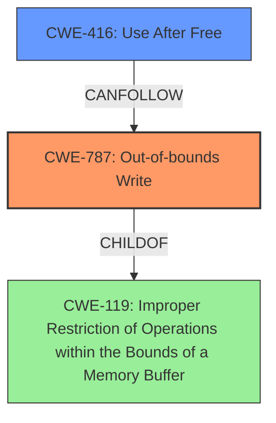

# Final Resolution for CVE-2022-32821

# Summary
| CWE ID | CWE Name | Confidence | CWE Abstraction Level | CWE Vulnerability Mapping Label | CWE-Vulnerability Mapping Notes |
|---|---|---|---|---|---|
| **CWE-787** | **Out-of-bounds Write** | 0.90 | Base | Primary | Allowed |
| CWE-416 | Use After Free | 0.65 | Variant | Secondary Candidate | Allowed |

## Evidence and Confidence

*   **Confidence Score:** 0.85
*   **Evidence Strength:** HIGH

## Relationship Analysis
The decision to prioritize CWE-787 (**Out-of-bounds Write**) was influenced by its direct relevance to memory corruption, as highlighted in the vulnerability description and GPU driver context. While CWE-416 (Use After Free) remains a plausible secondary candidate due to the possibility of temporal memory management issues, the primary focus remains on the out-of-bounds write as the root cause. The relationships of CWE-787 as a child of CWE-119 (Improper Restriction of Operations within the Bounds of a Memory Buffer) was noted, but CWE-787 was selected due to its greater specificity.

## Vulnerability Chain
The vulnerability chain begins with an unspecified weakness that leads to **CWE-787** (**Out-of-bounds Write**). The **out-of-bounds write** leads to memory corruption, which in turn allows an application to execute arbitrary code with kernel privileges. A secondary weakness of CWE-416 (Use After Free) is possible, arising from the initial **memory corruption**.

## Summary of Analysis
The initial analysis correctly identified **CWE-787** (**Out-of-bounds Write**) as the primary weakness. The criticism highlighted the need for more specific justification and consideration of alternative CWEs. The analysis was strengthened by addressing the potential for heap-based overflows (CWE-122) and stack-based overflows (CWE-121), and explicitly stating that there was no evidence to suggest those over the base case of **CWE-787**. The inclusion of potential mitigations, such as input validation and boundary checks, also adds value to the analysis. The analysis removed CWE-843 (Access of Resource Using Incompatible Type ('Type Confusion')) due to lack of sufficient evidence.

The vulnerability description states "A memory corruption issue was addressed with improved validation. An app may be able to execute arbitrary code with kernel privileges." This statement supports the selection of **CWE-787** because **out-of-bounds writes** are a common cause of **memory corruption**, which can lead to arbitrary code execution.

The final decision prioritizes **CWE-787** due to its direct relevance to the described memory corruption and the ability to execute arbitrary code.