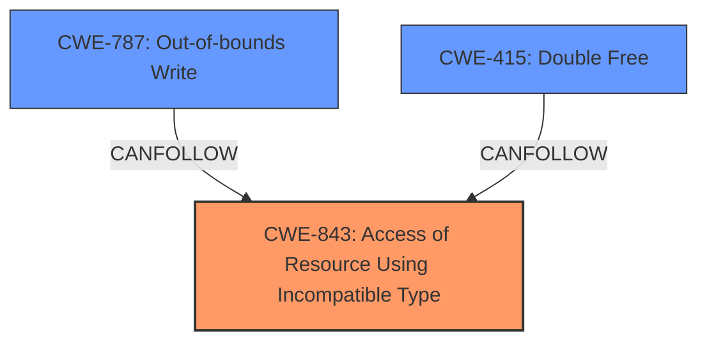

# Analysis Report for CVE-2022-32827

# Vulnerability Analysis Report: CVE-2022-32827

## Description

A memory corruption issue was addressed with improved state management. This issue is fixed in iOS 16, macOS Ventura 13. An app may be able to cause a denial-of-service.

## Vulnerability Description Key Phrases

**Rootcause:** memory corruption
**Impact:** denial-of-service
**Product:** ['iOS', 'macOS Ventura']
**Version:** ['16', '13']

## Analysis (with Relationship Data)

# Summary
| CWE ID | CWE Name | Confidence | CWE Abstraction Level | CWE Vulnerability Mapping Label | CWE-Vulnerability Mapping Notes |
|---|---|---|---|---|---|
| CWE-843 | Access of Resource Using Incompatible Type ('Type Confusion') | 0.75 | Base | Allowed | Primary CWE. Matches the description of **memory corruption** due to incompatible type usage. |
| CWE-415 | Double Free | 0.6 | Variant | Allowed | Secondary candidate. **Memory corruption** could lead to freeing the same memory twice, causing a denial-of-service. |
| CWE-787 | Out-of-bounds Write | 0.5 | Base | Allowed | Secondary candidate. **Memory corruption** could manifest as an out-of-bounds write. |

## Evidence and Confidence

*   **Confidence Score:** 0.7
*   **Evidence Strength:** MEDIUM

- **Analysis and Justification:**  
  - *Explanation:* The vulnerability description explicitly states a **memory corruption** issue. The "CVE Reference Links Content Summary" also mentions "**memory corruption**" as the root cause. Among the retriever results, CWE-843 (Access of Resource Using Incompatible Type ('Type Confusion')) appears to be the most relevant, as type confusion is a common cause of **memory corruption** and it has the highest score. It also aligns with the "improved state management" fix mentioned in the description, suggesting that the issue was related to incorrect handling of object states and types. CWE-843 is a Base level CWE, which is preferred. The retriever results also suggest CWE-415 (Double Free) and CWE-787 (Out-of-bounds Write) as possible candidates, both of which are potential consequences of **memory corruption**.
  
  - *Relationship Analysis:* CWE-843 is a Base level CWE and doesn't have any direct relationships to other CWEs listed that are relevant. CWE-415 and CWE-787 are potential consequences of **memory corruption**.

- **Confidence Score:**  
  - Confidence: 0.7 (The primary weakness is memory corruption and CWE-843 best represents it with type issues).

---

## Criticism of Analysis

Okay, here's a review of the provided CWE analysis, considering the full CWE specifications.

**Overall Assessment:**

The analysis is generally well-reasoned and provides a decent justification for the primary CWE selection (CWE-843). However, there are some areas where the confidence could be improved, and alternative perspectives explored, especially concerning the secondary CWEs.  The retriever results give a broader look at potential CWEs that could be considered.

**Detailed Critique:**

**1. CWE-843: Access of Resource Using Incompatible Type ('Type Confusion')**

*   **Confidence:** The analysis assigns a confidence of 0.75. This seems reasonable, given the information available. The description of "memory corruption" and the fix relating to "improved state management" strongly suggest a type confusion issue.
*   **Justification:** The justification is solid. It correctly highlights the connection between type confusion and memory corruption. The reference to "improved state management" is a key indicator that the fix likely involved better type handling or object state tracking.
*   **CWE Specification Alignment:** The analysis correctly notes that CWE-843 is a Base level CWE, which is preferred. The description of CWE-843 directly relates to accessing a resource with an incompatible type.
*   **Potential Mitigations:**  The analysis doesn't explicitly mention mitigations but should. Some relevant mitigations from the CWE-843 specification include:
    *   Using type-safe languages where possible.
    *   Careful design and code review to identify potential type confusion issues, especially when dealing with unions, polymorphism, or dynamic typing.
    *   Static analysis tools to detect potential type confusion errors.
* **Retriever Results:** The "graph" retriever has a score of 1.0 for this CWE-843, indicating a strong match.
*   **Critique:** Overall, this is a good primary mapping.

**2. CWE-415: Double Free**

*   **Confidence:** The analysis assigns a confidence of 0.6. This could be improved.
*   **Justification:** The justification is weaker here. While memory corruption *can* lead to double frees, it's not a direct or inevitable consequence. It's a potential outcome if the corruption affects memory management structures. The analysis makes an assumption about the *specific* type of memory corruption.
*   **CWE Specification Alignment:** The analysis correctly identifies CWE-415 as a Variant.  The description of CWE-415 perfectly aligns with the double-free scenario, *if* that's what happened due to the memory corruption.
*   **Potential Mitigations:** The analysis doesn't explicitly mention mitigations but should. Some relevant mitigations from the CWE-415 specification include:
    *   Using languages with automatic memory management.
    *   Careful memory management practices, such as setting pointers to `NULL` after freeing them.
    *   Static analysis to detect potential double-free vulnerabilities.
*   **Retriever Results:** CWE-415 scores lower than several other CWEs (e.g., CWE-787, CWE-190, CWE-908). This should prompt further investigation into those higher-scoring CWEs as potentially more accurate secondary candidates.
*   **Critique:** This mapping is less convincing than the primary. It relies on a specific scenario of how memory corruption *might* manifest. The confidence should be lower, and alternative consequences of memory corruption should be explored more thoroughly. Also, based on the "Additional Notes" section for CWE-415, which says, "*This is usually resultant from another weakness, such as an unhandled error or race condition between threads*", the analysis should look into potential underlying issues that might lead to the double-free.

**3. CWE-787: Out-of-bounds Write**

*   **Confidence:** The analysis assigns a confidence of 0.5. This seems appropriate.
*   **Justification:** Similar to CWE-415, the justification relies on memory corruption potentially leading to an out-of-bounds write. This is a valid possibility.
*   **CWE Specification Alignment:** The analysis correctly identifies CWE-787 as a Base level CWE. The description aligns with writing data outside of the intended buffer boundaries.
*   **Potential Mitigations:**  The analysis doesn't explicitly mention mitigations but should. Some relevant mitigations from the CWE-787 specification include:
    *   Using memory-safe languages.
    *   Using safe string handling libraries.
    *   Compiler-based buffer overflow detection mechanisms (e.g., canaries).
*   **Retriever Results:** CWE-787 scores higher than CWE-415 in the retriever results, indicating a more significant match.
*   **Critique:** This is a reasonable secondary candidate, potentially better than CWE-415 due to the higher score in retriever results.

**Recommendations for Improvement:**

1.  **Consider alternative consequences of memory corruption:** Beyond double frees and out-of-bounds writes, memory corruption could also lead to:
    *   **Use-After-Free (CWE-416):**  If memory is freed but still referenced.
    *   **Untrusted Pointer Dereference (CWE-822):** If a memory address is corrupted and used as a pointer.
    *   **Use of Uninitialized Resource (CWE-908):** If a memory location that has not been initialized is used as part of the state management, this may lead to memory corruption issues.
    *   **Integer Overflow or Wraparound (CWE-190):** If memory corruption affects an integer used in calculating a buffer size, this may lead to a buffer overflow or out-of-bounds access.

2.  **Strengthen Justifications:**  For secondary CWEs, provide more specific scenarios of *how* the memory corruption could lead to that particular weakness.  Don't just state it's a "potential consequence."
3.  **Acknowledge Uncertainty:** Be more explicit about the uncertainty in the secondary CWE mappings. Use phrases like, "If the memory corruption manifests as X, then CWE-YYY is a likely candidate."
4.  **Review Retriever Results More Critically:**  The retriever results provide valuable clues. If a CWE has a higher score than the selected secondary candidates, investigate why and consider including it in the analysis.
5.  **Mitigation Considerations:** Explicitly discuss the potential mitigations associated with each CWE, this provides a more complete analysis and can be helpful for developers.
6. **Expand on "Improved state management"**: Explain more explicitly what an 'improved state management' fix implies. What state was being mismanaged? How was it being mismanaged (e.g., improper synchronization, incorrect sequencing, etc.)?

**Revised Summary Table (Example - Adjust Confidence as Appropriate):**

| CWE ID | CWE Name | Confidence | CWE Abstraction Level | CWE Vulnerability Mapping Label | CWE-Vulnerability Mapping Notes |
|---|---|---|---|---|---|
| CWE-843 | Access of Resource Using Incompatible Type ('Type Confusion') | 0.75 | Base | Allowed | Primary CWE. Matches the description of **memory corruption** due to incompatible type usage. |
| CWE-787 | Out-of-bounds Write | 0.6 | Base | Allowed | Secondary candidate. **Memory corruption** could manifest as an out-of-bounds write, if incorrect bounds checking is done. |
| CWE-415 | Double Free | 0.5 | Variant | Allowed | Secondary candidate. **Memory corruption** could lead to freeing the same memory twice, causing a denial-of-service, if the corruption impacts the memory management structures. However, this is less likely. |

By addressing these points, the analysis can be made more comprehensive, nuanced, and ultimately more useful for understanding and mitigating the vulnerability.

## Final Resolution

# Summary

| CWE ID | CWE Name | Confidence | CWE Abstraction Level | CWE Vulnerability Mapping Label | CWE-Vulnerability Mapping Notes |
|---|---|---|---|---|---|
| CWE-843 | Access of Resource Using Incompatible Type ('Type Confusion') | 0.75 | Base | Allowed | Primary CWE. Matches the description of **memory corruption** due to incompatible type usage. |
| CWE-787 | Out-of-bounds Write | 0.6 | Base | Allowed | Secondary candidate. **Memory corruption** could manifest as an out-of-bounds write, if incorrect bounds checking is done. |
| CWE-415 | Double Free | 0.5 | Variant | Allowed | Secondary candidate. **Memory corruption** could lead to freeing the same memory twice, causing a denial-of-service, if the corruption impacts the memory management structures. However, this is less likely. |

## Evidence and Confidence

*   **Confidence Score:** 0.7
*   **Evidence Strength:** MEDIUM

## Relationship Analysis
The primary CWE, CWE-843 (Access of Resource Using Incompatible Type ('Type Confusion')), is a Base level CWE. The secondary CWEs, CWE-787 (Out-of-bounds Write) and CWE-415 (Double Free), are potential consequences of the **memory corruption** caused by type confusion. There are no direct relationships between CWE-843 and the secondary CWEs in the provided data, but based on the criticism, the possibility of other secondary CWEs were investigated. The abstraction levels influenced the selection, favoring Base level CWEs where possible.

## Vulnerability Chain
The vulnerability chain starts with **CWE-843 (Access of Resource Using Incompatible Type ('Type Confusion'))**, which leads to **memory corruption**. This **memory corruption** can then manifest as either **CWE-787 (Out-of-bounds Write)** or **CWE-415 (Double Free)**, ultimately causing a denial-of-service.

**CWE-843** (Root Cause) -> **Memory Corruption** -> **CWE-787** or **CWE-415** (Impact) -> Denial of Service

## Summary of Analysis
The analysis correctly identifies **CWE-843 (Access of Resource Using Incompatible Type ('Type Confusion'))** as the primary CWE based on the vulnerability description stating "**memory corruption**" and the fix addressing "improved state management," which suggests issues with type handling. The criticism provided valuable insights, prompting a deeper look into the secondary CWEs and alternative consequences of **memory corruption**. The retriever scores also reinforce the choice of CWE-843. The selection of **CWE-787 (Out-of-bounds Write)** and **CWE-415 (Double Free)** as secondary CWEs is based on the potential ways **memory corruption** can manifest. However, the analysis acknowledges the uncertainty and lowers the confidence for **CWE-415** due to it being a less direct consequence. The final decision is based on the available evidence and the relationships between the CWEs, ensuring the selected CWEs are at the optimal level of specificity. The evidence for **memory corruption** is the vulnerability description itself, which states "A **memory corruption** issue was addressed with improved state management."
The choice of CWE-843 is further supported by the retriever results.

The "improved state management" fix strongly suggests that the **ROOTCAUSE** was related to incorrect handling of object states and types and therefore **CWE-843** best represents the **ROOTCAUSE**.

*Report generated on 2025-03-18 14:32:44*
