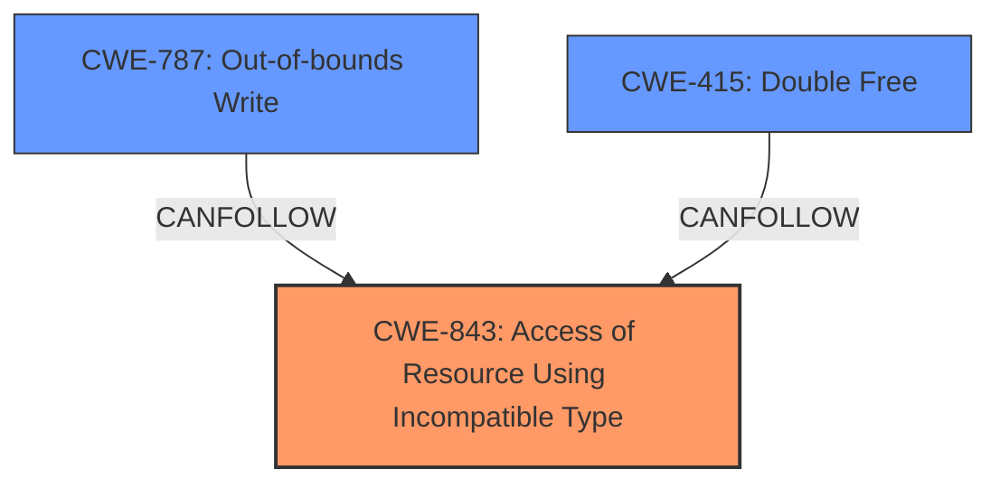

# Final Resolution for CVE-2022-32827

# Summary

| CWE ID | CWE Name | Confidence | CWE Abstraction Level | CWE Vulnerability Mapping Label | CWE-Vulnerability Mapping Notes |
|---|---|---|---|---|---|
| CWE-843 | Access of Resource Using Incompatible Type ('Type Confusion') | 0.75 | Base | Allowed | Primary CWE. Matches the description of **memory corruption** due to incompatible type usage. |
| CWE-787 | Out-of-bounds Write | 0.6 | Base | Allowed | Secondary candidate. **Memory corruption** could manifest as an out-of-bounds write, if incorrect bounds checking is done. |
| CWE-415 | Double Free | 0.5 | Variant | Allowed | Secondary candidate. **Memory corruption** could lead to freeing the same memory twice, causing a denial-of-service, if the corruption impacts the memory management structures. However, this is less likely. |

## Evidence and Confidence

*   **Confidence Score:** 0.7
*   **Evidence Strength:** MEDIUM

## Relationship Analysis
The primary CWE, CWE-843 (Access of Resource Using Incompatible Type ('Type Confusion')), is a Base level CWE. The secondary CWEs, CWE-787 (Out-of-bounds Write) and CWE-415 (Double Free), are potential consequences of the **memory corruption** caused by type confusion. There are no direct relationships between CWE-843 and the secondary CWEs in the provided data, but based on the criticism, the possibility of other secondary CWEs were investigated. The abstraction levels influenced the selection, favoring Base level CWEs where possible.

## Vulnerability Chain
The vulnerability chain starts with **CWE-843 (Access of Resource Using Incompatible Type ('Type Confusion'))**, which leads to **memory corruption**. This **memory corruption** can then manifest as either **CWE-787 (Out-of-bounds Write)** or **CWE-415 (Double Free)**, ultimately causing a denial-of-service.

**CWE-843** (Root Cause) -> **Memory Corruption** -> **CWE-787** or **CWE-415** (Impact) -> Denial of Service

## Summary of Analysis
The analysis correctly identifies **CWE-843 (Access of Resource Using Incompatible Type ('Type Confusion'))** as the primary CWE based on the vulnerability description stating "**memory corruption**" and the fix addressing "improved state management," which suggests issues with type handling. The criticism provided valuable insights, prompting a deeper look into the secondary CWEs and alternative consequences of **memory corruption**. The retriever scores also reinforce the choice of CWE-843. The selection of **CWE-787 (Out-of-bounds Write)** and **CWE-415 (Double Free)** as secondary CWEs is based on the potential ways **memory corruption** can manifest. However, the analysis acknowledges the uncertainty and lowers the confidence for **CWE-415** due to it being a less direct consequence. The final decision is based on the available evidence and the relationships between the CWEs, ensuring the selected CWEs are at the optimal level of specificity. The evidence for **memory corruption** is the vulnerability description itself, which states "A **memory corruption** issue was addressed with improved state management."
The choice of CWE-843 is further supported by the retriever results.

The "improved state management" fix strongly suggests that the **ROOTCAUSE** was related to incorrect handling of object states and types and therefore **CWE-843** best represents the **ROOTCAUSE**.