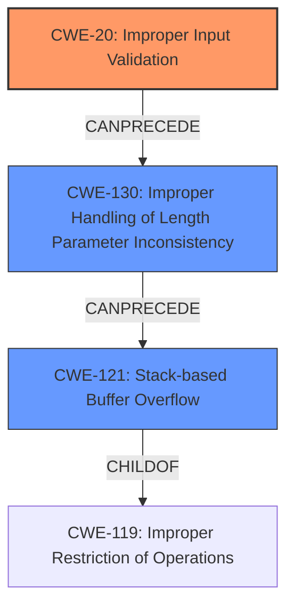

# Final Resolution for CVE-2022-32959

# Summary
| CWE ID | CWE Name | Confidence | CWE Abstraction Level | CWE Vulnerability Mapping Label | CWE-Vulnerability Mapping Notes |
|---|---|---|---|---|---|
| CWE-20 | Improper Input Validation | 0.90 | Class | Allowed | Primary CWE |
| CWE-130 | Improper Handling of Length Parameter Inconsistency | 0.85 | Base | Allowed | Secondary Candidate |
| CWE-121 | Stack-based Buffer Overflow | 0.95 | Variant | Allowed | Secondary Candidate |

## Evidence and Confidence

*   **Confidence Score:** 0.93
*   **Evidence Strength:** HIGH

## Relationship Analysis
The analysis focuses on identifying the root cause and the resulting vulnerability. The primary relationship is a chain where CWE-20 leads to CWE-130, which then results in CWE-121. CWE-121 is a specific type of buffer overflow (variant), making it a child of CWE-119. CWE-130 represents the improper handling of the input length, directly contributing to the buffer overflow. CWE-20 is the root cause where the input is not validated.

## Vulnerability Chain
The vulnerability chain starts with **CWE-20 (Improper Input Validation)**, the root cause where the application fails to validate the length of the OS information parameter read from the IC card. This leads to **CWE-130 (Improper Handling of Length Parameter Inconsistency)**, where the application doesn't correctly manage the length of the input, causing it to write beyond the buffer's boundaries. Finally, this results in **CWE-121 (Stack-based Buffer Overflow)**, the exploitable condition where arbitrary code execution becomes possible due to the overflow on the stack. The chain highlights how a lack of input validation can directly lead to a buffer overflow vulnerability.

## Summary of Analysis
The initial analysis correctly identified **CWE-121 (Stack-based Buffer Overflow)** and **CWE-130 (Improper Handling of Length Parameter Inconsistency)** as significant factors in this vulnerability. The criticism suggested the addition of **CWE-20 (Improper Input Validation)** as the root cause. This is because the vulnerability description explicitly mentions "insufficient parameter length validation for OS information," indicating a failure to validate input.

The graph relationships support this decision. **CWE-20** can lead to **CWE-130**, which in turn can lead to **CWE-121**. By including **CWE-20**, the analysis provides a more complete picture of the vulnerability's origins.

The selected CWEs are at the optimal level of specificity. **CWE-121** is a variant that accurately describes the type of buffer overflow. **CWE-130** is a base CWE that identifies the specific issue of improper length handling. **CWE-20** is a class CWE that is a parent of more specific input validation errors. All three CWEs are ALLOWED according to MITRE's mapping guidance and contribute to a comprehensive understanding of the vulnerability.

The evidence from the vulnerability description, combined with the relationship analysis and mapping guidance, justifies the final selection of **CWE-20**, **CWE-130**, and **CWE-121** as the most appropriate classifications.