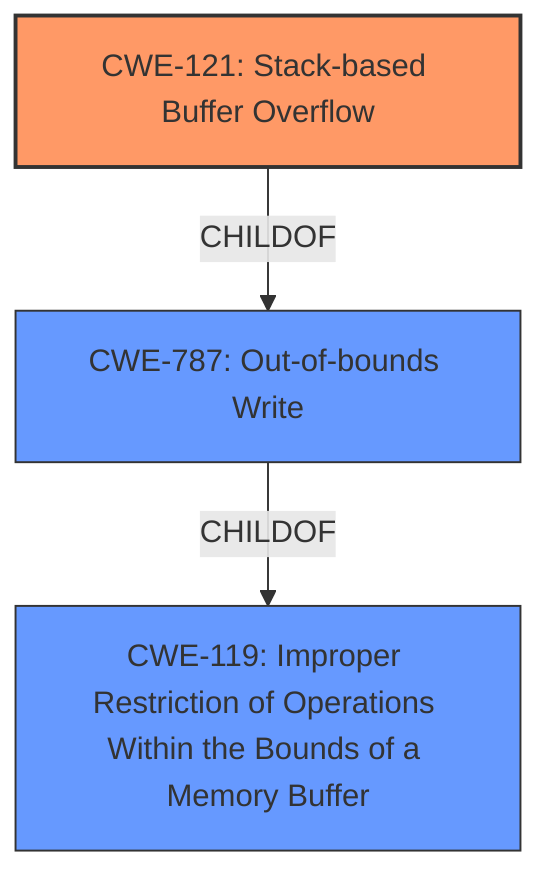

# Analysis Report for CVE-2022-3296

# Vulnerability Analysis Report: CVE-2022-3296

## Description

Stack-based Buffer Overflow in GitHub repository vim/vim prior to 9.0.0577.

## Vulnerability Description Key Phrases

**Weakness:** stack-based buffer overflow
**Product:** vim/vim
**Version:** prior to 9.0.0577

## Analysis (with Relationship Data)

# Summary
| CWE ID  | CWE Name   | Confidence | CWE Abstraction Level | CWE Vulnerability Mapping Label | CWE-Vulnerability Mapping Notes |
|---|---|---|---|---|---|
| CWE-121 | Stack-based Buffer Overflow | 0.95 | Variant | Allowed | Primary CWE |
| CWE-787 | Out-of-bounds Write | 0.75 | Base | Allowed | Secondary Candidate |

## Evidence and Confidence

*   **Confidence Score:** 0.90
*   **Evidence Strength:** HIGH

- **Analysis and Justification:**  
  - *Explanation:* "The vulnerability is explicitly described as a **stack-based buffer overflow** in the vim/vim repository. This directly aligns with CWE-121 (Stack-based Buffer Overflow), which is a Variant of CWE-119 (Improper Restriction of Operations Within the Bounds of a Memory Buffer). The vulnerability occurs when an unexpected `:finally` statement is encountered, leading to data being written beyond the allocated buffer on the stack. The CVE Reference Links Content Summary clearly supports this, stating that the primary **weakness** is a **stack buffer overflow**. The MITRE mapping guidance designates CWE-121 as ALLOWED for stack-based buffer overflows. Although CWE-787 (Out-of-bounds Write) is a parent weakness and could apply, CWE-121 is more specific and provides a better fit for describing the vulnerability."
  
  - *Relationship Analysis:* "CWE-121 is a Variant of CWE-119 and a ChildOf CWE-787. The retriever results also highlight the relevance of CWE-121 due to its higher combined score and usage designation of ALLOWED. The vulnerability being stack-based makes CWE-121 a more appropriate choice than the more general CWE-787."

- **Confidence Score:**  
  - Confidence: 0.95 (Strong evidence from the vulnerability description and CVE reference materials.)

---
- **Analysis and Justification:**  
  - *Explanation:* "CWE-787 (Out-of-bounds Write) is a more general case of writing data past the end or before the beginning of the intended buffer. While CWE-121 is more specific to stack-based buffer overflows, CWE-787 is still relevant as it describes the fundamental issue. The vulnerability involves writing outside the bounds of a buffer, which is precisely what CWE-787 defines. The retriever results list CWE-787. However, due to the explicit mention of a stack-based overflow, CWE-121 takes precedence. CWE-787 serves as a broader categorization of the **weakness**, but lacks the specificity needed to accurately describe this particular vulnerability. Although this CWE is less precise than CWE-121, it is applicable and accurately describes the underlying vulnerability."
  
  - *Relationship Analysis:* "CWE-787 is a parent of CWE-121 (Stack-based Buffer Overflow). The graph relationships also show that CWE-787 CanPrecede other weaknesses."

- **Confidence Score:**  
  - Confidence: 0.75 (Applicable, but less specific than CWE-121).

## Criticism of Analysis

Okay, here's a review of the provided CWE analysis, incorporating the full CWE specifications and focusing on the mapping guidance and potential mitigations.

**Overall Assessment:**

The analysis is generally good and correctly identifies CWE-121 (Stack-based Buffer Overflow) as the primary weakness. The justification is sound, and the confidence level is appropriate. The inclusion of CWE-787 (Out-of-bounds Write) as a secondary candidate is also reasonable, although the rationale could be slightly improved.

**Detailed Review:**

**1. CWE-121: Stack-based Buffer Overflow (Primary)**

*   **Confidence:** 0.95 (Excellent - Justified)
*   **Abstraction Level:** Variant (Correct)
*   **Vulnerability Mapping Label:** Allowed (Correct)

    *   **Strengths:**

        *   The analysis correctly identifies the "stack-based" nature of the overflow, making CWE-121 the most specific and accurate choice.
        *   The justification clearly articulates why CWE-121 is preferred over its parent CWE-787 due to its specificity.
        *   The analysis acknowledges the use case guidance that this CWE is ALLOWED.
    *   **Potential Improvements:**

        *   Consider mentioning that stack-based buffer overflows can lead to return address overwrites, which could then be used to point to attacker controlled code. This is mentioned in the "Additional Notes" section of the CWE-121 specification.
    *   **Mitigations (From CWE Specification):**

        *   **Operation, Build and Compilation:** Environment Hardening (e.g., /GS flag, FORTIFY_SOURCE, StackGuard, ProPolice).  This is a key mitigation to highlight. The analysis could explicitly mention these defenses and how they work (e.g., canary-based detection).
        *   **Architecture and Design:** Use an abstraction library. The analysis could elaborate on why this is *not* a complete solution.
        *   **Implementation:** Bounds checking. This is fundamental and should be emphasized.

**2. CWE-787: Out-of-bounds Write (Secondary Candidate)**

*   **Confidence:** 0.75 (Reasonable, but could be improved)
*   **Abstraction Level:** Base (Correct)
*   **Vulnerability Mapping Label:** Allowed (Correct)

    *   **Strengths:**

        *   Recognizes that the vulnerability ultimately involves writing outside of allocated memory.
        *   The analysis is valid in that CWE-787 *does* apply, albeit as a more general categorization.
        *   Usage guidance for this CWE is ALLOWED.
    *   **Potential Improvements:**

        *   The justification could be strengthened by explicitly stating that while CWE-121 captures the *location* of the buffer (stack), CWE-787 describes the *action* of writing beyond its boundaries. However, the stack location is known from the vulnerability description, so the CWE-121 should be preferred.
        *   The confidence could be lowered slightly, as the specificity of stack location is important here.
    *   **Mitigations (From CWE Specification):**  The suggested mitigations for CWE-787 are largely the same as for CWE-121.

**General Comments:**

*   **Relationship Analysis:** The analysis does a good job of explaining the parent-child relationship between CWE-787, CWE-119, and CWE-121.
*   **Retriever Results:** The Retriever Results are interesting.  The fact that CWE-121 has a lower "combined score" than CWE-124, CWE-120, CWE-193, CWE-126 and CWE-122, but was selected as the primary, shows the importance of manual analysis and not just relying on automated tools. This also highlights the importance of understanding the context of the vulnerability.

**Recommendations:**

1.  **Strengthen Justification for CWE-787:** Emphasize its role as describing the underlying *action* of writing out of bounds, but highlight why CWE-121's *location* specificity is more relevant given the provided information.
2.  **Expand on Mitigations:** Elaborate on the specific mitigation techniques mentioned in the CWE-121 and CWE-787 specifications, especially:
    *   How stack canaries work and their effectiveness.
    *   Why abstraction libraries are not complete solutions.
    *   The importance of thorough bounds checking in implementation.
3.  **Review Observed Examples** While provided in the full CWE data, it would be helpful to identify a similar Observed Example to show how this has happened before.

By incorporating these suggestions, the analysis will be more comprehensive and provide greater value in understanding and mitigating this type of vulnerability.

## Final Resolution

# Summary
| CWE ID  | CWE Name   | Confidence | CWE Abstraction Level | CWE Vulnerability Mapping Label | CWE-Vulnerability Mapping Notes |
|---|---|---|---|---|---|
| CWE-121 | Stack-based Buffer Overflow | 0.95 | Variant | Allowed | Primary CWE |
| CWE-787 | Out-of-bounds Write | 0.75 | Base | Allowed | Secondary Candidate |

## Evidence and Confidence

*   **Confidence Score:** 0.90
*   **Evidence Strength:** HIGH

## Relationship Analysis
The primary relationship impacting the decision is the parent-child relationship between CWE-787 (**Out-of-bounds Write**) and CWE-121 (**Stack-based Buffer Overflow**). CWE-121 is a variant of CWE-787, providing more specific information about the location of the buffer overflow (stack).

## Vulnerability Chain
The vulnerability chain starts with a programming error leading to an unexpected `:finally` statement. This results in data being written beyond the allocated buffer on the stack. This **out-of-bounds write** (**CWE-787**) on the stack (**CWE-121**) can overwrite critical data, potentially including the return address, allowing an attacker to control program execution.

## Summary of Analysis
The initial analysis correctly identified CWE-121 as the primary **weakness**, given the vulnerability description explicitly mentions a **stack-based buffer overflow**. The criticism suggests strengthening the justification for including CWE-787 and elaborating on mitigations. The decision to prioritize CWE-121 is based on the explicit evidence in the vulnerability description: "Stack-based Buffer Overflow in GitHub repository vim/vim prior to 9.0.0577." This specificity makes CWE-121 the more appropriate choice.

The graph relationships reinforce this decision, as CWE-121 is a variant of CWE-787, providing a more precise classification. The abstraction levels are also considered: CWE-121 is a Variant, which is an acceptable level of abstraction, while CWE-787 is a Base, which is a more general classification. While CWE-787 describes the underlying **out-of-bounds write**, the stack location is known and important, thus CWE-121 is more specific.

*Report generated on 2025-03-18 14:35:10*
