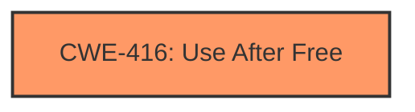

# Final Resolution for CVE-2022-3304

# Summary
| CWE ID | CWE Name | Confidence | CWE Abstraction Level | CWE Vulnerability Mapping Label | CWE-Vulnerability Mapping Notes |
|---|---|---|---|---|---|
| CWE-416 | Use After Free | 1.0 | Variant | Allowed | Primary CWE |

## Evidence and Confidence

*   **Confidence Score:** 1.0
*   **Evidence Strength:** HIGH

## Relationship Analysis
The primary CWE mapping is **CWE-416 (Use After Free)**, a variant-level CWE. While other CWEs like **CWE-122 (Heap-based Buffer Overflow)**, **CWE-415 (Double Free)**, **CWE-843 (Access of Resource Using Incompatible Type ('Type Confusion'))**, and **CWE-362 (Concurrent Execution using Shared Resource with Improper Synchronization ('Race Condition'))** were considered, the vulnerability description explicitly states "use after free," making **CWE-416** the most specific and accurate choice. There are no direct relationships of **CWE-416** mentioned in the provided information, so none are being visually represented in the graph.

## Vulnerability Chain
The vulnerability chain starts with a use-after-free condition in CSS, leading to potential heap corruption. The sequence is:
1.  **ROOTCAUSE**: **CWE-416 (Use After Free)** - Memory is accessed after it has been freed.
2.  **IMPACT**: Heap corruption.
3.  **CONSEQUENCE**: Potential for arbitrary code execution, denial of service, or information disclosure, as heap corruption could overwrite function pointers or critical data structures.

## Summary of Analysis
The initial analysis and the criticism both agree on the primary **WEAKNESS** being **CWE-416 (Use After Free)**. The vulnerability description explicitly mentions "use after free," which directly aligns with the definition of **CWE-416**.

Evidence from the vulnerability description: "Use after free in CSS in Google Chrome prior to 106.0.5249.62 allowed a remote attacker to potentially exploit heap corruption via a crafted HTML page."

The graph relationships did not significantly influence the decision, as no direct relationships were provided for **CWE-416**. However, the analysis correctly considered and ruled out other potential CWEs based on the specific details of the vulnerability description.

The selected **CWE-416** is at the optimal level of specificity because it directly reflects the stated **ROOTCAUSE** of the vulnerability.