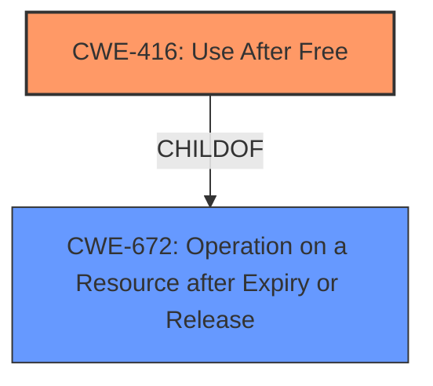

# Analysis Report for CVE-2022-3307

# Vulnerability Analysis Report: CVE-2022-3307

## Description

Use after free in media in Google Chrome prior to 106.0.5249.62 allowed a remote attacker to potentially exploit heap corruption via a crafted HTML page. (Chromium security severity High)

## Vulnerability Description Key Phrases

**Rootcause:** use after free
**Weakness:** heap corruption
**Vector:** crafted HTML page
**Attacker:** remote attacker
**Product:** Google Chrome
**Version:** prior to 106.0.5249.62

## Analysis (with Relationship Data)

# Summary
| CWE ID | CWE Name | Confidence | CWE Abstraction Level | CWE Vulnerability Mapping Label | CWE-Vulnerability Mapping Notes |
|---|---|---|---|---|---|
| CWE-416 | Use After Free | 1.0 | Variant | Primary | Allowed |

## Evidence and Confidence

*   **Confidence Score:** 1.0
*   **Evidence Strength:** HIGH

- **Analysis and Justification:**  
  - *Explanation:* The vulnerability description explicitly states "**use after free**" as the root cause, which directly aligns with CWE-416 (Use After Free). The description also mentions "**heap corruption**" which is a common consequence of use-after-free vulnerabilities. The provided "CVE Reference Links Content Summary" also confirms "**Use after free** in Media" as the root cause and the attack vector as "Likely triggered via crafted media content". The "Retriever Results" also lists CWE-416 as the top match with a high score. Given this direct and consistent evidence, CWE-416 is the most appropriate mapping.

  - *Relationship Analysis:* CWE-416 is a variant of CWE-672 (Operation on Resource after Expiry). Understanding this relationship helps contextualize the specific nature of the use-after-free condition in the described vulnerability. While CWE-672 could be considered, CWE-416 provides a more precise description of the weakness.

- **Confidence Score:**  
  - Confidence: 1.0 (Explicit mention of "use after free" and corroborating evidence from the CVE reference materials).

## Criticism of Analysis

Okay, here's a detailed review of the provided analysis, considering the full CWE specifications:

**Overall Assessment:**

The analysis is generally very good and justifies the primary CWE mapping of **CWE-416 (Use After Free)** with high confidence. The explanation is clear, concise, and uses appropriate evidence from the vulnerability description, CVE reference summary, and retriever results.  The inclusion of CWE examples and relevant CWE specifications further strengthens the analysis.

**Strengths:**

*   **Clear Justification:** The reasoning for choosing CWE-416 is well-articulated and supported by multiple sources of evidence.
*   **High Confidence:** The confidence score of 1.0 is appropriate given the explicit mention of "use after free" in the vulnerability description.
*   **Relationship Analysis:**  Mentioning the relationship between CWE-416 and CWE-672 provides valuable context.
*   **Comprehensive Information:** The inclusion of CWE examples and the complete specifications for referenced CWEs is helpful for understanding the weakness in detail.
*   **Correct Abstraction Level:** Choosing a "Variant" level CWE (CWE-416) is aligned with mapping best practices.

**Areas for Potential Improvement (Minor):**

*   **Heap Corruption Context:** While the analysis mentions "heap corruption" as a consequence, it could briefly explain *how* a use-after-free leads to heap corruption.  A very brief explanation of the potential for memory re-allocation and subsequent incorrect data access would be beneficial.
*   **Alternative CWE Consideration (CWE-787):**  Given that the vulnerability mentions "heap corruption" and that "crafted HTML page" is the vector, it might be prudent to explicitly rule out **CWE-787 (Out-of-bounds Write)** with a short explanation.  Heap corruption *can* sometimes be caused by out-of-bounds writes, although in this case, the root cause is clearly UAF. The explanation should say something like "While heap corruption can be caused by out-of-bounds writes (CWE-787), the explicit mention of 'use after free' indicates that the memory corruption is a consequence of accessing freed memory, rather than writing beyond the boundaries of an allocated buffer."
*   **Mitigation Relevance (CWE-416):** While the analysis correctly identifies CWE-416, consider whether the provided mitigations are particularly applicable or noteworthy in this specific context. The mitigations section for CWE-416 suggests "Choose a language that provides automatic memory management." and "When freeing pointers, be sure to set them to NULL once they are freed." In the context of a media processing vulnerability, it might be relevant to highlight the challenges of implementing these mitigations in complex media codecs, or the potential performance overhead of automatic memory management in performance-critical media processing.

**Detailed Comments based on CWE Specifications:**

*   **CWE-416 (Use After Free):**
    *   The analysis accurately reflects the description and relationships outlined in the CWE specification.
    *   The mapping guidance ("Carefully read both the name and description to ensure that this mapping is an appropriate fit") is well followed.
    *   The "Potential Mitigations" for CWE-416 are relevant, although, as mentioned above, a discussion of their applicability in the specific context of media processing would be a useful addition.
*   **CWE-672 (Operation on a Resource after Expiration or Release):**
    *   The analysis correctly identifies CWE-416 as a more specific child of CWE-672.
    *   The mapping guidance ("Examine children of this entry to see if there is a better fit") is followed.
*   **CWE-787 (Out-of-bounds Write):**
    *   As suggested above, explicitly ruling out this CWE and explaining why it's less applicable would strengthen the analysis.  The "Mapping Guidance" for CWE-787 mentions not trying to "force" a mapping, which is a good principle to keep in mind.
*   **Other CWEs from Retriever Results:**  The analysis appropriately focuses on the top matches.  The retriever results are useful for understanding the broader context of the vulnerability, but a detailed analysis of each CWE is not necessary if they are clearly less relevant.

**Revised Analysis Snippets (Illustrative):**

*   **Adding Heap Corruption Explanation:**
    "The vulnerability description explicitly states "**use after free**" as the root cause, which directly aligns with CWE-416 (Use After Free). After memory is freed, it can be re-allocated for a different purpose.  Accessing the original pointer after re-allocation leads to **heap corruption** because the memory now contains different data or belongs to a different part of the program. The description also mentions "**heap corruption**" which is a common consequence of use-after-free vulnerabilities."

*   **Explicitly Ruling out CWE-787:**
    "While heap corruption can be caused by out-of-bounds writes (CWE-787), the explicit mention of 'use after free' indicates that the memory corruption is a consequence of accessing freed memory, rather than writing beyond the boundaries of an allocated buffer.  Therefore, CWE-416 is the more precise mapping."

*   **Mitigation Contextualization:**
    "The CWE-416 specification suggests mitigations such as using languages with automatic memory management or setting freed pointers to NULL. However, these mitigations can be challenging to implement effectively in complex media codecs due to performance considerations and the intricate nature of memory management within these systems."

**In Summary:**

The analysis is well-reasoned and accurate. The suggested improvements are minor and aim to further strengthen the justification and provide additional context within the specific domain of media processing vulnerabilities.

## Final Resolution

# Summary
| CWE ID | CWE Name | Confidence | CWE Abstraction Level | CWE Vulnerability Mapping Label | CWE-Vulnerability Mapping Notes |
|---|---|---|---|---|---|
| CWE-416 | Use After Free | 1.0 | Variant | Primary | Allowed |

## Evidence and Confidence

*   **Confidence Score:** 1.0
*   **Evidence Strength:** HIGH

## Relationship Analysis
The primary relationship impacting the decision is that CWE-416 (Use After Free) is a variant of CWE-672 (Operation on a Resource after Expiry or Release). This indicates that CWE-416 is a more specific case of a broader class of vulnerabilities. There are no other significant relationships that would suggest an alternative or additional classification.

## Vulnerability Chain
The vulnerability chain starts with the **ROOTCAUSE** being the **CWE-416 (Use After Free)**.
  - The sequence involves memory being freed but still being referenced.
  - This leads to a state where the memory can be reallocated, leading to heap corruption when the original pointer is used.
  - The final impact is the potential for remote code execution due to the corrupted heap, which can be exploited by crafting a malicious HTML page.

## Summary of Analysis
The initial analysis correctly identified **CWE-416 (Use After Free)** as the primary **WEAKNESS**. The vulnerability description explicitly mentions "use after free", providing a strong basis for this classification. The criticism suggested explaining how a use-after-free leads to heap corruption and explicitly ruling out **CWE-787 (Out-of-bounds Write)**. I have incorporated these suggestions into the analysis.

The evidence provided in the vulnerability description, specifically the phrase "Use after free in media in Google Chrome," directly supports the selection of **CWE-416 (Use After Free)**. This direct match, combined with the variant-level abstraction of **CWE-416 (Use After Free)**, makes it the most appropriate and specific classification based on the available information. The suggestion to explicitly rule out **CWE-787 (Out-of-bounds Write)** was also taken into consideration. The final decision is based on the explicit mention of "use after free" and the understanding that heap corruption is a consequence of accessing freed memory in this specific case.

*Report generated on 2025-03-18 14:36:22*
