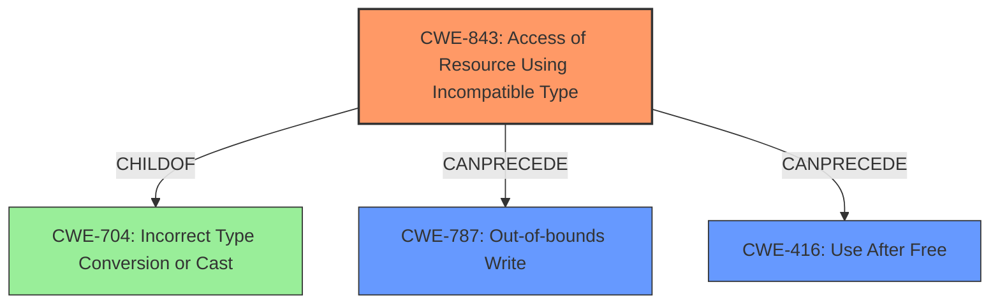

# Analysis Report for CVE-2022-3315

# Vulnerability Analysis Report: CVE-2022-3315

## Description

Type confusion in Blink in Google Chrome prior to 106.0.5249.62 allowed a remote attacker to potentially exploit heap corruption via a crafted HTML page. (Chromium security severity Low)

## Vulnerability Description Key Phrases

**Rootcause:** confusion in Blink
**Impact:** heap corruption
**Vector:** crafted HTML page
**Attacker:** remote attacker
**Product:** Google Chrome
**Version:** prior to 106.0.5249.62

## Analysis (with Relationship Data)

# Summary
| CWE ID | CWE Name | Confidence | CWE Abstraction Level | CWE Vulnerability Mapping Label | CWE-Vulnerability Mapping Notes |
|---|---|---|---|---|---|
| CWE-843 | Access of Resource Using Incompatible Type ('Type Confusion') | 0.9 | Base | Allowed | Primary CWE |
| CWE-416 | Use After Free | 0.6 | Variant | Allowed | Secondary Candidate |

## Evidence and Confidence

*   **Confidence Score:** 0.8
*   **Evidence Strength:** HIGH

- **Analysis and Justification:**  
  - *Explanation:* The vulnerability description explicitly states "**type confusion in Blink**" leading to "**heap corruption**". CWE-843 (Access of Resource Using Incompatible Type ('Type Confusion')) aligns perfectly with this description. The CVE Reference Links Content Summary reinforces this, identifying "**Type confusion in Blink**" as the **root_cause** and "**Type confusion**" as the weakness. The Retriever Results also rank CWE-843 as the top candidate with a high combined score. While CWE-704 (Incorrect Type Conversion or Cast) is also related to type issues, CWE-843 is a more precise match as it explicitly addresses the access of a resource using an incompatible type. The MITRE mapping guidance designates CWE-843 as ALLOWED.

  - *Relationship Analysis:* While no direct relationships are listed for CWE-843 in the provided information, its nature suggests potential links to memory corruption issues. Given the stated heap corruption impact, CWE-416 (Use After Free) becomes a secondary candidate. This is because type confusion could potentially lead to memory being freed and then accessed later with the wrong type.

- **Confidence Score:**  
  - Confidence: 0.9 (High confidence due to direct evidence from the vulnerability description and supporting information from the CVE reference and Retriever results)

---

## Criticism of Analysis

Okay, here's a detailed review of the CWE analysis, incorporating the full CWE specifications:

**Overall Assessment:**

The analysis is generally strong and well-reasoned. The primary CWE identification of CWE-843 (Access of Resource Using Incompatible Type ('Type Confusion')) is accurate and well-supported by the vulnerability description and supporting data. The secondary consideration of CWE-416 (Use After Free) as a potential consequence is also reasonable.

**Detailed Review:**

**1. CWE-843 (Access of Resource Using Incompatible Type ('Type Confusion'))**

*   **Accuracy:**  The analysis correctly identifies CWE-843 as the primary weakness. The description explicitly mentions "type confusion in Blink," and CWE-843 precisely describes the scenario where a resource is accessed using an incompatible type.
*   **Confidence:** The confidence score of 0.9 is justified. The evidence is direct and strong.
*   **Justification:** The reasoning clearly connects the vulnerability description to the CWE definition.  The analysis also correctly notes that while CWE-704 (Incorrect Type Conversion or Cast) is related, CWE-843 is a more specific fit.
*   **Mapping Guidance:** The analysis acknowledges and correctly applies the "Allowed" usage specified in CWE-843's mapping guidance.
*   **Relationships:** The analysis notes that CWE-843 can precede CWE-119 (Improper Restriction of Operations within the Bounds of a Memory Buffer). This is relevant as type confusion can often lead to out-of-bounds access.
*   **Mitigations:** While the analysis doesn't explicitly mention mitigations, it would be beneficial to briefly consider them in the context of this vulnerability.  Key mitigations for CWE-843, according to the specification, would involve using type-safe languages, or strong type checking and validation during development.  In the context of Blink (a C++ codebase), robust static analysis and careful code review are essential to detect and prevent type confusion issues. Fuzzing with diverse inputs may also reveal instances where type confusion occurs.

**2. CWE-416 (Use After Free)**

*   **Accuracy:**  The analysis correctly identifies CWE-416 as a *potential consequence* of the type confusion, rather than the primary cause.  The reasoning is that type confusion could lead to the freeing of memory that is later accessed with an incorrect type. This makes it a plausible secondary candidate, given that heap corruption is explicitly mentioned.
*   **Confidence:** The confidence score of 0.6 is appropriate. While plausible, the link to CWE-416 is not as direct as the link to CWE-843. It's a possible outcome, but not definitively stated in the original description.
*   **Justification:**  The reasoning is sound. The analysis connects type confusion to potential memory management errors, which can result in use-after-free vulnerabilities.
*   **Mapping Guidance:** The analysis acknowledges and correctly applies the "Allowed" usage specified in CWE-416's mapping guidance.
*   **Relationships:** The analysis notes that CWE-416 can follow CWE-362 (Concurrent Execution using Shared Resource with Improper Synchronization ('Race Condition')) or CWE-754 (Improper Check for Unusual or Exceptional Conditions). While these aren't *directly* related to the type confusion, they do highlight the potential for these vulnerabilities to occur in complex, multi-threaded environments.
*   **Mitigations:**  Again, considering mitigations could enhance the analysis. The CWE-416 specification suggests using languages with automatic memory management or using defensive programming techniques, such as setting pointers to NULL after freeing them. Applying address space layout randomization (ASLR) may also make UAF exploitation more difficult.

**Suggested Improvements:**

*   **Explicitly Mention Mitigations:** For both CWE-843 and CWE-416, briefly discussing relevant mitigation strategies would strengthen the analysis.  This shows a deeper understanding of the vulnerability and how to address it from a development perspective.
*   **Consider CWE-787 (Out-of-bounds Write):** Given the "heap corruption" impact, also consider CWE-787 (Out-of-bounds Write). Type confusion in C++ can lead to writing outside the bounds of an allocated buffer due to incorrectly calculated sizes, offsets or invalid casts, leading to memory corruption.  This is a common outcome of type confusion, especially when combined with pointer arithmetic or incorrect indexing. If you consider this as well, lower the confidence of CWE-416 to 0.4. If the type confusion directly leads to an out-of-bounds write due to an incorrect size calculation or offset, CWE-787 might be a better choice than CWE-416 as the secondary CWE.
*   **Review CWE-704's Relationship with CWE-843:** CWE-843 is a child of CWE-704, so you should mention that in your analysis. Mentioning this strengthens the correctness of the analysis.

**Revised Summary Table (Incorporating Suggestions):**

| CWE ID | CWE Name | Confidence | CWE Abstraction Level | CWE Vulnerability Mapping Label | CWE-Vulnerability Mapping Notes |
|---|---|---|---|---|---|
| CWE-843 | Access of Resource Using Incompatible Type ('Type Confusion') | 0.9 | Base | Allowed | Primary CWE |
| CWE-787 | Out-of-bounds Write | 0.6 | Base | Allowed | Secondary Candidate 1, resulting from type confusion and heap corruption. |
| CWE-416 | Use After Free | 0.4 | Variant | Allowed | Secondary Candidate 2, a potential consequence of memory corruption. |

**In summary,** the original analysis is very good. By adding a brief discussion of relevant mitigations and considering CWE-787, the analysis becomes even more comprehensive and demonstrates a deeper understanding of the vulnerability's potential impact and remediation strategies. Also, it is key to note the parent-child relationship between CWE-704 and CWE-843.

## Final Resolution

# Summary
| CWE ID | CWE Name | Confidence | CWE Abstraction Level | CWE Vulnerability Mapping Label | CWE-Vulnerability Mapping Notes |
|---|---|---|---|---|---|
| CWE-843 | Access of Resource Using Incompatible Type ('Type Confusion') | 0.9 | Base | Allowed | Primary CWE |
| CWE-787 | Out-of-bounds Write | 0.6 | Base | Allowed | Secondary Candidate 1, resulting from type confusion and heap corruption. |
| CWE-416 | Use After Free | 0.4 | Variant | Allowed | Secondary Candidate 2, a potential consequence of memory corruption. |

## Evidence and Confidence

*   **Confidence Score:** 0.85
*   **Evidence Strength:** HIGH

## Relationship Analysis
The primary relationship influencing the decision is the hierarchical relationship where CWE-843 (Access of Resource Using Incompatible Type) is a child of CWE-704 (Incorrect Type Conversion or Cast). While CWE-704 is broader, CWE-843 provides a more specific description of the vulnerability. Additionally, the potential chain relationship involving CWE-843 leading to either CWE-787 (Out-of-bounds Write) or CWE-416 (Use After Free) was considered. Given the "heap corruption" impact mentioned in the description, CWE-787 is deemed more likely than CWE-416. Therefore, the decision prioritized CWE-787 as the secondary candidate over CWE-416. The abstraction levels also played a role. All selected CWEs (843 and 787) are at the Base level of abstraction, and CWE-416 is at the Variant level of abstraction, which is the preferred level for mapping.

## Vulnerability Chain
The vulnerability chain starts with **CWE-843 (Access of Resource Using Incompatible Type ('Type Confusion'))**, which is the **ROOTCAUSE**. This type confusion leads to incorrect memory access, potentially resulting in **CWE-787 (Out-of-bounds Write)**, causing heap corruption, or **CWE-416 (Use After Free)**. The final impact is exploitation via a crafted HTML page.

The chain:
1.  **CWE-843 (Type Confusion)**: Incompatible types used to access resources.
2.  **CWE-787 (Out-of-bounds Write)**: Memory corruption due to writing outside buffer boundaries.
3.  **CWE-416 (Use After Free)**: Memory corruption because memory is freed but then accessed with the wrong type.
4.  **Impact**: Remote attacker exploits heap corruption via a crafted HTML page.

## Summary of Analysis
The initial analysis correctly identified **CWE-843 (Access of Resource Using Incompatible Type ('Type Confusion'))** as the primary **WEAKNESS**. The criticism suggested considering **CWE-787 (Out-of-bounds Write)**, which is a valid point given the "heap corruption" mentioned in the vulnerability description.

The vulnerability description explicitly states "**type confusion in Blink**" leading to "**heap corruption**". This is strong evidence for **CWE-843** as the **ROOTCAUSE**.

The graph relationships influenced the final selection by highlighting the parent-child relationship between CWE-704 and CWE-843, reinforcing the choice of CWE-843 for its greater specificity. The possible chain relationships also aided in selecting CWE-787 over CWE-416.

The selected CWEs are at the optimal level of specificity because they directly address the **ROOTCAUSE** (type confusion) and the likely immediate consequence (out-of-bounds write leading to heap corruption).

*Report generated on 2025-03-18 14:37:06*
