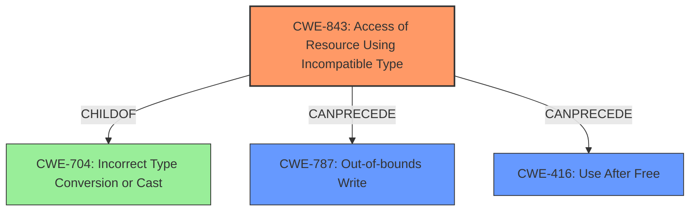

# Final Resolution for CVE-2022-3315

# Summary
| CWE ID | CWE Name | Confidence | CWE Abstraction Level | CWE Vulnerability Mapping Label | CWE-Vulnerability Mapping Notes |
|---|---|---|---|---|---|
| CWE-843 | Access of Resource Using Incompatible Type ('Type Confusion') | 0.9 | Base | Allowed | Primary CWE |
| CWE-787 | Out-of-bounds Write | 0.6 | Base | Allowed | Secondary Candidate 1, resulting from type confusion and heap corruption. |
| CWE-416 | Use After Free | 0.4 | Variant | Allowed | Secondary Candidate 2, a potential consequence of memory corruption. |

## Evidence and Confidence

*   **Confidence Score:** 0.85
*   **Evidence Strength:** HIGH

## Relationship Analysis
The primary relationship influencing the decision is the hierarchical relationship where CWE-843 (Access of Resource Using Incompatible Type) is a child of CWE-704 (Incorrect Type Conversion or Cast). While CWE-704 is broader, CWE-843 provides a more specific description of the vulnerability. Additionally, the potential chain relationship involving CWE-843 leading to either CWE-787 (Out-of-bounds Write) or CWE-416 (Use After Free) was considered. Given the "heap corruption" impact mentioned in the description, CWE-787 is deemed more likely than CWE-416. Therefore, the decision prioritized CWE-787 as the secondary candidate over CWE-416. The abstraction levels also played a role. All selected CWEs (843 and 787) are at the Base level of abstraction, and CWE-416 is at the Variant level of abstraction, which is the preferred level for mapping.

## Vulnerability Chain
The vulnerability chain starts with **CWE-843 (Access of Resource Using Incompatible Type ('Type Confusion'))**, which is the **ROOTCAUSE**. This type confusion leads to incorrect memory access, potentially resulting in **CWE-787 (Out-of-bounds Write)**, causing heap corruption, or **CWE-416 (Use After Free)**. The final impact is exploitation via a crafted HTML page.

The chain:
1.  **CWE-843 (Type Confusion)**: Incompatible types used to access resources.
2.  **CWE-787 (Out-of-bounds Write)**: Memory corruption due to writing outside buffer boundaries.
3.  **CWE-416 (Use After Free)**: Memory corruption because memory is freed but then accessed with the wrong type.
4.  **Impact**: Remote attacker exploits heap corruption via a crafted HTML page.

## Summary of Analysis
The initial analysis correctly identified **CWE-843 (Access of Resource Using Incompatible Type ('Type Confusion'))** as the primary **WEAKNESS**. The criticism suggested considering **CWE-787 (Out-of-bounds Write)**, which is a valid point given the "heap corruption" mentioned in the vulnerability description.

The vulnerability description explicitly states "**type confusion in Blink**" leading to "**heap corruption**". This is strong evidence for **CWE-843** as the **ROOTCAUSE**.

The graph relationships influenced the final selection by highlighting the parent-child relationship between CWE-704 and CWE-843, reinforcing the choice of CWE-843 for its greater specificity. The possible chain relationships also aided in selecting CWE-787 over CWE-416.

The selected CWEs are at the optimal level of specificity because they directly address the **ROOTCAUSE** (type confusion) and the likely immediate consequence (out-of-bounds write leading to heap corruption).