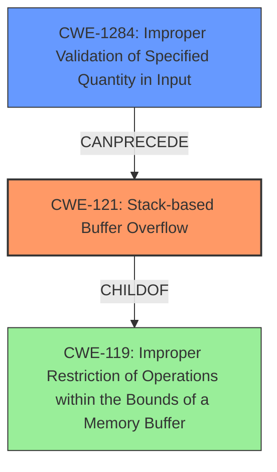

# Final Resolution for CVE-2022-33183

# Summary
| CWE ID | CWE Name | Confidence | CWE Abstraction Level | CWE Vulnerability Mapping Label | CWE-Vulnerability Mapping Notes |
|---|---|---|---|---|---|
| **CWE-121** | **Stack-based Buffer Overflow** | 1.0 | Variant | Allowed | Primary **CWE** |
| **CWE-1284** | **Improper Validation of Specified Quantity in Input** | 0.7 | Base | Allowed | Secondary **CWE** contributing to the overflow by not validating input size. |

## Evidence and Confidence

*   **Confidence Score:** 0.9
*   **Evidence Strength:** HIGH

## Relationship Analysis
The primary weakness is **CWE-121 (Stack-based Buffer Overflow)**, which is a variant of **CWE-119 (Improper Restriction of Operations within the Bounds of a Memory Buffer)**. The secondary **CWE**, **CWE-1284 (Improper Validation of Specified Quantity in Input)**, can **precede** **CWE-121** by causing the buffer size to be incorrectly determined, leading to the overflow. The abstraction levels influenced the selection by prioritizing the most specific **CWE** (**CWE-121**) while also including a contributing base **CWE** (**CWE-1284**) to explain the root cause of the size miscalculation.

## Vulnerability Chain
The vulnerability chain starts with **CWE-1284 (Improper Validation of Specified Quantity in Input)**, where the software fails to validate the size of the input. This leads to **CWE-121 (Stack-based Buffer Overflow)**, where the improperly sized input overwrites the stack buffer, potentially leading to data modification or denial of service. The root cause is the missing or inadequate input validation, and the impact is the overflow.

## Summary of Analysis
The initial analysis correctly identified **CWE-121 (Stack-based Buffer Overflow)** as the primary **CWE**. The criticism highlighted the importance of exploring contributing factors and chain scenarios, specifically mentioning input validation. The vulnerability description states "A vulnerability in Brocade Fabric OS CLI before Brocade Fabric OS v9.1.0, 9.0.1e, 8.2.3c, 8.2.0cbn5, 7.4.2.j could allow a remote authenticated attacker to perform stack buffer overflow using in firmwaredownload and diagshow commands." This evidence points to a stack buffer overflow occurring within the `firmwaredownload` and `diagshow` commands.

Based on the retriever results and the criticism, **CWE-1284 (Improper Validation of Specified Quantity in Input)** was selected as a secondary **CWE** because the `firmwaredownload` and `diagshow` commands likely take size or length parameters that are not adequately validated. This makes **CWE-1284** a highly relevant contributing factor.

**CWE-1284** is at the Base level of abstraction, which aligns with MITRE's guidance. The relationships show that **CWE-1284** can **precede** **CWE-789 (Uncontrolled Memory Allocation)**, which, while relevant, is less specific than the overflow itself. **CWE-1284** also has a parent relationship to **CWE-606 (Missing Check on Completeness)** which is not applicable.

The decision to include **CWE-1284** is based on the reasonable assumption that the commands receive a quantity as input. The confidence score for **CWE-1284** is 0.7, reflecting the need for further code analysis to confirm this contributing factor. The primary **CWE** remains **CWE-121** with a confidence of 1.0.