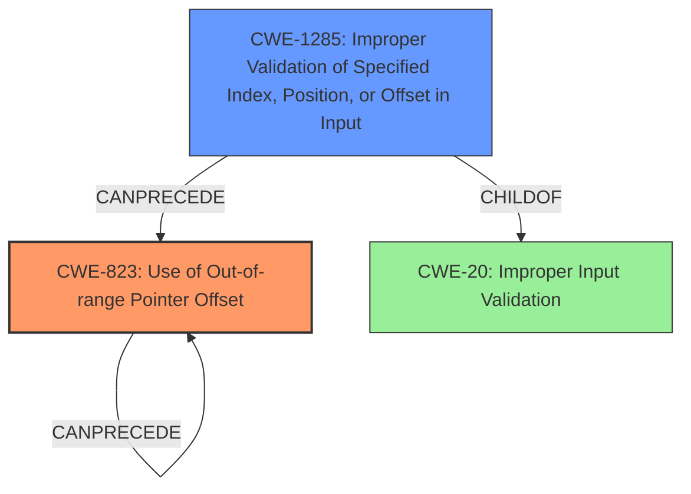

# Final Resolution for CVE-2022-33210

# Summary
| CWE ID | CWE Name | Confidence | CWE Abstraction Level | CWE Vulnerability Mapping Label | CWE-Vulnerability Mapping Notes |
|---|---|---|---|---|---|
| CWE-823 | Use of Out-of-range Pointer Offset | 0.95 | Base | Allowed | Primary CWE: The vulnerability involves the use of an out-of-range pointer offset, directly matching the CWE's description. |
| CWE-1285 | Improper Validation of Specified Index, Position, or Offset in Input | 0.80 | Base | Allowed | Secondary Candidate: This CWE could apply if the out-of-range pointer offset is caused by a failure to validate an index, position, or offset in the input. |

## Evidence and Confidence

*   **Confidence Score:** 0.92
*   **Evidence Strength:** HIGH

## Relationship Analysis
The primary relationship impacting the decision is the chain relationship between CWE-1285 and CWE-823. The analysis suggests that **improper validation** of the input offset (CWE-1285) leads to the **use of an out-of-range pointer offset** (CWE-823). This relationship helps define the vulnerability's progression from root cause to the specific flaw. Also, the parent child relationship of CWE-1285 to CWE-20 (Improper Input Validation) helped with understanding of how data is handled. The base abstraction level helps to pinpoint to the specific cause.

## Vulnerability Chain
The vulnerability chain starts with **improper validation of input** (CWE-1285). This lack of validation leads to the **use of an out-of-range pointer offset** (CWE-823). This offset can lead to memory corruption due to out-of-bounds access.

## Summary of Analysis
The initial analysis correctly identified CWE-823 as the primary **WEAKNESS**, supported by the vulnerability description's direct mention of "use of out-of-range pointer offset." The criticism highlighted the importance of considering the chain relationship between input validation and the offset usage, which strengthens the case for including CWE-1285 as a secondary candidate.

The initial choice of CWE-476 was deemed less relevant as it introduces an assumption of a null pointer, which is not explicitly supported by the evidence. Therefore, CWE-476 was dropped.

The selection of CWE-823 and CWE-1285 is based on direct evidence and inferred relationships. CWE-823 directly matches the **ROOTCAUSE**, and CWE-1285 plausibly contributes to the vulnerability based on the parsing context. Both CWEs are at the Base level of abstraction. The confidence level for CWE-1285 was increased to 0.80 due to chain considerations.

The final decision prioritizes accuracy and specificity, focusing on the described **WEAKNESS** of out-of-range offset usage and the likely contributing factor of improper input validation.