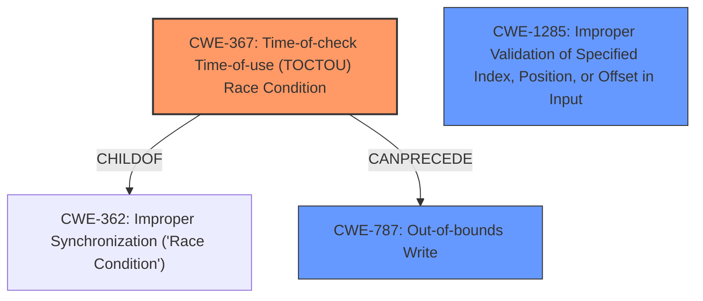

# Analysis Report for CVE-2022-33214

# Vulnerability Analysis Report: CVE-2022-33214

## Description

Memory corruption in display due to time-of-check time-of-use of metadata reserved size in Snapdragon Auto, Snapdragon Compute, Snapdragon Consumer IOT, Snapdragon Industrial IOT, Snapdragon Mobile, Snapdragon Wearables

## Vulnerability Description Key Phrases

**Rootcause:** time-of-check time-of-use
**Impact:** Memory corruption
**Product:** Snapdragon Auto, Snapdragon Compute, Snapdragon Consumer IOT, Snapdragon Industrial IOT, Snapdragon Mobile, Snapdragon Wearables
**Component:** display

## Analysis (with Relationship Data)

# Summary
| CWE ID | CWE Name | Confidence | CWE Abstraction Level | CWE Vulnerability Mapping Label | CWE-Vulnerability Mapping Notes |
|---|---|---|---|---|---|
| CWE-367 | Time-of-check Time-of-use (TOCTOU) Race Condition | 0.9 | Base | Allowed | Primary CWE |
| CWE-787 | Out-of-bounds Write | 0.7 | Base | Allowed | Secondary Candidate |

## Evidence and Confidence

*   **Confidence Score:** 0.8
*   **Evidence Strength:** MEDIUM

- **Analysis and Justification:**
  - *Explanation:* The vulnerability description explicitly mentions "**time-of-check time-of-use**" (TOCTOU) as the **root cause**, leading to memory corruption. CWE-367 (Time-of-check Time-of-use (TOCTOU) Race Condition) directly addresses this weakness. The description perfectly aligns with the TOCTOU condition, where the state of metadata reserved size is checked, but the same metadata is used later without re-validation, leading to potential memory corruption if the size changes in between. CWE-787 (Out-of-bounds Write) is also a plausible weakness since the **impact** is memory corruption. If the metadata reserved size has been changed, then it is possible that write operation may cause out-of-bounds write.
  - *Relationship Analysis:* CWE-367 has no direct relationships listed in the provided information. However, TOCTOU vulnerabilities often can lead to other issues such as out-of-bounds writes. CWE-787 is a child of CWE-119 (Improper Restriction of Operations within the Bounds of a Memory Buffer).

- **Confidence Score:**
  - Confidence: 0.9 (High confidence because the vulnerability description explicitly mentions TOCTOU)

---

## Criticism of Analysis

Okay, let's review the analysis provided, leveraging the full CWE specifications to assess its accuracy and completeness.

**Overall Assessment:**

The analysis is generally well-reasoned and accurate, particularly in identifying CWE-367 (TOCTOU) as the primary vulnerability. The inclusion of CWE-787 (Out-of-bounds Write) as a secondary candidate is also justified, given the impact of memory corruption. However, there are a few areas where the analysis could be strengthened by considering alternative perspectives and additional CWEs that might be relevant either as contributing factors or consequences.

**Detailed Review:**

**1. CWE-367: Time-of-check Time-of-use (TOCTOU) Race Condition**

*   **Confidence:** The confidence score of 0.9 is well-supported. The presence of the phrase "**time-of-check time-of-use**" in the vulnerability description provides very strong evidence.
*   **Justification:**  The explanation is clear and correctly identifies the core issue: a check on metadata reserved size is performed, but the subsequent use of that size is not revalidated.  This perfectly fits the CWE-367 description.
*   **Mitigations:** The document lists potential mitigations, which are valid for TOCTOU in general. The analysis could be improved by considering specific mitigations relevant to memory corruption. Mitigation such as using atomic operations to update and access shared memory resources, using mutexes or semaphores to control access to the metadata size, or employing a lock-free data structure might be more pertinent.
*   **Relationships:** The analysis mentions that TOCTOU has no direct relationships listed. However, consider that CWE-367 is a child of CWE-362 Concurrent Execution using Shared Resource with Improper Synchronization ('Race Condition'). While CWE-367 is more specific, noting the parent relationship can provide context. Additionally, exploring potential consequences beyond the immediate out-of-bounds write could be valuable. For example, the TOCTOU condition could lead to denial of service (CWE-400) or even privilege escalation (if the corrupted memory affects access control).

**2. CWE-787: Out-of-bounds Write**

*   **Confidence:** The confidence score of 0.7 is reasonable as a secondary candidate. The vulnerability description only mentions the *impact* of memory corruption. The primary cause might be TOCTOU but this leads to an *out-of-bounds write*, therefore, the relationship is valid.
*   **Justification:** The explanation correctly points out that a change in the metadata reserved size between the check and use could lead to a write operation outside the intended bounds.
*   **Mitigations:** The provided mitigations for CWE-787 are general buffer overflow preventions. It would be good to link back to the TOCTOU aspect here. For example, even with buffer overflow protections in place, a TOCTOU vulnerability could still exist if the size check itself is bypassed or invalidated by a race condition.
*   **Relationships:** The analysis correctly states that CWE-787 is a child of CWE-119. This is a valuable point. However, since CWE-119 is discouraged, the analysis correctly uses CWE-787.

**Additional Considerations and Potential CWEs:**

*   **CWE-1285: Improper Validation of Specified Index, Position, or Offset in Input:** The retrievers suggest this CWE as a relevant weakness. If the 'metadata reserved size' is obtained from an external source (even indirectly), the lack of proper validation of its value before using it as an offset or index could be a contributing factor.  For example, if the display system receives a message indicating the size of the metadata, it needs to ensure that size is within acceptable limits before using it to allocate memory or perform calculations. Even with a TOCTOU condition, the root of the problem might stem from trusting an unvalidated value. This weakness is marked as Allowed.

*   **CWE-131: Incorrect Calculation of Buffer Size:** While not explicitly mentioned, the "metadata reserved size" is likely used in a buffer size calculation. An error in this calculation *could* contribute to the out-of-bounds write.  Even if the initial size is validated, an incorrect calculation based on that size could lead to a buffer that is too small. This is less likely if the TOCTOU is the primary factor, but it's worth considering. This weakness is marked as Allowed.

*   **CWE-822: Untrusted Pointer Dereference / CWE-823: Use of Out-of-range Pointer Offset / CWE-824: Access of Uninitialized Pointer / CWE-825: Expired Pointer Dereference:** These pointer-related weaknesses are all suggestions by the retrievers and worth investigating, but they are unlikely to be the most relevant weaknesses. Given that the "metadata reserved size" is causing the issues, the root cause most likely does not fall under the pointer dereference family. All of these weaknesses are marked as Allowed.

**Suggestions for Improvement:**

1.  **Chain of Causation:** Explicitly describe the chain of events.  "A TOCTOU condition (CWE-367) allows a race condition where the metadata size is checked but then modified before being used. This leads to using the incorrect size, potentially resulting in an out-of-bounds write (CWE-787) and memory corruption."
2.  **More Specific Mitigations:** Include more specific mitigations tailored to the display system's memory management and concurrency model. Consider atomic operations, mutexes, lock-free data structures, and size validation strategies.
3.  **Input Validation Discussion:** Explore whether CWE-1285 is applicable. If so, add it as a contributing factor and discuss how improved input validation of the metadata size could reduce the risk.
4.  **Contextualize Relationships:** While noting parent/child relationships is good, explain *why* a particular relationship is relevant in this specific scenario.
5.  **Explain Retriever Results:** Briefly explain *why* certain retriever results were deemed less relevant. This increases confidence in the analysis. For example, "CWE-822 (Untrusted Pointer Dereference) was considered but rejected because the vulnerability does not involve directly using an untrusted value *as* a pointer."

**Revised Summary Table:**

| CWE ID | CWE Name | Confidence | CWE Abstraction Level | CWE Vulnerability Mapping Label | CWE-Vulnerability Mapping Notes |
|---|---|---|---|---|---|
| CWE-367 | Time-of-check Time-of-use (TOCTOU) Race Condition | 0.9 | Base | Allowed | Primary CWE |
| CWE-787 | Out-of-bounds Write | 0.7 | Base | Allowed | Consequence of TOCTOU |
| CWE-1285 | Improper Validation of Specified Index, Position, or Offset in Input | 0.4 | Base | Allowed | Contributing factor if metadata size is derived from external input. |

By incorporating these suggestions, the analysis will become more comprehensive, demonstrate a deeper understanding of the vulnerability, and provide more actionable guidance for remediation.

## Final Resolution

# Summary
| CWE ID | CWE Name | Confidence | CWE Abstraction Level | CWE Vulnerability Mapping Label | CWE-Vulnerability Mapping Notes |
|---|---|---|---|---|---|
| CWE-367 | Time-of-check Time-of-use (TOCTOU) Race Condition | 0.9 | Base | Allowed | Primary **CWE** |
| CWE-787 | Out-of-bounds Write | 0.7 | Base | Allowed | Secondary Candidate - Consequence of TOCTOU |
| CWE-1285 | Improper Validation of Specified Index, Position, or Offset in Input | 0.4 | Base | Allowed | Contributing factor if metadata size is derived from external input. |

## Evidence and Confidence

*   **Confidence Score:** 0.85
*   **Evidence Strength:** MEDIUM

## Relationship Analysis
The analysis considers the parent-child relationship where **CWE-367** is a child of **CWE-362**, which is a broader class of race conditions. This context helps to position **CWE-367** within the landscape of concurrency issues, but **CWE-367** is still more specific.
The relationship between **CWE-367** and **CWE-787** is a chain relationship where **CWE-367** can lead to **CWE-787**.
**CWE-1285** is considered a potential contributing factor.

## Vulnerability Chain
The vulnerability chain starts with a **ROOTCAUSE** of **CWE-367** (Time-of-check Time-of-use (TOCTOU) Race Condition), where the metadata size is checked but not revalidated before use. This leads to **CWE-787** (Out-of-bounds Write), resulting in memory corruption. **CWE-1285** (Improper Validation of Specified Index, Position, or Offset in Input) could be a contributing factor if the metadata size is obtained from an external source without proper validation.

## Summary of Analysis
The initial analysis correctly identified **CWE-367** as the primary **WEAKNESS** due to the explicit mention of "**time-of-check time-of-use**" in the vulnerability description. The criticism provided additional context and suggested improvements.

The final determination is based on the following:

- **CWE-367** is the most direct match to the vulnerability description, which states "time-of-check time-of-use of metadata reserved size."
- **CWE-787** is a valid secondary candidate because the **impact** of the TOCTOU condition is memory corruption due to an out-of-bounds write.
- **CWE-1285** is a potential contributing factor if the metadata size is derived from an external source without proper validation. The retriever results highlighted this possibility, and it aligns with the broader context of input validation.
- The graph relationships confirm the hierarchical structure (**CWE-367** being a child of **CWE-362**) and the chain relationship between **CWE-367** and **CWE-787**.
- The selected **CWE**s are at the optimal level of specificity because they directly address the **ROOTCAUSE** (TOCTOU) and the immediate **IMPACT** (out-of-bounds write).

The decision to include **CWE-1285** as a contributing factor acknowledges the importance of input validation, even in the presence of a TOCTOU condition. However, the confidence level is lower (0.4) because it is not explicitly stated in the vulnerability description.

The vulnerability chain analysis provides a clear sequence of events, from the initial TOCTOU condition to the final memory corruption, with the potential for **CWE-1285** to play a role in the overall vulnerability.

*Report generated on 2025-03-18 14:40:38*
