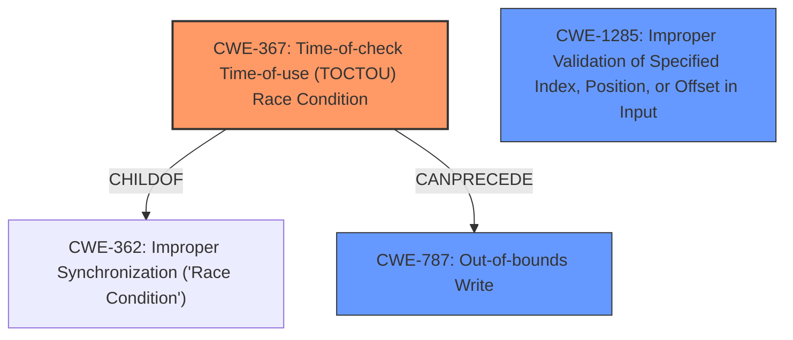

# Final Resolution for CVE-2022-33214

# Summary
| CWE ID | CWE Name | Confidence | CWE Abstraction Level | CWE Vulnerability Mapping Label | CWE-Vulnerability Mapping Notes |
|---|---|---|---|---|---|
| CWE-367 | Time-of-check Time-of-use (TOCTOU) Race Condition | 0.9 | Base | Allowed | Primary **CWE** |
| CWE-787 | Out-of-bounds Write | 0.7 | Base | Allowed | Secondary Candidate - Consequence of TOCTOU |
| CWE-1285 | Improper Validation of Specified Index, Position, or Offset in Input | 0.4 | Base | Allowed | Contributing factor if metadata size is derived from external input. |

## Evidence and Confidence

*   **Confidence Score:** 0.85
*   **Evidence Strength:** MEDIUM

## Relationship Analysis
The analysis considers the parent-child relationship where **CWE-367** is a child of **CWE-362**, which is a broader class of race conditions. This context helps to position **CWE-367** within the landscape of concurrency issues, but **CWE-367** is still more specific.
The relationship between **CWE-367** and **CWE-787** is a chain relationship where **CWE-367** can lead to **CWE-787**.
**CWE-1285** is considered a potential contributing factor.

## Vulnerability Chain
The vulnerability chain starts with a **ROOTCAUSE** of **CWE-367** (Time-of-check Time-of-use (TOCTOU) Race Condition), where the metadata size is checked but not revalidated before use. This leads to **CWE-787** (Out-of-bounds Write), resulting in memory corruption. **CWE-1285** (Improper Validation of Specified Index, Position, or Offset in Input) could be a contributing factor if the metadata size is obtained from an external source without proper validation.

## Summary of Analysis
The initial analysis correctly identified **CWE-367** as the primary **WEAKNESS** due to the explicit mention of "**time-of-check time-of-use**" in the vulnerability description. The criticism provided additional context and suggested improvements.

The final determination is based on the following:

- **CWE-367** is the most direct match to the vulnerability description, which states "time-of-check time-of-use of metadata reserved size."
- **CWE-787** is a valid secondary candidate because the **impact** of the TOCTOU condition is memory corruption due to an out-of-bounds write.
- **CWE-1285** is a potential contributing factor if the metadata size is derived from an external source without proper validation. The retriever results highlighted this possibility, and it aligns with the broader context of input validation.
- The graph relationships confirm the hierarchical structure (**CWE-367** being a child of **CWE-362**) and the chain relationship between **CWE-367** and **CWE-787**.
- The selected **CWE**s are at the optimal level of specificity because they directly address the **ROOTCAUSE** (TOCTOU) and the immediate **IMPACT** (out-of-bounds write).

The decision to include **CWE-1285** as a contributing factor acknowledges the importance of input validation, even in the presence of a TOCTOU condition. However, the confidence level is lower (0.4) because it is not explicitly stated in the vulnerability description.

The vulnerability chain analysis provides a clear sequence of events, from the initial TOCTOU condition to the final memory corruption, with the potential for **CWE-1285** to play a role in the overall vulnerability.