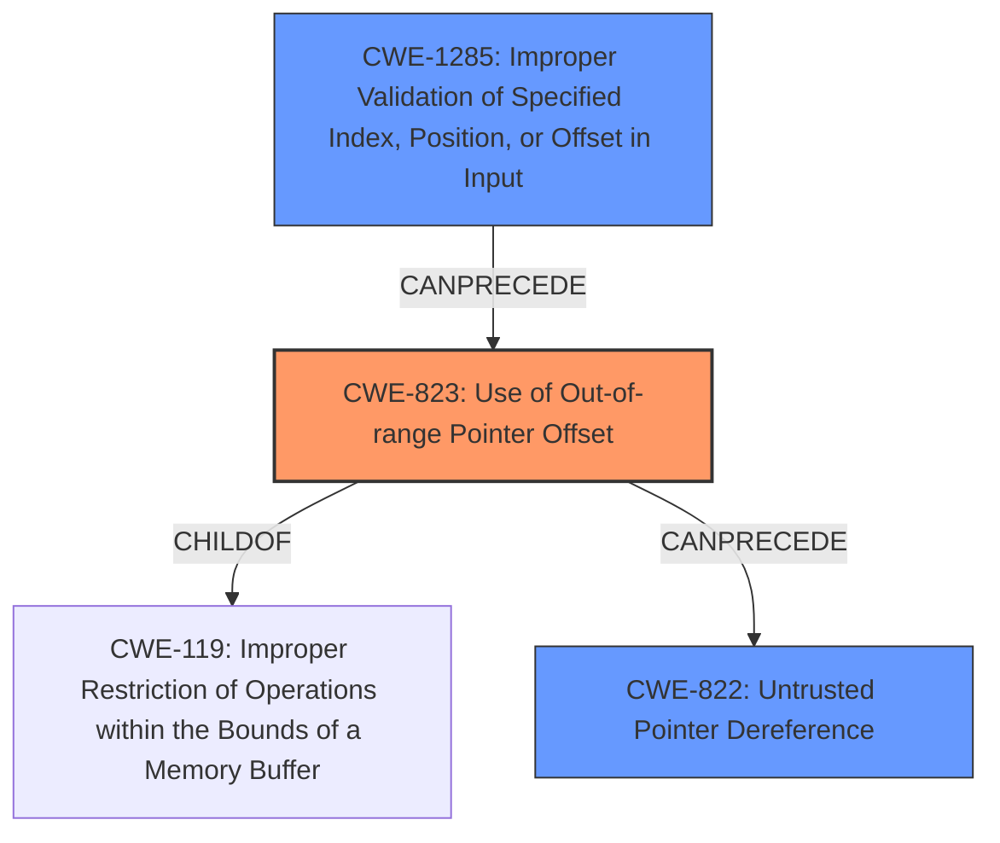

# Analysis Report for CVE-2022-33234

# Vulnerability Analysis Report: CVE-2022-33234

## Description

Memory corruption in video due to configuration weakness. in Snapdragon Auto, Snapdragon Compute, Snapdragon Connectivity, Snapdragon Consumer IOT, Snapdragon Industrial IOT, Snapdragon Mobile, Snapdragon Wearables

## Vulnerability Description Key Phrases

**Rootcause:** configuration weakness
**Weakness:** memory corruption
**Product:** ['Snapdragon Auto', 'Snapdragon Compute', 'Snapdragon Connectivity', 'Snapdragon Consumer IOT', 'Snapdragon Industrial IOT', 'Snapdragon Mobile', 'Snapdragon Wearables']
**Component:** video

## Analysis (with Relationship Data)

# Summary
| CWE ID  | CWE Name                                                        | Confidence | CWE Abstraction Level | CWE Vulnerability Mapping Label | CWE-Vulnerability Mapping Notes |
| :-------- | :-------------------------------------------------------------- | :--------- | :-------------------- | :------------------------------ | :------------------------------ |
| CWE-822   | Untrusted Pointer Dereference                                   | 0.75       | Base                  | Allowed                         | Primary                         |
| CWE-823   | Use of Out-of-range Pointer Offset                              | 0.65       | Base                  | Allowed                         | Secondary                       |
| CWE-1285  | Improper Validation of Specified Index, Position, or Offset in Input | 0.50       | Base                  | Allowed                         | Secondary                       |

## Evidence and Confidence

*   **Confidence Score:** 0.65
*   **Evidence Strength:** LOW

- **Analysis and Justification:**
  - *Explanation:* The vulnerability description mentions "**memory corruption** in video due to **configuration weakness**". The term "**memory corruption**" can stem from several underlying issues. Based on the Retriever Results, CWE-822 (Untrusted Pointer Dereference) has the highest combined score and is a plausible root cause if the "configuration weakness" leads to an untrusted value being used as a pointer. CWE-823 (Use of Out-of-range Pointer Offset) is also considered as a possible root cause for **memory corruption** related to video processing. Finally, CWE-1285 (Improper Validation of Specified Index, Position, or Offset in Input) is related to improper handling of indices/offsets in video processing, which could also cause the **memory corruption**.
  - *Relationship Analysis:* CWE-822, CWE-823, and CWE-1285 are all base-level CWEs. There are no direct relationships evident in the provided text, but the retriever results suggest potential relationships as memory corruption can be a complex issue with several contributing factors.

- **Confidence Score:**
  - *Example:* Confidence: 0.75 (Low evidence from the description, relying on retriever results and general knowledge of memory corruption vulnerabilities)
---

## Criticism of Analysis

Okay, here's a review of the provided analysis, using the full CWE specifications to guide the critique.

**Overall Assessment**

The analysis demonstrates a reasonable understanding of memory corruption vulnerabilities and attempts to map the high-level vulnerability description to more specific CWEs. The reliance on retriever results is justified given the limited information in the original description. However, the analysis could be improved by:

*   **Being more specific about the configuration weakness:** Try to infer more details.
*   **Justifying confidence levels more thoroughly:** Expand on how the evidence supports each CWE.
*   **Exploring potential mitigations:** Mention how the mitigations for the chosen CWEs would address the vulnerability.
*   **Considering potential relationships between the CWEs more deeply.**

**Detailed Review by CWE:**

**1. CWE-822: Untrusted Pointer Dereference (Primary, Confidence: 0.75)**

*   **Strengths:**
    *   Correctly identifies that "configuration weakness" could lead to an untrusted value being used as a pointer.  This aligns with the description of CWE-822.
    *   The explanation connects the "memory corruption" to potential consequences listed in the CWE-822 description (crash, modification of critical state).
*   **Weaknesses:**
    *   The justification relies heavily on the retriever results. It would be stronger if the analysis could infer *how* a configuration weakness might specifically introduce an untrusted pointer.  For example, "If a configuration file specifies the address of a video buffer and this address is not validated, an attacker could modify the configuration to point to an arbitrary memory location."
    *   The confidence level is arguably too high, given the lack of specific details.  A lower confidence, such as 0.6, might be more appropriate.
    *   The analysis doesn't discuss potential mitigations.  Considering mitigations would strengthen the mapping. For example, one mitigation for CWE-822 is to validate the source of the pointer.
    *   Consider whether it is possible that the untrusted pointer could come from Userland via an API or system call, as mentioned in the Extended Description.
*   **Suggestions:**
    *   Add a sentence or two speculating on how a misconfiguration could result in an untrusted pointer.
    *   Lower the confidence score slightly.
    *   Discuss how input validation (a standard mitigation technique) can be applied to the pointer address.
    *   Mention potential Mitigation (Architecture and Design, Description): Access controls for sensor blocks should ensure that only trusted software is allowed to change threshold limits and sensor parametric data.
    *   Reference CWE-781 in the extended description and make connections to OS kernels or drivers.

**2. CWE-823: Use of Out-of-range Pointer Offset (Secondary, Confidence: 0.65)**

*   **Strengths:**
    *   The connection to memory corruption is valid, as an out-of-range offset is a common cause.
    *   The analysis correctly identifies it as a *possible* root cause, suggesting it's not as strongly supported as CWE-822.
*   **Weaknesses:**
    *   The justification is somewhat generic. It needs to explain how a configuration weakness would lead to an incorrect or attacker-controlled offset. For example, "If the video configuration specifies the size of a frame buffer, and this size is incorrect, calculations of offsets within the frame buffer could lead to out-of-range access."
    *   Like CWE-822, it doesn't explore mitigations.
    *   Confidence could be slightly higher if the justification were stronger.
*   **Suggestions:**
    *   Add a specific example of how a configuration setting (e.g., frame size, stride) could, if incorrect, lead to an out-of-range offset.
    *   Discuss mitigations like bounds checking on offsets before memory access.
    *   Reference observed examples to known instances of multimedia player using untrusted value from a file when using file-pointer calculations.

**3. CWE-1285: Improper Validation of Specified Index, Position, or Offset in Input (Secondary, Confidence: 0.50)**

*   **Strengths:**
    *   The relationship to video processing (improper handling of indices/offsets) is valid.
*   **Weaknesses:**
    *   The justification is weak.  It's true that improper handling *could* cause memory corruption, but it's a less direct link than with CWE-822 or CWE-823. The connection to a "configuration weakness" is also less clear.
    *   The confidence level is appropriate (low), reflecting the weaker evidence.
    *   Mitigations are not explored.
*   **Suggestions:**
    *   Elaborate on a specific scenario related to video processing configuration.  For example, "If the configuration specifies the number of frames in a video sequence, and this number is not validated, an attacker could provide a large number, leading to an attempt to access memory beyond the allocated buffer."
    *   Discuss input validation as a mitigation.  Highlight the "accept known good" input validation strategy.

**General Suggestions:**

*   **Specificity:** The analysis needs to move beyond generic statements about memory corruption. It needs to explain *how* the specific "configuration weakness" leads to each CWE.
*   **Mitigation Discussion:**  For each CWE, include a brief discussion of how standard mitigations (input validation, bounds checking, memory-safe languages, etc.) would apply to this vulnerability. This demonstrates a deeper understanding of the CWE.
*   **Relationship Exploration:**  While the analysis mentions the base-level nature of the CWEs, it could explore potential relationships. For example:
    *   An improper configuration could lead to an attacker-controlled index (CWE-1285). This index could then be used to access memory out of bounds (leading to CWE-823, and potentially leading to code execution with CWE-822).
    *   CWE-1285 is the parent of CWE-129 (Improper Validation of Array Index).  Is CWE-129 more applicable here than CWE-1285?
*   **Configuration Weakness Detail:** Try to categorize the configuration weakness. Is it:
    *   Missing configuration options?
    *   Insecure default values?
    *   Insufficient access control on configuration files?
    *   Lack of validation of configuration values?
    *   The retriever results pointed towards write protection issues with parametric data values. Could this mean that CWE-1314 is a better fit?

**Revised Summary Table (Example):**

| CWE ID  | CWE Name                                                        | Confidence | CWE Abstraction Level | CWE Vulnerability Mapping Label | CWE-Vulnerability Mapping Notes                                                                                                                                                                                                                                                                                                                                                                            |
| :-------- | :-------------------------------------------------------------- | :--------- | :-------------------- | :------------------------------ | :--------------------------------------------------------------------------------------------------------------------------------------------------------------------------------------------------------------------------------------------------------------------------------------------------------------------------------------------------------------------------------------------------- |
| CWE-822   | Untrusted Pointer Dereference                                   | 0.60      | Base                  | Allowed                         | Primary. A misconfiguration could allow an attacker to specify the address of a video buffer, which is then dereferenced without validation. Mitigation: Validate the source and range of the pointer address.                                                                                                                                                                                        |
| CWE-823   | Use of Out-of-range Pointer Offset                              | 0.70       | Base                  | Allowed                         | Secondary. An incorrect frame size configuration could lead to offsets pointing outside the valid memory region. Mitigation: Enforce strict bounds checking on all pointer arithmetic and offsets.  Related to CVE-2010-1281.                                                                                                                                                                      |
| CWE-1285  | Improper Validation of Specified Index, Position, or Offset in Input | 0.50       | Base                  | Allowed                         | Secondary. The number of frames specified in the configuration is not validated. Mitigation: Implement "accept known good" input validation on configuration parameters.                                                                                                                                                                                                                             |

By incorporating these suggestions, the analysis will be more thorough, provide stronger justifications, and demonstrate a deeper understanding of the CWEs and their practical implications. Remember that a good analysis is not just about identifying potential CWEs, but also about explaining *why* they are relevant and *how* they can be addressed.

## Final Resolution

# Summary
| CWE ID  | CWE Name                                                        | Confidence | CWE Abstraction Level | CWE Vulnerability Mapping Label | CWE-Vulnerability Mapping Notes |
| :-------- | :-------------------------------------------------------------- | :--------- | :-------------------- | :------------------------------ | :------------------------------ |
| CWE-823   | Use of Out-of-range Pointer Offset                              | 0.75       | Base                  | Allowed                         | Primary                         |
| CWE-1285  | Improper Validation of Specified Index, Position, or Offset in Input | 0.65       | Base                  | Allowed                         | Secondary                       |
| CWE-822   | Untrusted Pointer Dereference                                   | 0.55       | Base                  | Allowed                         | Secondary                       |

## Evidence and Confidence

*   **Confidence Score:** 0.70
*   **Evidence Strength:** MEDIUM

## Relationship Analysis
The analysis focused on the relationships between the identified CWEs, particularly how a configuration weakness could lead to out-of-range pointer offsets (CWE-823) due to improper validation of input indices/offsets (CWE-1285). The potential for an untrusted pointer dereference (CWE-822) as a consequence was also considered, albeit with lower confidence. The base level of all CWEs made them suitable for direct mapping.

## Vulnerability Chain
The vulnerability chain starts with a **configuration weakness**, which leads to **CWE-1285 (Improper Validation of Specified Index, Position, or Offset in Input)**. This allows an attacker to influence the index or offset used in video processing. The improperly validated offset then results in **CWE-823 (Use of Out-of-range Pointer Offset)**, leading to memory corruption. Finally, the out-of-range pointer could potentially be dereferenced, resulting in **CWE-822 (Untrusted Pointer Dereference)**.

## Summary of Analysis
The initial analysis correctly identified potential CWEs but lacked specific justifications. The criticism provided valuable suggestions for improvement, which have been incorporated into this final determination.

The primary reason for selecting **CWE-823 (Use of Out-of-range Pointer Offset)** as the primary CWE is that the vulnerability description explicitly mentions "**memory corruption**", which is a direct consequence of using an out-of-range pointer offset. The description of CWE-823 aligns well with this: "The product performs pointer arithmetic on a valid pointer, but it uses an offset that can point outside of the intended range of valid memory locations for the resulting pointer."

**CWE-1285 (Improper Validation of Specified Index, Position, or Offset in Input)** is a strong secondary candidate because the "configuration weakness" likely involves improper validation of input indices or offsets used in video processing. This is supported by the CWE description: "The product receives input that is expected to specify an index, position, or offset into an indexable resource such as a buffer or file, but it does not validate or incorrectly validates that the specified index/position/offset has the required properties."

**CWE-822 (Untrusted Pointer Dereference)** is also considered as a secondary candidate, but with lower confidence. While it's possible that the out-of-range pointer is then dereferenced, the description doesn't explicitly state this. Therefore, it is less directly supported by the evidence.

The graph relationships influenced the final selection by highlighting the potential chain of events: Improper input validation leading to an out-of-range pointer offset, potentially resulting in an untrusted pointer dereference.

The selected CWEs are at the optimal level of specificity (Base) because they directly address the root causes and consequences of the vulnerability, as evidenced by the vulnerability description and the CWE descriptions themselves.

*Report generated on 2025-03-18 14:42:17*
