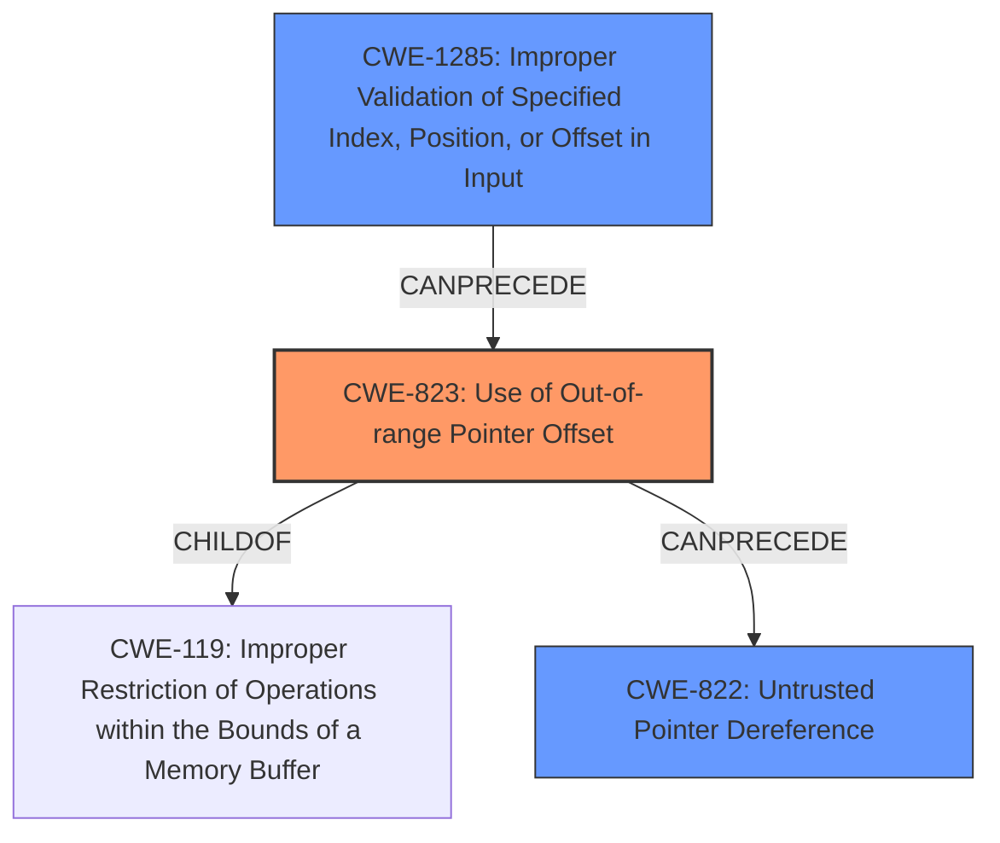

# Final Resolution for CVE-2022-33234

# Summary
| CWE ID  | CWE Name                                                        | Confidence | CWE Abstraction Level | CWE Vulnerability Mapping Label | CWE-Vulnerability Mapping Notes |
| :-------- | :-------------------------------------------------------------- | :--------- | :-------------------- | :------------------------------ | :------------------------------ |
| CWE-823   | Use of Out-of-range Pointer Offset                              | 0.75       | Base                  | Allowed                         | Primary                         |
| CWE-1285  | Improper Validation of Specified Index, Position, or Offset in Input | 0.65       | Base                  | Allowed                         | Secondary                       |
| CWE-822   | Untrusted Pointer Dereference                                   | 0.55       | Base                  | Allowed                         | Secondary                       |

## Evidence and Confidence

*   **Confidence Score:** 0.70
*   **Evidence Strength:** MEDIUM

## Relationship Analysis
The analysis focused on the relationships between the identified CWEs, particularly how a configuration weakness could lead to out-of-range pointer offsets (CWE-823) due to improper validation of input indices/offsets (CWE-1285). The potential for an untrusted pointer dereference (CWE-822) as a consequence was also considered, albeit with lower confidence. The base level of all CWEs made them suitable for direct mapping.

## Vulnerability Chain
The vulnerability chain starts with a **configuration weakness**, which leads to **CWE-1285 (Improper Validation of Specified Index, Position, or Offset in Input)**. This allows an attacker to influence the index or offset used in video processing. The improperly validated offset then results in **CWE-823 (Use of Out-of-range Pointer Offset)**, leading to memory corruption. Finally, the out-of-range pointer could potentially be dereferenced, resulting in **CWE-822 (Untrusted Pointer Dereference)**.

## Summary of Analysis
The initial analysis correctly identified potential CWEs but lacked specific justifications. The criticism provided valuable suggestions for improvement, which have been incorporated into this final determination.

The primary reason for selecting **CWE-823 (Use of Out-of-range Pointer Offset)** as the primary CWE is that the vulnerability description explicitly mentions "**memory corruption**", which is a direct consequence of using an out-of-range pointer offset. The description of CWE-823 aligns well with this: "The product performs pointer arithmetic on a valid pointer, but it uses an offset that can point outside of the intended range of valid memory locations for the resulting pointer."

**CWE-1285 (Improper Validation of Specified Index, Position, or Offset in Input)** is a strong secondary candidate because the "configuration weakness" likely involves improper validation of input indices or offsets used in video processing. This is supported by the CWE description: "The product receives input that is expected to specify an index, position, or offset into an indexable resource such as a buffer or file, but it does not validate or incorrectly validates that the specified index/position/offset has the required properties."

**CWE-822 (Untrusted Pointer Dereference)** is also considered as a secondary candidate, but with lower confidence. While it's possible that the out-of-range pointer is then dereferenced, the description doesn't explicitly state this. Therefore, it is less directly supported by the evidence.

The graph relationships influenced the final selection by highlighting the potential chain of events: Improper input validation leading to an out-of-range pointer offset, potentially resulting in an untrusted pointer dereference.

The selected CWEs are at the optimal level of specificity (Base) because they directly address the root causes and consequences of the vulnerability, as evidenced by the vulnerability description and the CWE descriptions themselves.