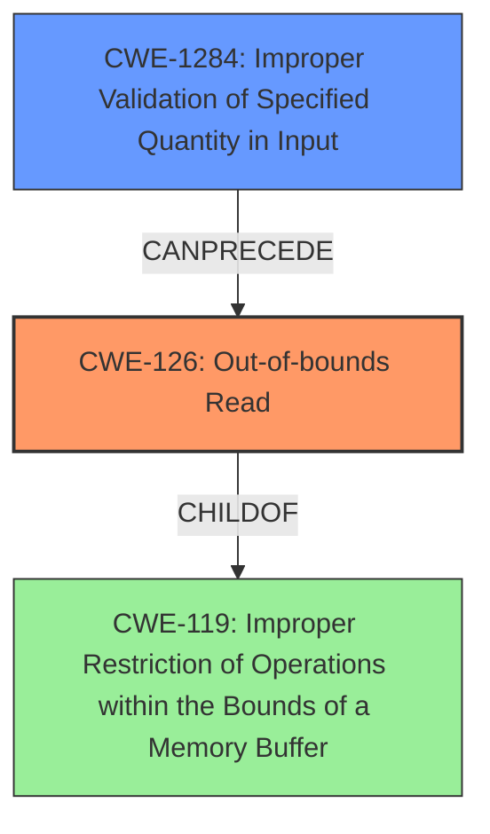

# Analysis Report for CVE-2022-33236

# Vulnerability Analysis Report: CVE-2022-33236

## Description

Transient DOS due to buffer over-read in WLAN firmware while parsing cipher suite info attributes. in Snapdragon Compute, Snapdragon Connectivity, Snapdragon Mobile, Snapdragon Wired Infrastructure and Networking

## Vulnerability Description Key Phrases

**Rootcause:** buffer over-read
**Impact:** denial of service
**Vector:** parsing cipher suite info attributes
**Product:** ['Snapdragon Compute', 'Snapdragon Connectivity', 'Snapdragon Mobile', 'Snapdragon Wired Infrastructure and Networking']
**Component:** WLAN firmware

## Analysis (with Relationship Data)

# Summary
| CWE ID | CWE Name | Confidence | CWE Abstraction Level | CWE Vulnerability Mapping Label | CWE-Vulnerability Mapping Notes |
|---|---|---|---|---|---|
| CWE-126 | Buffer Over-read | 0.9 | Variant | Allowed | Primary CWE |
| CWE-1284 | Improper Validation of Specified Quantity in Input | 0.6 | Base | Allowed | Secondary Candidate |

## Evidence and Confidence

*   **Confidence Score:** 0.75
*   **Evidence Strength:** MEDIUM

- **Analysis and Justification:**  
  - *Explanation:* The vulnerability description explicitly mentions "**buffer over-read**" as the **rootcause** of the transient denial of service (DOS). This directly aligns with CWE-126, which is defined as "The product reads from a buffer using buffer access mechanisms such as indexes or pointers that reference memory locations after the targeted buffer." The vulnerability occurs while parsing cipher suite info attributes in WLAN firmware, indicating a specific context for the **buffer over-read**. CWE-126 is a Variant level CWE, which is a preferred level of abstraction.
  - *Explanation:* The vulnerability also mentions parsing cipher suite info attributes. It's possible the size of this data is not validated before reading, which would cause a **buffer over-read**. This aligns with CWE-1284, which is defined as "The product receives input that is expected to specify a quantity (such as size or length), but it does not validate or incorrectly validates that the quantity has the required properties."

  - *Relationship Analysis:* CWE-126 is a variant of the class CWE-119 (Improper Restriction of Operations within the Bounds of a Memory Buffer). CWE-1284 is a base level CWE.

- **Confidence Score:**  
  - Confidence: 0.9 (High confidence due to explicit mention of "**buffer over-read**" and the alignment with the CWE description)
  - Confidence: 0.6 (Medium confidence because improper validation of quantity is just a possible cause to the over-read)

---

## Criticism of Analysis

Okay, here's a review of the provided CWE analysis, incorporating the full CWE specifications:

**Overall Assessment**

The analysis is generally good. It correctly identifies CWE-126 (Buffer Over-read) as the primary weakness due to the explicit mention in the vulnerability description. It also identifies CWE-1284 (Improper Validation of Specified Quantity in Input) as a secondary candidate, which is a reasonable assumption based on the vulnerability's context. The confidence scores seem appropriate. The provided examples are also on point.

**Detailed Review**

*   **CWE-126: Buffer Over-read**
    *   **Correctness:**  The mapping is correct and well-justified. The vulnerability description explicitly states "buffer over-read," making this the most obvious and appropriate choice.  The explanation given for the selection is correct and to the point, using the definition to showcase its alignment with the vulnerability.
    *   **Abstraction Level:**  CWE-126 is a Variant, which aligns with the guidance to map to a specific level of abstraction when details allow.
    *   **Mapping Guidance:** The "Usage: Allowed" guidance is correct. The analysis explicitly states the name and description are read and understood.
    *   **Examples:** The CVE examples provided are relevant and helpful, demonstrating real-world instances of CWE-126.
    *   **Confidence:** The high confidence score (0.9) is justified.
*   **CWE-1284: Improper Validation of Specified Quantity in Input**
    *   **Correctness:**  Identifying CWE-1284 as a potential contributing factor is sound reasoning.  If the code doesn't validate the size of the cipher suite info attributes before reading them, a buffer over-read can occur. This is a common root cause for buffer over-reads.  However, the description doesn't *explicitly* state this lack of validation, hence the lower confidence.
    *   **Abstraction Level:** CWE-1284 is a Base-level CWE.
    *   **Mapping Guidance:** The "Usage: Allowed" guidance is correct.
    *   **Potential Mitigations:** The mitigations provided for CWE-1284 (especially the "accept known good" input validation strategy) are directly applicable and highlight the preventative measures that could have avoided this vulnerability.
    *   **Examples:** The examples provided are adequate and correctly map to the CWE.
    *   **Confidence:**  The medium confidence score (0.6) is appropriate. It acknowledges the possibility but also the lack of direct evidence in the original vulnerability description.

**Suggestions for Improvement**

1.  **Consider Adding a Chain:** While not strictly *required*, the analysis could benefit from explicitly describing the potential chain of events *if* CWE-1284 is indeed a factor.  For example: "The lack of input validation of the cipher suite info attribute size (CWE-1284) leads to a buffer over-read (CWE-126) during parsing, resulting in a denial of service."  This reinforces the relationship between the two CWEs.
2. **Address retriever Results:**
    * CWE-124 is a Buffer Underwrite, this does not fit the root cause and should not be considered.
    * CWE-190, CWE-252 are not applicable.
    * CWE-1314 and CWE-413 do not apply.

**Revised Table Summary**

| CWE ID | CWE Name | Confidence | CWE Abstraction Level | CWE Vulnerability Mapping Label | CWE-Vulnerability Mapping Notes |
|---|---|---|---|---|---|
| CWE-126 | Buffer Over-read | 0.9 | Variant | Allowed | Primary CWE |
| CWE-1284 | Improper Validation of Specified Quantity in Input | 0.6 | Base | Allowed | Secondary Candidate, contributing factor to CWE-126 |

**Conclusion**

The analysis is well-reasoned and accurate. The suggestions above are primarily for enhancing the analysis by explicitly stating the potential chain of events. The confidence levels are appropriately assigned, reflecting the certainty associated with each CWE mapping.

## Final Resolution

# Summary
| CWE ID | CWE Name | Confidence | CWE Abstraction Level | CWE Vulnerability Mapping Label | CWE-Vulnerability Mapping Notes |
|---|---|---|---|---|---|
| CWE-126 | Out-of-bounds Read | 0.9 | Variant | Allowed | Primary CWE |
| CWE-1284 | Improper Validation of Specified Quantity in Input | 0.6 | Base | Allowed | Secondary Candidate, contributing factor to **CWE-126** |

## Evidence and Confidence

*   **Confidence Score:** 0.8
*   **Evidence Strength:** MEDIUM

## Relationship Analysis
The primary relationship is that **CWE-1284** can precede **CWE-126**. If the quantity is not validated, this can lead to an out-of-bounds read. **CWE-126** is a variant of **CWE-119** (Improper Restriction of Operations within the Bounds of a Memory Buffer). This means that **CWE-126** is a more specific type of **CWE-119**. **CWE-1284** is a base level CWE, while **CWE-126** is a variant. The analysis takes into account the abstraction levels and selects the most specific option that aligns with the provided evidence.

## Vulnerability Chain
The vulnerability chain starts with **CWE-1284** (Improper Validation of Specified Quantity in Input), where the size of the cipher suite info attributes is not validated. This leads to **CWE-126** (Out-of-bounds Read) during parsing, as the code reads beyond the allocated buffer. The impact of this is a transient denial of service (DOS).

## Summary of Analysis
The initial analysis and criticism both correctly identified **CWE-126** as the primary weakness due to the explicit mention of "**buffer over-read**" in the vulnerability description. The analysis also correctly identifies **CWE-1284** as a secondary candidate because it could be a contributing factor to the **buffer over-read**.

The vulnerability description explicitly mentions "**buffer over-read**" in WLAN firmware while parsing cipher suite info attributes. This provides direct evidence for selecting **CWE-126**.

The chain relationship (**CWE-1284** CanPrecede **CWE-126**) supports the selection of **CWE-1284** as a secondary weakness. The lack of input validation (CWE-1284) directly contributes to the possibility of reading beyond the buffer boundaries (**CWE-126**).

The selected CWEs are at the optimal level of specificity. **CWE-126** is a Variant, providing a specific description of the **buffer over-read**, while **CWE-1284** is a Base CWE that represents the root cause of the issue.

The assessment is primarily based on the provided evidence and relationships between CWEs. The explicit mention of "**buffer over-read**" provides strong support for **CWE-126**.

*Report generated on 2025-03-18 14:43:00*
