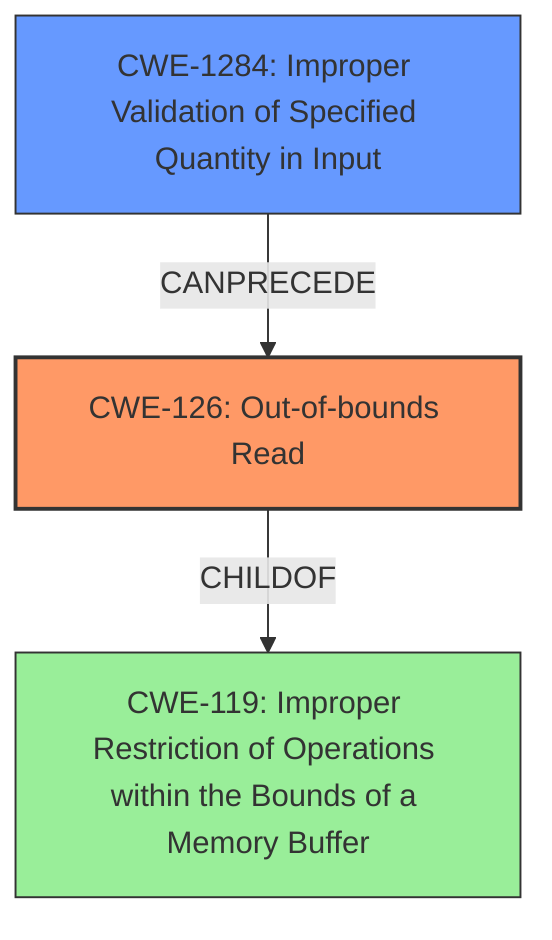

# Final Resolution for CVE-2022-33236

# Summary
| CWE ID | CWE Name | Confidence | CWE Abstraction Level | CWE Vulnerability Mapping Label | CWE-Vulnerability Mapping Notes |
|---|---|---|---|---|---|
| CWE-126 | Out-of-bounds Read | 0.9 | Variant | Allowed | Primary CWE |
| CWE-1284 | Improper Validation of Specified Quantity in Input | 0.6 | Base | Allowed | Secondary Candidate, contributing factor to **CWE-126** |

## Evidence and Confidence

*   **Confidence Score:** 0.8
*   **Evidence Strength:** MEDIUM

## Relationship Analysis
The primary relationship is that **CWE-1284** can precede **CWE-126**. If the quantity is not validated, this can lead to an out-of-bounds read. **CWE-126** is a variant of **CWE-119** (Improper Restriction of Operations within the Bounds of a Memory Buffer). This means that **CWE-126** is a more specific type of **CWE-119**. **CWE-1284** is a base level CWE, while **CWE-126** is a variant. The analysis takes into account the abstraction levels and selects the most specific option that aligns with the provided evidence.

## Vulnerability Chain
The vulnerability chain starts with **CWE-1284** (Improper Validation of Specified Quantity in Input), where the size of the cipher suite info attributes is not validated. This leads to **CWE-126** (Out-of-bounds Read) during parsing, as the code reads beyond the allocated buffer. The impact of this is a transient denial of service (DOS).

## Summary of Analysis
The initial analysis and criticism both correctly identified **CWE-126** as the primary weakness due to the explicit mention of "**buffer over-read**" in the vulnerability description. The analysis also correctly identifies **CWE-1284** as a secondary candidate because it could be a contributing factor to the **buffer over-read**.

The vulnerability description explicitly mentions "**buffer over-read**" in WLAN firmware while parsing cipher suite info attributes. This provides direct evidence for selecting **CWE-126**.

The chain relationship (**CWE-1284** CanPrecede **CWE-126**) supports the selection of **CWE-1284** as a secondary weakness. The lack of input validation (CWE-1284) directly contributes to the possibility of reading beyond the buffer boundaries (**CWE-126**).

The selected CWEs are at the optimal level of specificity. **CWE-126** is a Variant, providing a specific description of the **buffer over-read**, while **CWE-1284** is a Base CWE that represents the root cause of the issue.

The assessment is primarily based on the provided evidence and relationships between CWEs. The explicit mention of "**buffer over-read**" provides strong support for **CWE-126**.