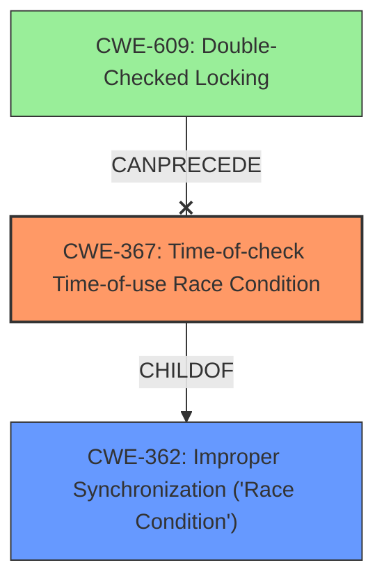

# Final Resolution for CVE-2022-33257

# Summary
| CWE ID | CWE Name | Confidence | CWE Abstraction Level | CWE Vulnerability Mapping Label | CWE-Vulnerability Mapping Notes |
|---|---|---|---|---|---|
| CWE-367 | Time-of-check Time-of-use (TOCTOU) Race Condition | 0.95 | Base | Allowed | Primary CWE |
| CWE-362 | Concurrent Execution using Shared Resource with Improper Synchronization ('Race Condition') | 0.65 | Class | Allowed-with-Review | Secondary Candidate |

## Evidence and Confidence

*   **Confidence Score:** 0.95
*   **Evidence Strength:** HIGH

## Relationship Analysis
The primary relationship that influenced the decision was the parent-child relationship between CWE-362 and CWE-367. CWE-367 is a specific type of race condition and is therefore a child of the more general CWE-362. This relationship guided the selection of CWE-367 as the primary because it is the most specific and accurate representation of the vulnerability described. The analysis also considered the CANPRECEDE relationship from CWE-609 to CWE-367 but ruled it out because there was no evidence of double-checked locking in the vulnerability description.

## Vulnerability Chain
The vulnerability chain starts with the **ROOTCAUSE** being a **CWE-367 (Time-of-check Time-of-use (TOCTOU) Race Condition)**. The product checks the state of a resource, but the resource's state can change before it's used. This leads to **memory corruption** in the Core, specifically during dump collection in the trust zone. This can allow for unauthorized access or execution of arbitrary code. The chain is: **CWE-367** -> **Memory Corruption** -> **Unauthorized Access/Code Execution**.

## Summary of Analysis
The initial analysis and criticism both agree that **CWE-367 (Time-of-check Time-of-use (TOCTOU) Race Condition)** is the most appropriate primary CWE. The vulnerability description explicitly mentions a "time-of-check time-of-use race condition," which directly corresponds to the definition of **CWE-367**. The evidence strength is high due to this explicit mention. The relationship analysis further supports this decision, as **CWE-367** is a more specific child of the more general **CWE-362 (Concurrent Execution using Shared Resource with Improper Synchronization ('Race Condition'))**. The selection of **CWE-367** is at the optimal level of specificity, as it accurately characterizes the **time-of-check time-of-use race condition** described in the vulnerability. The retriever scores also support this selection.