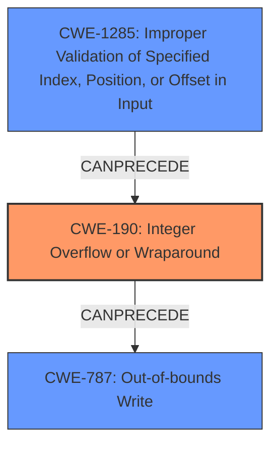

# Final Resolution for CVE-2022-33266

# Summary
| CWE ID | CWE Name | Confidence | CWE Abstraction Level | CWE Vulnerability Mapping Label | CWE-Vulnerability Mapping Notes |
|---|---|---|---|---|---|
| CWE-190 | Integer Overflow or Wraparound | 0.9 | Base | Allowed | Primary CWE. Directly reflects the **integer overflow** root cause. |
| CWE-787 | Out-of-bounds Write | 0.7 | Base | Allowed | Secondary CWE. Represents the memory corruption due to the overflow. |
| CWE-1285 | Improper Validation of Specified Index, Position, or Offset in Input | 0.4 | Base | Allowed | Contributing factor. Represents the size of the audio clip as untrusted data. Potentially causes integer overflow if the data is not validated. |

## Evidence and Confidence

*   **Confidence Score:** 0.85
*   **Evidence Strength:** MEDIUM

## Relationship Analysis
The primary relationship is that CWE-190 (**Integer Overflow or Wraparound**) can precede CWE-787 (**Out-of-bounds Write**), which accurately reflects the vulnerability chain. The addition of CWE-1285 (**Improper Validation of Specified Index, Position, or Offset in Input**) as a contributing factor suggests that the size of the audio clip, which is untrusted data, is not validated and may cause an **integer overflow**. All three CWEs are at the Base abstraction level.

## Vulnerability Chain
The vulnerability chain starts with potentially untrusted input (size of audio clip) which is not validated (CWE-1285), leading to an **integer overflow** (CWE-190) during buffer size calculation. This results in a smaller-than-expected buffer, causing an out-of-bounds write (CWE-787) and memory corruption during audio data processing.
  - **Root Cause:** Untrusted input size, leading to **integer overflow**.
  - **Weakness 1:** CWE-1285: Improper Validation of Specified Index, Position, or Offset in Input
  - **Weakness 2:** CWE-190: Integer Overflow or Wraparound
  - **Impact:** CWE-787: Out-of-bounds Write, Memory Corruption

## Summary of Analysis
The initial analysis correctly identified CWE-190 (**Integer Overflow or Wraparound**) and CWE-787 (**Out-of-bounds Write**) as the primary and secondary weaknesses. The criticism suggested considering additional CWEs, specifically CWE-1285 (**Improper Validation of Specified Index, Position, or Offset in Input**).

The vulnerability description, "Memory corruption in Audio due to integer overflow to buffer overflow while music playback of clips like amr,evrc,qcelp with modified content," directly supports the selection of CWE-190 and CWE-787.

The graph relationships confirm that CWE-190 can precede CWE-787. The addition of CWE-1285 is based on the understanding that the size of the audio clip likely comes from untrusted input, which if not validated, contributes to the **integer overflow**.

The final classification includes CWE-1285 because the vulnerability description mentions "modified content," implying that the input size might be manipulated. This makes it a contributing factor, although the confidence is lower (0.4) because it is inferred rather than explicitly stated. CWE-190 remains the primary **root cause**, and CWE-787 remains the direct consequence.

The selected CWEs are at the optimal level of specificity because they accurately represent the **root cause** (CWE-190), the impact (CWE-787), and a contributing factor (CWE-1285) based on the available evidence.