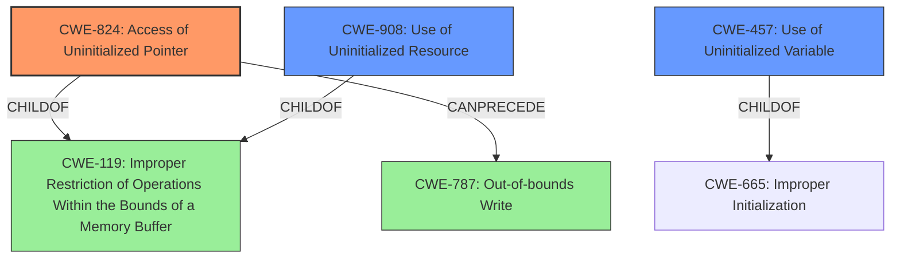

# Analysis Report for CVE-2022-33280

# Vulnerability Analysis Report: CVE-2022-33280

## Description

Memory corruption due to access of uninitialized pointer in Bluetooth HOST while processing the AVRCP packet.

## Vulnerability Description Key Phrases

**Rootcause:** access of uninitialized pointer
**Impact:** Memory corruption
**Product:** Bluetooth HOST

## Analysis (with Relationship Data)

```markdown
# Summary
| CWE ID    | CWE Name                       | Confidence | CWE Abstraction Level | CWE Vulnerability Mapping Label | CWE-Vulnerability Mapping Notes |
| --------- | ------------------------------ | ---------- | --------------------- | ------------------------------- | ----------------------------- |
| CWE-824   | Access of Uninitialized Pointer | 0.95       | Base                  | Allowed                         | Primary CWE                   |
| CWE-908   | Use of Uninitialized Resource   | 0.75       | Base                  | Allowed                         | Secondary Candidate           |
| CWE-457   | Use of Uninitialized Variable | 0.65       | Variant                  | Allowed                         | Secondary Candidate           |

## Evidence and Confidence

*   **Confidence Score:** 0.90
*   **Evidence Strength:** HIGH

- **Analysis and Justification:**
  - *Explanation:* The vulnerability description explicitly states "**access of uninitialized pointer**" as the root cause of memory corruption in Bluetooth HOST while processing AVRCP packets. This directly maps to CWE-824 (Access of Uninitialized Pointer). The description clearly indicates that the pointer being accessed has not been initialized, which leads to memory corruption. CWE-824 is a Base level CWE, making it a suitable choice for root cause analysis.
  CWE-908 is "Use of Uninitialized Resource". While the vulnerability is specifically about an uninitialized pointer, the more general CWE-908 could also be considered as a related weakness.
  CWE-457 is "Use of Uninitialized Variable". Since the uninitialized pointer is essentially an uninitialized variable that holds a memory address, CWE-457 is a potential, though less specific, candidate.

  - *Relationship Analysis:* CWE-824 is a base level weakness and is related to other memory corruption issues. It can precede CWE-787 (Out-of-bounds Write) if the uninitialized pointer happens to point to an invalid memory location and a write operation occurs.

- **Confidence Score:**
  - Confidence: 0.95 (High confidence due to the clear statement of the root cause in the vulnerability description and the direct match with CWE-824).

---
```

## Criticism of Analysis

Okay, here's a detailed review of the provided CWE analysis, incorporating the full CWE specifications:

**Overall Assessment:**

The analysis is generally sound, particularly in its identification of CWE-824 (Access of Uninitialized Pointer) as the primary CWE. The justification is clear and directly tied to the vulnerability description. The inclusion of CWE-908 (Use of Uninitialized Resource) and CWE-457 (Use of Uninitialized Variable) as secondary candidates is also reasonable, as they represent broader categories that encompass the specific issue. The confidence scores assigned are appropriate.

**Detailed Review by CWE:**

*   **CWE-824: Access of Uninitialized Pointer (Primary CWE)**

    *   **Correctness:**  This is the most accurate and specific mapping. The vulnerability description explicitly mentions an "access of uninitialized pointer," making CWE-824 a direct match.
    *   **Justification Strength:** Excellent. The justification clearly links the vulnerability description to the CWE definition.
    *   **Abstraction Level:** Base, which is the preferred level for this type of root cause analysis.
    *   **Mapping Guidance Compliance:** The analysis adheres to the mapping guidance, which allows for Base-level CWEs when they accurately represent the vulnerability.
    *   **Mitigations:** Potential mitigations for CWE-824 generally include:
        *   Ensuring pointers are initialized before use.
        *   Reviewing complex conditionals to guarantee initialization occurs on all branches.
    *   **Observed Examples:** The analysis can be strengthened by including relevant observed examples of CWE-824, for example:
    *   **CVE-2024-32878:** LLM product has a free of an uninitialized pointer
    *   **CVE-2010-0211:** chain: unchecked return value (CWE-252) leads to free of invalid, uninitialized pointer (CWE-824).
    *   **CVE-2009-2768:** Pointer in structure is not initialized, leading to NULL pointer dereference (CWE-476) and system crash.

*   **CWE-908: Use of Uninitialized Resource (Secondary Candidate)**

    *   **Correctness:**  Reasonable.  An uninitialized pointer *is* an uninitialized resource. However, CWE-824 is more specific.
    *   **Justification Strength:** Good. The analysis correctly identifies that the pointer is a type of resource.
    *   **Abstraction Level:** Base.  Appropriate, but less precise than CWE-824.
    *   **Mapping Guidance Compliance:** Compliant. Base-level CWEs are allowed, but the description should explain why a more specific Variant is not used as the primary.
    *   **Mitigations:** Potential mitigations for CWE-908 generally include:
        *   Explicitly initializing the resource before use.
        *   Paying close attention to complex conditionals that affect initialization.
    *   **Observed Examples:** The analysis can be strengthened by including relevant observed examples of CWE-908, for example:
    *   **CVE-2019-9805:** Chain: Creation of the packet client occurs before initialization is complete (CWE-696) resulting in a read from uninitialized memory (CWE-908), causing memory corruption.
    *   **CVE-2008-4197:** Use of uninitialized memory may allow code execution.
    *   **CVE-2008-2934:** Free of an uninitialized pointer leads to crash and possible code execution.

*   **CWE-457: Use of Uninitialized Variable (Secondary Candidate)**

    *   **Correctness:**  Acceptable. A pointer *is* a variable. However, CWE-824 is far more precise and accurately captures the nature of the vulnerability.
    *   **Justification Strength:** Fair. It's true that a pointer is a variable, but the connection isn't as direct as with CWE-824.
    *   **Abstraction Level:** Variant.  Appropriate if it were the *primary* CWE, but less suitable as a secondary if a more specific Base CWE exists (CWE-824).
    *   **Mapping Guidance Compliance:** Compliant, but the description needs to explicitly address why the Variant (CWE-457) is considered *less* specific than the Base (CWE-824) in this case, even though Variant is generally preferred.
    *   **Mitigations:** Potential mitigations for CWE-457 generally include:
        *   Assigning all variables to an initial value.
        *   Enabling compiler warnings to detect uninitialized variables.
    *   **Observed Examples:** The analysis can be strengthened by including relevant observed examples of CWE-457, for example:
    *   **CVE-2019-15900:** Chain: sscanf() call is used to check if a username and group exists, but the return value of sscanf() call is not checked (CWE-252), causing an uninitialized variable to be checked (CWE-457), returning success to allow authorization bypass for executing a privileged (CWE-863).
    *   **CVE-2008-3688:** Chain: A denial of service may be caused by an uninitialized variable (CWE-457) allowing an infinite loop (CWE-835) resulting from a connection to an unresponsive server.
    *   **CVE-2008-0081:** Uninitialized variable leads to code execution in popular desktop application.

**Recommendations for Improvement:**

1.  **Strengthen Justification for Secondary CWEs:** Explicitly address the hierarchy and relationships between CWE-824, CWE-908, and CWE-457. Explain why CWE-824 is the most precise representation of the vulnerability, even though CWE-457 is a Variant.
2.  **Expand Observed Examples:**  Add specific CVE examples for each CWE to the analysis, drawing from the CWE database information. This demonstrates a clear understanding of how the CWE manifests in real-world vulnerabilities.
3.  **Consider Chaining:**  The analysis mentions that CWE-824 can precede CWE-787 (Out-of-bounds Write).  Explore this relationship further. Could the uninitialized pointer lead to an out-of-bounds write if the garbage value in the pointer points to an invalid memory location? If so, make this chain explicit in the analysis.
4.  **Minor Edits:**
    *   Correct "Confidence Score: 0.90" to "Confidence Score: 0.95" to match the confidence stated for CWE-824.

**Revised Summary Table (Example with added chain):**

| CWE ID    | CWE Name                       | Confidence | CWE Abstraction Level | CWE Vulnerability Mapping Label | CWE-Vulnerability Mapping Notes                                                                                                                    |
| --------- | ------------------------------ | ---------- | --------------------- | ------------------------------- | -------------------------------------------------------------------------------------------------------------------------------------------------- |
| CWE-824   | Access of Uninitialized Pointer | 0.95       | Base                  | Allowed                         | Primary CWE. The uninitialized pointer leads to memory corruption when accessed.  Example: CVE-2024-32878, CVE-2010-0211, CVE-2009-2768 |
| CWE-908   | Use of Uninitialized Resource   | 0.75       | Base                  | Allowed                         | Secondary Candidate. A broader category encompassing uninitialized pointers. Example: CVE-2019-9805, CVE-2008-4197, CVE-2008-2934                                          |
| CWE-457   | Use of Uninitialized Variable | 0.65       | Variant               | Allowed                         | Secondary Candidate. A pointer is a type of variable. Example: CVE-2019-15900, CVE-2008-3688, CVE-2008-0081                                                                     |
| CWE-787   | Out-of-Bounds Write             | 0.45       | Base                  | Allowed                         | Potential Consequence (Chain). If the uninitialized pointer contains a random address, writing to it could cause an out-of-bounds write.                    |

By incorporating these recommendations, you can strengthen the analysis and make it more informative and compliant with CWE's mapping guidance. Remember that the goal is to provide a clear, well-supported, and actionable understanding of the vulnerability's root cause.

## Final Resolution

# Summary
| CWE ID    | CWE Name                       | Confidence | CWE Abstraction Level | CWE Vulnerability Mapping Label | CWE-Vulnerability Mapping Notes |
| --------- | ------------------------------ | ---------- | --------------------- | ------------------------------- | ----------------------------- |
| CWE-824   | Access of Uninitialized Pointer | 0.95       | Base                  | Allowed                         | Primary CWE. The **uninitialized pointer** leads to memory corruption when accessed. Example: CVE-2024-32878, CVE-2010-0211, CVE-2009-2768 |
| CWE-908   | Use of Uninitialized Resource   | 0.75       | Base                  | Allowed                         | Secondary Candidate. A broader category encompassing **uninitialized pointers**. Example: CVE-2019-9805, CVE-2008-4197, CVE-2008-2934                                          |
| CWE-457   | Use of Uninitialized Variable | 0.65       | Variant               | Allowed                         | Secondary Candidate. A pointer is a type of variable. Example: CVE-2019-15900, CVE-2008-3688, CVE-2008-0081                                                                     |
| CWE-787   | Out-of-Bounds Write             | 0.45       | Base                  | Allowed                         | Potential Consequence (Chain). If the **uninitialized pointer** contains a random address, writing to it could cause an out-of-bounds write.                    |

## Evidence and Confidence

*   **Confidence Score:** 0.95
*   **Evidence Strength:** HIGH

## Relationship Analysis
The primary weakness is CWE-824, a Base CWE. CWE-908 and CWE-457 are related but less specific. CWE-908 (Use of Uninitialized Resource) is a Base CWE that broadly covers the use of any **uninitialized resource**, while CWE-457 (Use of Uninitialized Variable) is a Variant that refers to any **uninitialized variable**. A pointer is a variable and can be considered a resource, thus justifying their inclusion as secondary candidates. The relationship between CWE-824 and CWE-787 (Out-of-Bounds Write) is a "Can Precede" relationship, indicating a potential vulnerability chain where the **uninitialized pointer** leads to an out-of-bounds write. The chosen CWEs reflect an optimal level of specificity, with CWE-824 accurately representing the **root cause**.



## Vulnerability Chain
The vulnerability chain starts with the **uninitialized pointer** (CWE-824). This leads to memory corruption due to accessing an invalid memory location. If a write operation occurs at this invalid location, it could result in an out-of-bounds write (CWE-787).
  - **Root Cause:** **Uninitialized Pointer** (CWE-824)
  - **Weakness:** Accessing the **uninitialized pointer** leading to memory corruption.
  - **Impact:** Potential out-of-bounds write (CWE-787) and further system instability.

## Summary of Analysis
The analysis is based on the vulnerability description stating "**access of uninitialized pointer**". This directly maps to CWE-824 (Access of Uninitialized Pointer). The graph relationships show that CWE-824 can lead to CWE-787, representing a potential vulnerability chain. The selection of CWE-824 is at the optimal level of specificity as it is a Base CWE that accurately describes the **root cause** of the vulnerability. The inclusion of CWE-908 and CWE-457 as secondary candidates provides context but are less specific. The high confidence is due to the direct match between the vulnerability description and the CWE description for CWE-824.


*Report generated on 2025-03-18 14:47:34*
