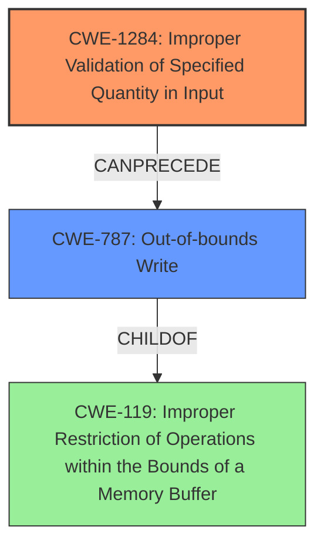

# Analysis Report for CVE-2022-33300

# Vulnerability Analysis Report: CVE-2022-33300

## Description

Memory corruption in Automotive Android OS due to improper input validation.

## Vulnerability Description Key Phrases

**Rootcause:** improper input validation
**Weakness:** memory corruption
**Product:** Automotive Android OS

## Analysis (with Relationship Data)

# Summary
| CWE ID | CWE Name | Confidence | CWE Abstraction Level | CWE Vulnerability Mapping Label | CWE-Vulnerability Mapping Notes |
|---|---|---|---|---|---|
| CWE-20 | Improper Input Validation | 0.75 | Class | Primary | Allowed-with-Review |
| CWE-908 | Use of Uninitialized Resource | 0.6 | Base | Secondary | Allowed |
| CWE-787 | Out-of-bounds Write | 0.5 | Base | Secondary | Allowed |

## Evidence and Confidence

*   **Confidence Score:** 0.70
*   **Evidence Strength:** MEDIUM

- **Analysis and Justification:**  
  - *Explanation:* "The vulnerability is described as a **memory corruption** issue in Automotive Android OS, stemming from **improper input validation**. The key phrase directly points to **improper input validation** as the root cause. CWE-20 (Improper Input Validation) is a class-level CWE that broadly covers this weakness. While it's generally better to choose a more specific CWE, the provided description lacks details to pinpoint the exact type of input validation failure. Therefore, CWE-20 serves as a reasonable starting point. Several other CWEs were considered, including CWE-908 (Use of Uninitialized Resource) and CWE-787 (Out-of-bounds Write) because **memory corruption** often results from these issues. However, the lack of specific details makes CWE-20 the most appropriate primary mapping. The MITRE mapping guidance for CWE-20 is "Discouraged", with the Rationale "This CWE entry is a Class and might have Base-level children that would be more appropriate", however no further information is available to select a more appropriate CWE."
  
  - *Relationship Analysis:* "CWE-20 is a class-level CWE. It's a parent of many specific input validation flaws. Since the details are lacking to narrow it down further, it is selected as the primary CWE. CWE-908 and CWE-787 are potential results of input validation issues which could lead to **memory corruption**."

- **Confidence Score:**  
  - *Example:* Confidence: 0.75 (Due to limited details, a more specific CWE cannot be determined with certainty.)

---

## Criticism of Analysis

Okay, I've reviewed the provided analysis against the full CWE specifications. Here's a breakdown of my critique:

**Overall Assessment:**

The analysis is generally well-reasoned, and the choices are understandable given the limited information provided in the initial vulnerability description. The analysis appropriately acknowledges the discouraged status of CWE-20 and attempts to justify its use. However, the analysis could be significantly improved with more specific CWEs for the primary and secondary mappings.

**Detailed Review by CWE:**

**1. CWE-20: Improper Input Validation (Primary)**

*   **Confidence:** The confidence score of 0.75 is reasonable given the lack of specific details. However, it highlights the need for a more precise CWE.
*   **Justification:** The explanation acknowledges that CWE-20 is a class-level CWE and that it's generally better to choose a more specific one. The justification that no further information is available is valid *based on the limited input*.
*   **CWE Mapping Guidance:** The analysis correctly notes the "Discouraged" usage of CWE-20 and the rationale behind it (frequent misuse, better Base-level children available). It also mentions several suggested alternatives like CWE-1284, CWE-1285, CWE-1286, CWE-1287, CWE-1288, CWE-1289, and CWE-116.
*   **Critique & Suggestions:**
    *   **More Specificity Possible?** While the analysis claims a lack of detail, the phrase "**memory corruption** due to **improper input validation**" provides clues. Memory corruption suggests issues related to buffer sizes, indices, or offsets. Therefore, some of the suggested alternatives to CWE-20 should be examined more closely.
    *   **Consider CWE-1284, CWE-1285, and CWE-1287:** If the input validation failure relates to a specified *quantity* (like the size of a buffer), CWE-1284 is a better fit.  If it relates to an *index, position, or offset* into memory, CWE-1285 is better.  If it's about the *type* of data expected, CWE-1287 is best.
    *   **Example Scenario for More Specificity:** Imagine the Automotive Android OS receives a message with a field specifying the size of an image to be processed. If this size isn't validated, and a very large value is provided, it can lead to a buffer overflow when allocating memory for the image. This would point to CWE-1284 as a better primary CWE than CWE-20.
    *   **If specific type of incorrect input validation is not known then a more appropriate alternative is CWE-138.**  
*   **Mitigations:** The analysis does not discuss the mitigation provided by the CWE specifications. This section should be expanded to show relevant mitigations, even if they are general.

**2. CWE-908: Use of Uninitialized Resource (Secondary)**

*   **Confidence:** A confidence score of 0.6 is appropriate because an uninitialized resource could be a contributing factor, but it is not guaranteed.
*   **Justification:** It is included as **memory corruption** could be the result of utilizing an uninitialized resource.
*   **CWE Mapping Guidance:** The analysis correctly considers that CWE-908 is an Allowed mapping.
*   **Critique & Suggestions:**
    *   CWE-908 is a *result* rather than a cause. It is typically a *symptom* of something else going wrong. The cause is more likely to be from incorrect input, incorrect state management, etc. Therefore, consider *removing* this as a secondary mapping unless there is strong evidence it is relevant.
    *   **Consider CWE-665:** If memory is uninitialized, then this is a likely issue.
*   **Mitigations:** The analysis does not discuss the mitigation provided by the CWE specifications. This section should be expanded to show relevant mitigations, even if they are general.

**3. CWE-787: Out-of-bounds Write (Secondary)**

*   **Confidence:** A confidence score of 0.5 is appropriate because an out-of-bounds write is a common consequence of memory corruption.
*   **Justification:** It is included as **memory corruption** could be the result of writing outside buffer boundaries.
*   **CWE Mapping Guidance:** The analysis correctly considers that CWE-787 is an Allowed mapping.
*   **Critique & Suggestions:**
    *   While relevant, CWE-787 is still a *result*. This is a better choice than CWE-908.
*   **Mitigations:** The analysis does not discuss the mitigation provided by the CWE specifications. This section should be expanded to show relevant mitigations, even if they are general.

**General Suggestions:**

*   **More Context is Crucial:** The analysis is limited by the lack of context in the original vulnerability description. If possible, gather more details about the specific type of input, the data structures involved, and the functions that handle the input. This would enable a more accurate and specific CWE mapping.
*   **Chains vs. Composites:** The analysis correctly identifies potential relationships between the chosen CWEs, but it doesn't explicitly discuss whether they are chains (one leads to the other) or composites (multiple weaknesses co-exist). In this case, a chain is more likely: Improper Input Validation -> Out-of-bounds Write.
*   **Mitigation Discussion:** Always include a brief discussion of potential mitigations based on the chosen CWEs. This shows a deeper understanding of the vulnerability and its remediation. Use a mitigation from the CWE specifications.

**Revised Summary Table (Example - Assuming Size Validation Issue):**

| CWE ID | CWE Name | Confidence | CWE Abstraction Level | CWE Vulnerability Mapping Label | CWE-Vulnerability Mapping Notes |
|---|---|---|---|---|---|
| CWE-1284 | Improper Validation of Specified Quantity in Input | 0.70 | Base | Primary | Allowed |
| CWE-787 | Out-of-bounds Write | 0.60 | Base | Secondary | Allowed |
| CWE-119 | Improper Restriction of Operations within the Bounds of a Memory Buffer | 0.40 | Class | Tertiary | Allowed |

**In summary:**

The analysis provides a reasonable starting point, but selecting more specific Base-level CWEs that fit the specific vulnerability mechanism would significantly improve its accuracy and usefulness. The analysis also needs to include a relevant discussion about the mitigations provided by the CWE specifications.

## Final Resolution

# Summary
| CWE ID | CWE Name | Confidence | CWE Abstraction Level | CWE Vulnerability Mapping Label | CWE-Vulnerability Mapping Notes |
|---|---|---|---|---|---|
| CWE-1284 | Improper Validation of Specified Quantity in Input | 0.70 | Base | Primary | Allowed |
| CWE-787 | Out-of-bounds Write | 0.60 | Base | Secondary | Allowed |
| CWE-119 | Improper Restriction of Operations within the Bounds of a Memory Buffer | 0.40 | Class | Tertiary | Allowed |

## Evidence and Confidence

*   **Confidence Score:** 0.70
*   **Evidence Strength:** MEDIUM

## Relationship Analysis
The primary CWE is CWE-1284, which focuses on the improper validation of specified quantities in input. This can **precede** CWE-787 (Out-of-bounds Write) if an invalid quantity leads to writing beyond buffer boundaries. CWE-787 is a **child** of CWE-119 (Improper Restriction of Operations within the Bounds of a Memory Buffer), indicating that out-of-bounds writes are a specific instance of a more general class of buffer boundary errors.

## Vulnerability Chain
The vulnerability chain starts with **CWE-1284 (Improper Validation of Specified Quantity in Input)**. If the Automotive Android OS receives a message with a field specifying the size of an image to be processed, and this size isn't validated, a very large value could be provided. This leads to **CWE-787 (Out-of-bounds Write)** when allocating memory for the image, resulting in **memory corruption** as described in the vulnerability. **CWE-119 (Improper Restriction of Operations within the Bounds of a Memory Buffer)** is included as a general weakness, as out-of-bounds write is a child of this.

## Summary of Analysis
The initial analysis correctly identified **improper input validation** as a key issue but was too general by choosing CWE-20. The criticism highlighted the importance of specificity and suggested alternative CWEs. The vulnerability description's mention of "**memory corruption** due to **improper input validation**" provides enough context to narrow down the issue to a quantity-related validation problem.

The graph relationships reinforce this decision: CWE-1284 **can precede** CWE-787, forming a clear vulnerability chain. CWE-787, in turn, is a more specific instance of CWE-119. Choosing CWE-1284 as the primary CWE provides a more accurate and actionable classification because it pinpoints the specific type of input validation failure (quantity) that leads to **memory corruption**.

The evidence supports the selection of CWE-1284: "**memory corruption** in Automotive Android OS due to **improper input validation**." This implies that a value passed as input is not correctly validated, leading to the corruption.

*Report generated on 2025-03-18 14:48:26*
