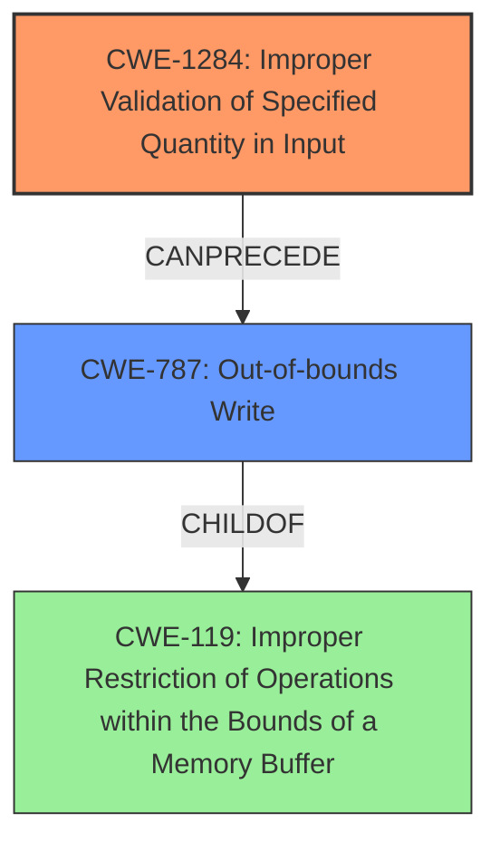

# Final Resolution for CVE-2022-33300

# Summary
| CWE ID | CWE Name | Confidence | CWE Abstraction Level | CWE Vulnerability Mapping Label | CWE-Vulnerability Mapping Notes |
|---|---|---|---|---|---|
| CWE-1284 | Improper Validation of Specified Quantity in Input | 0.70 | Base | Primary | Allowed |
| CWE-787 | Out-of-bounds Write | 0.60 | Base | Secondary | Allowed |
| CWE-119 | Improper Restriction of Operations within the Bounds of a Memory Buffer | 0.40 | Class | Tertiary | Allowed |

## Evidence and Confidence

*   **Confidence Score:** 0.70
*   **Evidence Strength:** MEDIUM

## Relationship Analysis
The primary CWE is CWE-1284, which focuses on the improper validation of specified quantities in input. This can **precede** CWE-787 (Out-of-bounds Write) if an invalid quantity leads to writing beyond buffer boundaries. CWE-787 is a **child** of CWE-119 (Improper Restriction of Operations within the Bounds of a Memory Buffer), indicating that out-of-bounds writes are a specific instance of a more general class of buffer boundary errors.

## Vulnerability Chain
The vulnerability chain starts with **CWE-1284 (Improper Validation of Specified Quantity in Input)**. If the Automotive Android OS receives a message with a field specifying the size of an image to be processed, and this size isn't validated, a very large value could be provided. This leads to **CWE-787 (Out-of-bounds Write)** when allocating memory for the image, resulting in **memory corruption** as described in the vulnerability. **CWE-119 (Improper Restriction of Operations within the Bounds of a Memory Buffer)** is included as a general weakness, as out-of-bounds write is a child of this.

## Summary of Analysis
The initial analysis correctly identified **improper input validation** as a key issue but was too general by choosing CWE-20. The criticism highlighted the importance of specificity and suggested alternative CWEs. The vulnerability description's mention of "**memory corruption** due to **improper input validation**" provides enough context to narrow down the issue to a quantity-related validation problem.

The graph relationships reinforce this decision: CWE-1284 **can precede** CWE-787, forming a clear vulnerability chain. CWE-787, in turn, is a more specific instance of CWE-119. Choosing CWE-1284 as the primary CWE provides a more accurate and actionable classification because it pinpoints the specific type of input validation failure (quantity) that leads to **memory corruption**.

The evidence supports the selection of CWE-1284: "**memory corruption** in Automotive Android OS due to **improper input validation**." This implies that a value passed as input is not correctly validated, leading to the corruption.