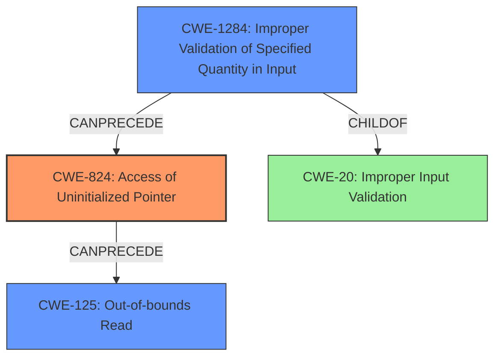

# Final Resolution for CVE-2022-3377

# Summary
| CWE ID | CWE Name | Confidence | CWE Abstraction Level | CWE Vulnerability Mapping Label | CWE-Vulnerability Mapping Notes |
|---|---|---|---|---|---|
| CWE-824 | Access of Uninitialized Pointer | 1.0 | Base | Allowed | Primary CWE |
| CWE-125 | Out-of-bounds Read | 0.7 | Base | Allowed | Secondary Candidate |
| CWE-1284 | Improper Validation of Specified Quantity in Input | 0.6 | Base | Allowed | Contributory CWE |

## Evidence and Confidence

*   **Confidence Score:** 0.9
*   **Evidence Strength:** HIGH

## Relationship Analysis
The primary **WEAKNESS** is CWE-824 (**CWE-824: Access of Uninitialized Pointer**), which directly stems from the vulnerability description. This **ROOTCAUSE** can then lead to CWE-125 (**CWE-125: Out-of-bounds Read**) as a consequence. The criticism astutely points out the potential relevance of input validation. If the FNT file contains invalid size/length fields (CWE-1284 - **CWE-1284: Improper Validation of Specified Quantity in Input**), this could lead to the use of an uninitialized pointer, thus forming a chain. CWE-1284 is a child of CWE-20 (**CWE-20: Improper Input Validation**), but it is more specific and therefore more appropriate than CWE-20 directly.

## Vulnerability Chain
The vulnerability chain starts with a failure to properly validate user-supplied data, specifically within the FNT file. This **WEAKNESS** (CWE-1284) allows for the use of an **uninitialized pointer** (**ROOTCAUSE**: CWE-824). Consequently, dereferencing this **uninitialized pointer** results in an out-of-bounds memory read (CWE-125). The chain highlights how inadequate input validation can lead to memory corruption vulnerabilities.

## Summary of Analysis
The initial analysis accurately identifies CWE-824 as the primary **WEAKNESS**. The criticism raises valid points regarding input validation and the potential for a more complete vulnerability chain. The vulnerability description mentions "does not properly validate user-supplied data". The updated assessment incorporates CWE-1284 to address this aspect, providing a more comprehensive representation of the vulnerability.

The graph relationships influenced the final selection by highlighting the causal chain between input validation, pointer initialization, and memory access. CWE-824 remains the primary **ROOTCAUSE**, but CWE-1284 provides crucial context regarding the initial flaw. The selected CWEs are at the optimal level of specificity because they directly address the specific issues described in the vulnerability: the use of an **uninitialized pointer**, the resulting out-of-bounds read, and the lack of input validation for size/length fields in the FNT file.