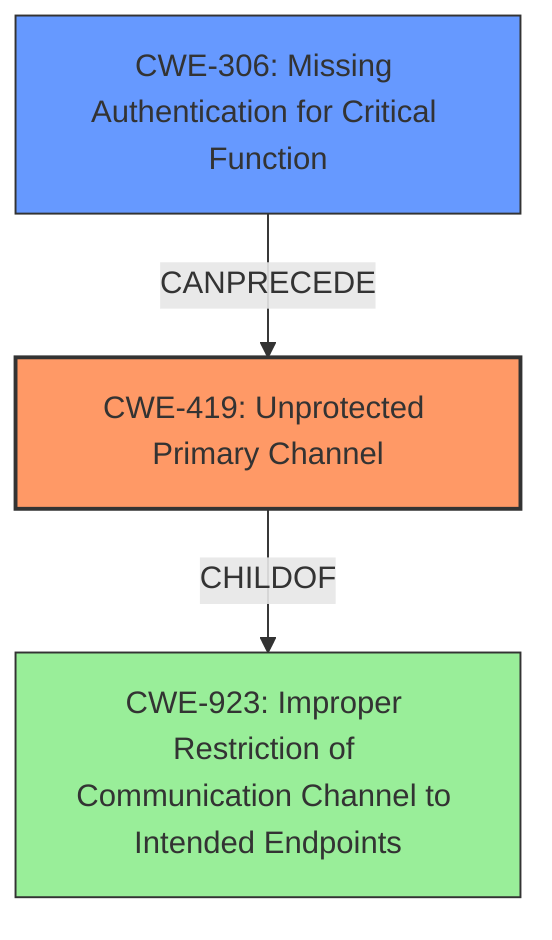

# Final Resolution for CVE-2022-33932

# Summary
| CWE ID | CWE Name | Confidence | CWE Abstraction Level | CWE Vulnerability Mapping Label | CWE-Vulnerability Mapping Notes |
|---|---|---|---|---|---|
| CWE-419 | Unprotected Primary Channel | 0.95 | Base | Allowed | Primary CWE. ChildOf -> CWE-923 |
| CWE-306 | Missing Authentication for Critical Function | 0.65 | Base | Allowed | Secondary Candidate. Implies inadequate authentication mechanisms on the unprotected channel. |

## Evidence and Confidence

*   **Confidence Score:** 0.90
*   **Evidence Strength:** HIGH

## Relationship Analysis
The primary CWE, **CWE-419 (Unprotected Primary Channel)**, is a base-level CWE directly addressing the vulnerability described. Its parent relationship to CWE-923 (Improper Restriction of Communication Channel to Intended Endpoints) provides a broader context of securing communication channels. The secondary CWE, **CWE-306 (Missing Authentication for Critical Function)**, is also a base-level CWE, representing a potential contributing factor due to inadequate authentication on the primary channel. While a direct parent-child relationship between CWE-306 and CWE-419 is not listed, the relationship analysis suggests that CWE-306 could be a prerequisite for CWE-419.

## Vulnerability Chain
The vulnerability chain starts with the **ROOTCAUSE** of an **unprotected primary channel (CWE-419)**. This may be caused by **missing or inadequate authentication (CWE-306)** on the channel. The lack of proper protection allows an unauthenticated network attacker to exploit the channel, leading to the impact of denial of filesystem services.

## Summary of Analysis
The initial analysis and criticism both align on the selection of **CWE-419 (Unprotected Primary Channel)** as the primary weakness. The vulnerability description explicitly states an "**unprotected primary channel**," providing direct evidence for this classification. The criticism refines the justification for the secondary CWE, **CWE-306 (Missing Authentication for Critical Function)**, by clarifying that the issue is not the complete absence of authentication but rather the inadequacy of existing mechanisms. The relationship analysis further supports this by suggesting that **CWE-306** could be a prerequisite for **CWE-419**. The final decision reflects the evidence-based approach, prioritizing the explicit mention of the "**unprotected primary channel**" while acknowledging the potential contribution of inadequate authentication. The selected CWEs are at the optimal level of specificity, with **CWE-419** being a base-level CWE that directly addresses the vulnerability.