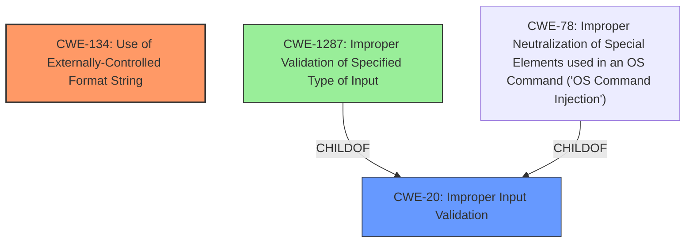

# Analysis Report for CVE-2022-33938

# Vulnerability Analysis Report: CVE-2022-33938

## Description

A format string injection vulnerability exists in the ghome_process_control_packet functionality of Abode Systems, Inc. iota All-In-One Security Kit 6.9Z and 6.9X. A specially-crafted XCMD can lead to memory corruption, information disclosure and denial of service. An attacker can send a malicious XML payload to trigger this vulnerability.

## Vulnerability Description Key Phrases

**Rootcause:** format string injection
**Impact:** ['memory corruption', 'information disclosure', 'denial of service']
**Vector:** specially-crafted XCMD
**Attacker:** attacker
**Product:** Abode Systems iota All-In-One Security Kit
**Version:** 6.9Z and 6.9X
**Component:** ghome_process_control_packet functionality

## Analysis (with Relationship Data)

# Summary
| CWE ID | CWE Name | Confidence | CWE Abstraction Level | CWE Vulnerability Mapping Label | CWE-Vulnerability Mapping Notes |
|---|---|---|---|---|---|
| CWE-134 | Use of Externally-Controlled Format String | 1.0 | Base | Allowed | Primary CWE |

## Evidence and Confidence

*   **Confidence Score:** 1.0
*   **Evidence Strength:** HIGH

- **Analysis and Justification:**  
  - *Explanation:* The vulnerability description explicitly states a "**format string injection**" vulnerability exists. The CVE reference summary further details that the `log_msg` variable, derived from user-controlled `cmd` and `id` parameters, is used directly as the format string in a `vsnprintf` call without proper sanitization. This aligns perfectly with CWE-134 [Use of Externally-Controlled Format String], which describes a scenario where a format string originates from an external source (user input in this case). The impact of memory corruption, information disclosure, and denial of service are also consistent with format string vulnerabilities. The retriever results also listed CWE-134 as the top hit.
  
  - *Relationship Analysis:* There are no direct relationships provided in the retriever results for CWE-134. However, format string vulnerabilities often stem from a lack of input validation and can lead to other issues like code execution or information leakage. This is ALLOWED as per the MITRE mapping guidance.

- **Confidence Score:**  
  - *Example:* Confidence: 1.0 (High confidence due to the explicit mention of format string injection and the supporting details in the CVE reference materials.)

## Criticism of Analysis

Okay, I've reviewed the analysis and the provided full CWE specifications. Here's my critique, focusing on the accuracy of the primary CWE mapping and identifying potential secondary CWEs, and keeping in mind the mapping guidance.

**Overall Assessment:**

The analysis correctly identifies **CWE-134: Use of Externally-Controlled Format String** as the primary weakness. The explanation is clear, well-supported by the vulnerability description and CVE summary, and aligns perfectly with the CWE definition. The confidence score of 1.0 is justified.

**Detailed Review:**

*   **CWE-134: Use of Externally-Controlled Format String:**

    *   **Strengths:** The justification is strong. It directly links the user-controlled input (`cmd` and `id` from the XML payload) being used as the format string in `vsnprintf` without sanitization to the CWE-134 definition.  The explanation of the impact (memory corruption, information disclosure, DoS) further reinforces this mapping.
    *   **Mapping Guidance Compliance:** The analysis correctly notes the "Allowed" usage of CWE-134 because it's at the Base level of abstraction and accurately reflects the root cause.
    *   **Mitigation Considerations:** The analysis doesn't explicitly discuss mitigations, but it's implied in the discussion of sanitization. Referring to the CWE-134 mitigations (e.g., using static format strings, avoiding the `%n` operator, high compiler warning levels) would strengthen the analysis.

*   **Secondary CWEs (Based on Retriever Results and Analysis):**

    *   **CWE-20: Improper Input Validation:** *High Probability*
        *   **Rationale:** The root cause of the issue is that the `cmd` and `id` parameters are not validated before being used in the `snprintf` function that constructs the `log_msg`. This aligns directly with CWE-20, as the product is receiving input but not validating that the input has the properties that are required to process the data safely and correctly. The analysis even states: "Lack of Input Sanitization: The `ghome_process_control_packet` function does not sanitize the `cmd` and `id` values..."
        *   **CWE Specification Considerations:**  The mapping guidance for CWE-20 suggests exploring more specific children CWEs.
        *   **Suggested Improvements:** Include CWE-20 as a secondary CWE with the Allowed-with-Review usage and mention that a more specific CWE related to input validation might exist.
        *   **Example Notes:** Note the mitigations include using Language-theoretic security (LangSec) techniques and validating input.
    *   **CWE-1287: Improper Validation of Specified Type of Input:** *Medium Probability*
        *   **Rationale:** While CWE-20 covers general input validation issues, CWE-1287 dives deeper into not validating the type of input.
        *   **CWE Specification Considerations:** Aligns to the input not validated to be a specified type.
        *   **Suggested Improvements:** This could be added as a tertiary CWE with a more limited confidence score.
    *   **CWE-78: Improper Neutralization of Special Elements used in an OS Command ('OS Command Injection'):** *Low Probability*
        *   **Rationale:** While not directly OS Command Injection, a format string specifier could be used to write to a system file or execute a shell command.
        *   **CWE Specification Considerations:** This is a stretch, and it would require the attacker to use format string specifiers in a creative way.
        *   **Suggested Improvements:** Remove from the analysis.

**Recommendations for Improvement:**

1.  **Explicitly Mention Mitigations:** Include a section discussing potential mitigations for CWE-134. Refer to the CWE specification for specific mitigation strategies (e.g., using static format strings, sanitizing input, compile-time checks).
2.  **Add CWE-20 as a Secondary Weakness:** Include CWE-20 (Improper Input Validation) as a secondary weakness. Explain that the lack of sanitization of the `cmd` and `id` parameters before constructing the format string is a form of improper input validation.
3.  **Consider and Potentially Add CWE-1287:** Consider adding CWE-1287 to dive deeper on the type of input validation that could be missing.
4.  **Remove CWE-78**

**Revised Summary Table:**

| CWE ID  | CWE Name                                  | Confidence | CWE Abstraction Level | CWE Vulnerability Mapping Label | CWE-Vulnerability Mapping Notes                                                                                                                                                                                             |
| :------ | :---------------------------------------- | :--------- | :-------------------- | :------------------------------ | :----------------------------------------------------------------------------------------------------------------------------------------------------------------------------------------------------------------------------- |
| CWE-134 | Use of Externally-Controlled Format String | 1.0        | Base                  | Allowed                       | Primary CWE                                                                                                                                                                                                                  |
| CWE-20  | Improper Input Validation               | 0.8        | Class                 | Allowed-with-Review         | Secondary CWE: Lack of sanitization of user-supplied data before use in format string functions. See CWE-1287.                                                                                                             |
| CWE-1287 | Improper Validation of Specified Type of Input | 0.4        | Base                 | Allowed         | Tertiary CWE: Lack of specific input validation of type of input.                                                                                                             |

By incorporating these suggestions, the analysis will be more comprehensive, better aligned with CWE guidelines, and provide more actionable information for remediation.

## Final Resolution

# Summary
| CWE ID | CWE Name | Confidence | CWE Abstraction Level | CWE Vulnerability Mapping Label | CWE-Vulnerability Mapping Notes |
|---|---|---|---|---|---|
| CWE-134 | Use of Externally-Controlled Format String | 1.0 | Base | Allowed | Primary CWE |
| CWE-20  | Improper Input Validation               | 0.8 | Class | Discouraged | Secondary Candidate: The lack of sanitization of user-supplied data before use in format string functions demonstrates improper input validation. |

## Evidence and Confidence

*   **Confidence Score:** 0.9
*   **Evidence Strength:** HIGH

## Relationship Analysis
The decision was influenced by the following CWE relationships:
  - CWE-20 is a parent of CWE-1287, which relates to validating specific input types. This suggests that if we had more information about the specific type of input validation that was missing, we could choose CWE-1287. However, based on the current evidence, the broader **CWE-20: Improper Input Validation** is more appropriate as a secondary candidate.
  - CWE-20 is a Class level CWE, and the mapping guidance discourages the use of Class level CWEs when more specific Base level CWEs are available. Since CWE-134 adequately describes the **ROOTCAUSE**, this is the primary CWE.
  - CWE-78 is a peer of CWE-88 (Improper Neutralization of Special Elements in a Command), and a child of CWE-77 (Improper Neutralization of Special Elements in a Command). We are not dealing with command injection here, so this CWE is not appropriate.

## Vulnerability Chain
The vulnerability chain begins with a lack of input validation (**CWE-20**) allowing user-controlled data to be passed to the format string function. This leads to the use of an externally-controlled format string (**CWE-134**), which can then result in memory corruption, information disclosure, or denial of service. The **ROOTCAUSE** is the lack of input validation, and **WEAKNESS** is the externally-controlled format string that leverages the lack of input validation.

## Summary of Analysis
The initial analysis correctly identified **CWE-134 [Use of Externally-Controlled Format String]** as the primary **WEAKNESS**. The evidence from the vulnerability description explicitly mentions "format string injection" and the use of user-controlled parameters (`cmd` and `id`) in the `vsnprintf` function without proper sanitization. This aligns directly with the definition of CWE-134.

The criticism suggested adding **CWE-20 [Improper Input Validation]** as a secondary weakness, which is a valid point. The lack of sanitization of the `cmd` and `id` parameters before they are used in constructing the format string is a clear case of improper input validation. While the mapping guidance discourages the use of CWE-20 when more specific CWEs are available, in this case, CWE-20 captures the broader issue of missing input validation that leads to the format string vulnerability.

The suggestion to consider **CWE-1287 [Improper Validation of Specified Type of Input]** is less compelling. While it's possible that the input should be validated for a specific type, the primary issue is the lack of any validation at all. Therefore, CWE-20 is the more appropriate secondary weakness.

The evidence to support the **CWE-134** classification is: "A format string injection vulnerability exists in the `ghome_process_control_packet` functionality...A specially-crafted XCMD can lead to memory corruption, information disclosure and denial of service. An attacker can send a malicious XML payload to trigger this vulnerability." This clearly indicates a format string injection vulnerability.

The evidence to support the inclusion of **CWE-20** is: "The `ghome_process_control_packet` function does not sanitize the `cmd` and `id` values..." This statement directly implies a lack of input validation.

The final decision is to include CWE-134 as the primary CWE and CWE-20 as a secondary candidate. This provides a more complete picture of the vulnerability by highlighting both the specific format string injection issue and the underlying lack of input validation. The confidence score is reduced to 0.9 to reflect that while CWE-134 is a near-certain match, CWE-20 is a strong candidate that could potentially be replaced by a more specific input validation CWE if more details were available about the expected input format.

*Report generated on 2025-03-18 14:51:18*
