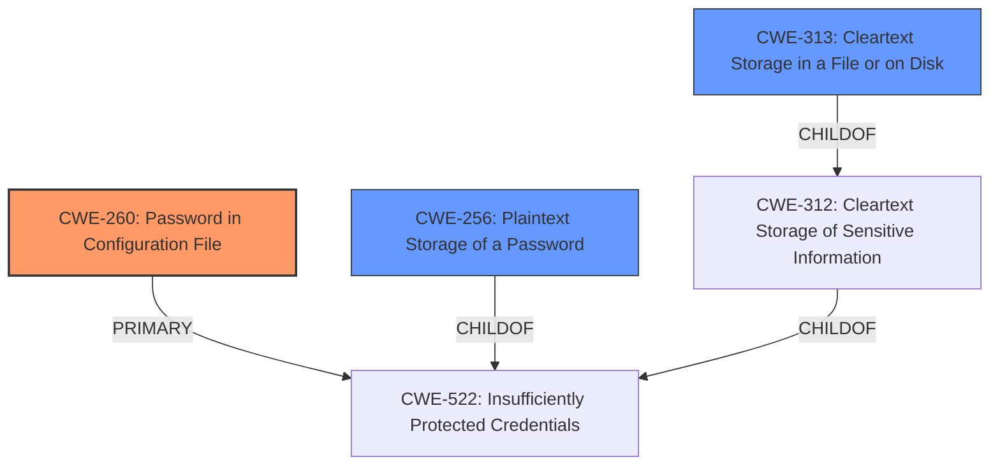

# Final Resolution for CVE-2022-34213

# Summary
| CWE ID | CWE Name | Confidence | CWE Abstraction Level | CWE Vulnerability Mapping Label | CWE-Vulnerability Mapping Notes |
|---|---|---|---|---|---|
| CWE-260 | Password in Configuration File | 0.95 | Base | Allowed | Primary CWE |
| CWE-313 | Cleartext Storage in a File or on Disk | 0.8 | Variant | Allowed | Secondary Candidate |
| CWE-256 | Plaintext Storage of a Password | 0.7 | Base | Allowed | Secondary Candidate |

## Evidence and Confidence

*   **Confidence Score:** 0.9
*   **Evidence Strength:** HIGH

## Relationship Analysis
The primary CWE selected is CWE-260, which is a base-level CWE. The selection of CWE-260 is influenced by the vulnerability description that explicitly states that the Jenkins plugin stores passwords unencrypted in its global configuration file. This aligns directly with CWE-260, which describes storing passwords in a configuration file that might be accessible to unauthorized actors. The secondary CWEs are children of higher-level CWEs such as CWE-522, but the children are more specific. CWE-313 is a more specific version of CWE-312, so I have decided to replace CWE-312 with CWE-313, as the criticism suggested.

## Vulnerability Chain
The vulnerability chain starts with the **ROOTCAUSE** of storing sensitive information, specifically passwords, in a configuration file in cleartext.
1.  The plugin stores passwords unencrypted in its global configuration file. (CWE-260)
2.  This results in the passwords being stored in cleartext in a file on disk. (CWE-313)
3.  This leads to the passwords being stored in plaintext, accessible to those with access to the file system. (CWE-256)
4.  The impact is that users with access to the Jenkins controller file system can view the unencrypted passwords, potentially leading to unauthorized access or privilege escalation.

## Summary of Analysis
The initial analysis and criticism were both well-reasoned. The vulnerability description states, "Jenkins Squash TM Publisher (Squash4Jenkins) Plugin 1.0.0 and earlier stores passwords unencrypted in its global configuration file on the Jenkins controller where they can be viewed by users with access to the Jenkins controller file system." This directly indicates that **passwords are stored unencrypted in the configuration file**, directly aligning with **CWE-260 (Password in Configuration File)**. I agree with the suggestion to replace CWE-312 with CWE-313, as the latter is a more precise finding. The graph relationships show that CWE-260 is a base-level CWE, while CWE-256 and CWE-313 are more specific variants. The selected CWEs are at the optimal level of specificity because they accurately describe the vulnerability and are based on evidence from the vulnerability description.