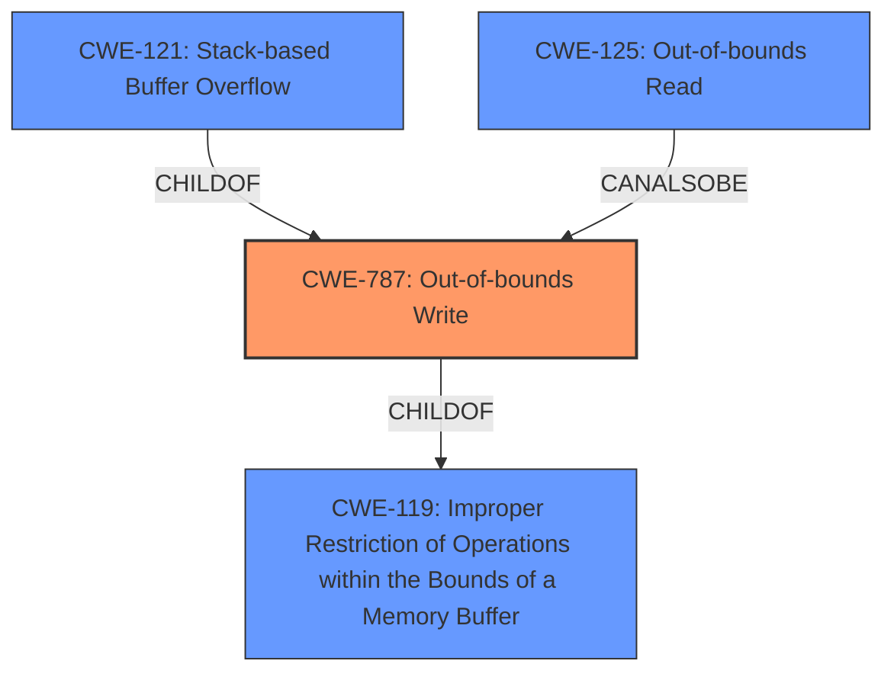

# Analysis Report for CVE-2022-34291

# Vulnerability Analysis Report: CVE-2022-34291

## Description

A vulnerability has been identified in PADS Standard/Plus Viewer (All versions). The affected application contains a stack corruption vulnerability while parsing PCB files. An attacker could leverage this vulnerability to leak information in the context of the current process. (FG-VD-22-057, FG-VD-22-058, FG-VD-22-060)

## Vulnerability Description Key Phrases

**Weakness:** stack corruption
**Impact:** information disclosure
**Vector:** parsing PCB files
**Product:** PADS Standard/Plus Viewer
**Version:** All versions

## Analysis (with Relationship Data)

# Summary
| CWE ID | CWE Name | Confidence | CWE Abstraction Level | CWE Vulnerability Mapping Label | CWE-Vulnerability Mapping Notes |
|---|---|---|---|---|---|
| CWE-787 | Out-of-bounds Write | 0.9 | Base | Primary | Allowed |
| CWE-121 | Stack-based Buffer Overflow | 0.7 | Variant | Secondary | Allowed |
| CWE-119 | Improper Restriction of Operations within the Bounds of a Memory Buffer | 0.6 | Class | Secondary | Discouraged |

## Evidence and Confidence

*   **Confidence Score:** 0.8
*   **Evidence Strength:** HIGH

- **Analysis and Justification:**  
  - *Explanation:* The vulnerability description explicitly states "**stack corruption**" while parsing PCB files, indicating a memory corruption issue within the stack. The "CVE Reference Links Content Summary" further clarifies that the **root cause** is an "Improper restriction of operations within the bounds of a memory buffer (CWE-119) leading to stack corruption". CWE-787 (Out-of-bounds Write) is a suitable primary mapping because it describes writing data past the end of an intended buffer which leads to **stack corruption**. Since the **stack corruption** happens on the stack, CWE-121 (Stack-based Buffer Overflow) is also applicable. CWE-119 (Improper Restriction of Operations within the Bounds of a Memory Buffer) is a Class-level CWE and is less specific than CWE-787 and CWE-121. Therefore, it is less preferred.
  
  - *Relationship Analysis:* CWE-787 is a base-level CWE and is a child of CWE-119. CWE-121 is a variant and a more specific case of CWE-787. The vulnerability's impact is information disclosure, which can be a consequence of **stack corruption** due to out-of-bounds write operations.

- **Confidence Score:**  
  - Confidence: 0.9 (High confidence due to explicit mention of **stack corruption** and supporting details in the CVE summary.)

---

## Criticism of Analysis

Okay, I've reviewed the provided analysis and the complete CWE specifications. Here's my critique, focusing on the accuracy, completeness, and justification of the CWE mappings, as well as alternative CWEs to consider:

**Overall Assessment:**

The analysis is generally well-reasoned and the primary CWE mapping to CWE-787 (Out-of-bounds Write) is appropriate. The inclusion of CWE-121 (Stack-based Buffer Overflow) as a secondary mapping further refines the description of the vulnerability. The decision to *discourage* CWE-119 is also correct, given the availability of more specific CWEs.

**Detailed Review of the Mappings:**

*   **CWE-787: Out-of-bounds Write (Primary)**

    *   **Confidence:** High (0.9) - Justified by the explicit mention of "stack corruption" and the description of writing past buffer boundaries.
    *   **Justification:** The description of CWE-787 aligns directly with the vulnerability: "The product writes data past the end, or before the beginning, of the intended buffer." Stack corruption is a common consequence of out-of-bounds writes. The provided evidence supports this mapping.
    *   **Mitigations:** The listed mitigations for CWE-787 (language selection, vetted libraries, compiler-based overflow detection) are all relevant to preventing this type of vulnerability.
    *   **Observed Examples:** Reviewing the provided CVE examples for CWE-787, such as CVE-2021-21220 highlights that the analysis is consistent with industry findings.
    *   **Critique:** Mapping is strong.

*   **CWE-121: Stack-based Buffer Overflow (Secondary)**

    *   **Confidence:** Medium (0.7) - Reasonable, given that the stack is specifically mentioned as being corrupted.
    *   **Justification:** CWE-121 is a *variant* of CWE-787 that specifies the location of the buffer as being on the stack. Because the vulnerability involves stack corruption, this is a valid, more specific mapping.
    *   **Mitigations:** The mitigations listed for CWE-121 (compiler/linker protections, abstraction libraries, bounds checking) are relevant.
    *   **Observed Examples:** Reviewing the provided CVE examples for CWE-121, such as CVE-2021-35395, shows that stack-based buffer overflows are commonly exploited.
    *   **Critique:** Correct and a good addition to refine the CWE Mapping.

*   **CWE-119: Improper Restriction of Operations within the Bounds of a Memory Buffer (Secondary - Discouraged)**

    *   **Confidence:** Low (0.6) - Correctly identified as less preferred, as per CWE guidance.
    *   **Justification:** While technically correct (CWE-787 and CWE-121 are children of CWE-119), CWE-119 is too general. The CWE specifications explicitly state that its usage is "Discouraged" and recommends mapping to its children.
    *   **Mapping Guidance:** The CWE specification for CWE-119 explicitly discourages its use when more specific CWEs are available. This analysis acknowledges and adheres to that guidance.
    *   **Observed Examples:** While the provided CVE examples for CWE-119 are related to buffer overflows in the wild, the mapping guidance and analysis is correct in choosing a more specific CWE such as CWE-787 and CWE-121.
    *   **Critique:** Correctly identified as a discouraged mapping.

**Potential Alternative CWEs to Consider (Low Priority):**

Given the information disclosure impact, it might be worth briefly considering the following CWEs, although they are likely less directly relevant than the selected ones:

*   **CWE-125: Out-of-bounds Read:** While the primary action is a *write*, an out-of-bounds write *could* lead to reading sensitive data from adjacent memory locations before overwriting them. The impact *information disclosure* suggests a read, although this is a secondary effect. This is a *lower* priority than the current mappings, as the primary vector is a write.
    *   **Relationships:** This entry is a child of CWE-119, further highlighting its connection to the root cause of the vulnerability.
    *   **Mitigations:** Input validation is listed as a mitigation for this vulnerability. Input validation is also mentioned in the CVE links content summary.
*   **CWE-457: Use of Uninitialized Variable:** Depending on how the stack is being corrupted, it's *possible* (though less likely) that the write operation targets an uninitialized variable, leading to information disclosure.  This would be a very *secondary* consideration.
    *   **Description:** "The code uses a variable that has not been initialized, leading to unpredictable or unintended results."
    *   **Relationships:** ChildOf -> CWE-908, further highlighting that memory corruption can be caused by uninitialized variables.
*   **CWE-770: Allocation of Resources Without Limits or Throttling:** If the vulnerability involves allocating excessive amounts of memory on the stack, leading to exhaustion and potential corruption, this could be considered. It seems less applicable than the out-of-bounds write focus. The top combined results and retriever results also ranked this as high. However, this does not align with the description of the vulnerability as the stack corruption is caused by writing over the allocated memory bounds rather than from memory exhaustion.
    *   **Description:** "The product allocates a reusable resource or group of resources on behalf of an actor without imposing any restrictions on the size or number of resources that can be allocated, in violation of the intended security policy for that actor."

**Recommendations:**

*   The current CWE selections are appropriate. The analysis is well-justified and adheres to CWE mapping guidance. No changes are strictly necessary.
*   For completeness, consider *briefly* mentioning the *possibility* of a *secondary* CWE-125 (Out-of-bounds Read) mapping in the justification, but emphasize that the primary action is a write (CWE-787). This would address the information disclosure aspect of the vulnerability with a more complete picture. However, keep this as a low priority since it is not the primary cause.

In summary, the analysis is solid and defensible. The prioritization of CWE-787 and CWE-121 is correct, and the decision to discourage CWE-119 is appropriate.

## Final Resolution

# Summary
| CWE ID | CWE Name | Confidence | CWE Abstraction Level | CWE Vulnerability Mapping Label | CWE-Vulnerability Mapping Notes |
|---|---|---|---|---|---|
| **CWE-787** | **Out-of-bounds Write** | 0.9 | Base | Primary | Allowed |
| **CWE-121** | **Stack-based Buffer Overflow** | 0.7 | Variant | Secondary | Allowed |
| CWE-125 | Out-of-bounds Read | 0.4 | Base | Secondary Candidate | Allowed |
| CWE-119 | Improper Restriction of Operations within the Bounds of a Memory Buffer | 0.3 | Class | Secondary | Discouraged |

## Evidence and Confidence

*   **Confidence Score:** 0.8
*   **Evidence Strength:** HIGH

## Relationship Analysis
The primary weakness is **CWE-787 (Out-of-bounds Write)**, which is a base-level CWE and a child of **CWE-119 (Improper Restriction of Operations within the Bounds of a Memory Buffer)**. **CWE-121 (Stack-based Buffer Overflow)** is a variant of **CWE-787**, specifying that the overflow occurs on the stack. The suggested addition of **CWE-125 (Out-of-bounds Read)** represents a potential secondary impact due to the possibility of reading sensitive information before the write.

## Vulnerability Chain
The vulnerability chain starts with an improper restriction of operations within a memory buffer, leading to an out-of-bounds write on the stack, which causes stack corruption and potential information disclosure.
  - **Root Cause:** Improper handling of PCB files leading to a buffer overflow.
  - **Weakness 1:** **CWE-787 (Out-of-bounds Write)** due to the lack of proper bounds checking.
  - **Weakness 2:** **CWE-121 (Stack-based Buffer Overflow)** as a specific instance of **CWE-787** occurring on the stack.
  - **Potential Impact:** Stack corruption leading to information disclosure.
  - **Secondary Consideration:** **CWE-125 (Out-of-bounds Read)** if sensitive data is read before being overwritten.

## Summary of Analysis
The initial analysis and criticism both converge on the selection of **CWE-787 (Out-of-bounds Write)** as the primary weakness due to the explicit mention of "stack corruption" in the vulnerability description, which aligns with the concept of writing data beyond the intended buffer boundaries. The choice of **CWE-121 (Stack-based Buffer Overflow)** as a secondary weakness is justified by the fact that the corruption occurs on the stack, making it a more specific instance of **CWE-787**.

The decision to discourage **CWE-119 (Improper Restriction of Operations within the Bounds of a Memory Buffer)** is appropriate, as it is a more general class-level CWE, and the guidance suggests using more specific base or variant-level CWEs when available.

The suggestion to consider **CWE-125 (Out-of-bounds Read)** is also reasonable, as the vulnerability description mentions information disclosure, which could potentially result from reading sensitive data before it is overwritten. However, since the primary action described is a write, **CWE-125** remains a secondary consideration.

The final CWE selections are at the optimal level of specificity, with **CWE-787** capturing the root cause of the out-of-bounds write and **CWE-121** specifying the location of the overflow on the stack.

The evidence provided in the vulnerability description, combined with the relationship analysis of the CWEs, supports the classification decision with high confidence.

*Report generated on 2025-03-18 14:53:35*
