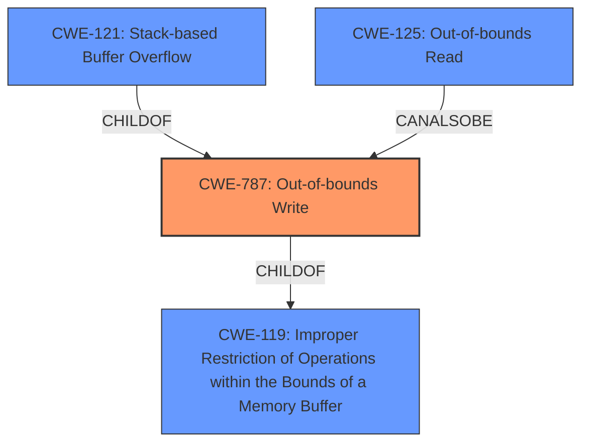

# Final Resolution for CVE-2022-34291

# Summary
| CWE ID | CWE Name | Confidence | CWE Abstraction Level | CWE Vulnerability Mapping Label | CWE-Vulnerability Mapping Notes |
|---|---|---|---|---|---|
| **CWE-787** | **Out-of-bounds Write** | 0.9 | Base | Primary | Allowed |
| **CWE-121** | **Stack-based Buffer Overflow** | 0.7 | Variant | Secondary | Allowed |
| CWE-125 | Out-of-bounds Read | 0.4 | Base | Secondary Candidate | Allowed |
| CWE-119 | Improper Restriction of Operations within the Bounds of a Memory Buffer | 0.3 | Class | Secondary | Discouraged |

## Evidence and Confidence

*   **Confidence Score:** 0.8
*   **Evidence Strength:** HIGH

## Relationship Analysis
The primary weakness is **CWE-787 (Out-of-bounds Write)**, which is a base-level CWE and a child of **CWE-119 (Improper Restriction of Operations within the Bounds of a Memory Buffer)**. **CWE-121 (Stack-based Buffer Overflow)** is a variant of **CWE-787**, specifying that the overflow occurs on the stack. The suggested addition of **CWE-125 (Out-of-bounds Read)** represents a potential secondary impact due to the possibility of reading sensitive information before the write.

## Vulnerability Chain
The vulnerability chain starts with an improper restriction of operations within a memory buffer, leading to an out-of-bounds write on the stack, which causes stack corruption and potential information disclosure.
  - **Root Cause:** Improper handling of PCB files leading to a buffer overflow.
  - **Weakness 1:** **CWE-787 (Out-of-bounds Write)** due to the lack of proper bounds checking.
  - **Weakness 2:** **CWE-121 (Stack-based Buffer Overflow)** as a specific instance of **CWE-787** occurring on the stack.
  - **Potential Impact:** Stack corruption leading to information disclosure.
  - **Secondary Consideration:** **CWE-125 (Out-of-bounds Read)** if sensitive data is read before being overwritten.

## Summary of Analysis
The initial analysis and criticism both converge on the selection of **CWE-787 (Out-of-bounds Write)** as the primary weakness due to the explicit mention of "stack corruption" in the vulnerability description, which aligns with the concept of writing data beyond the intended buffer boundaries. The choice of **CWE-121 (Stack-based Buffer Overflow)** as a secondary weakness is justified by the fact that the corruption occurs on the stack, making it a more specific instance of **CWE-787**.

The decision to discourage **CWE-119 (Improper Restriction of Operations within the Bounds of a Memory Buffer)** is appropriate, as it is a more general class-level CWE, and the guidance suggests using more specific base or variant-level CWEs when available.

The suggestion to consider **CWE-125 (Out-of-bounds Read)** is also reasonable, as the vulnerability description mentions information disclosure, which could potentially result from reading sensitive data before it is overwritten. However, since the primary action described is a write, **CWE-125** remains a secondary consideration.

The final CWE selections are at the optimal level of specificity, with **CWE-787** capturing the root cause of the out-of-bounds write and **CWE-121** specifying the location of the overflow on the stack.

The evidence provided in the vulnerability description, combined with the relationship analysis of the CWEs, supports the classification decision with high confidence.